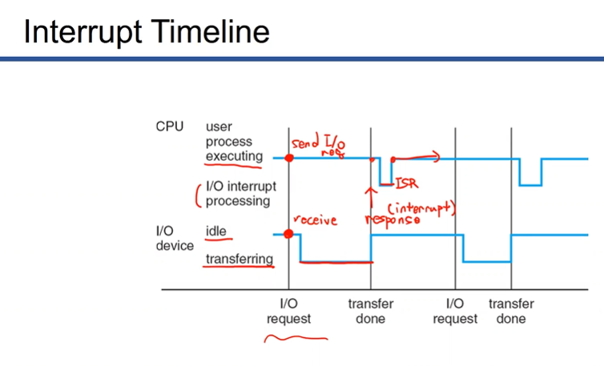
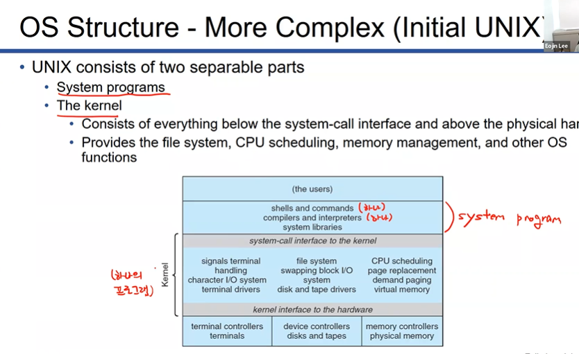

# Interrupt

CPU 외부에서 CPU한테 이벤트를 알려주면서 CPU를 멈추게함
각각의 인터럽트는 cpu가 수행할 인터럽트 서비스 루틴(ISR)이 존재

Interrupt vector : inturrupt와 ISR을 매칭시켜놓음. 모든 서비스 루틴에 대한 주소를 가지고 있음.

cpu 내에서 일어난건 trap, exception이라고 부름 인터럽트랑 다르게 취급

software-generated interrupt라고도 부름

ex. 0으로 나누면 안되는데 0으로 나눴다던지

os내부의 커널은 생각보다 수동적. 밖에서 인터럽트가 들어와야 일을 함

## Interrupt Handling

**인터럽트가 오면 어떻게 하죠?**

* 현재 프로그램을 stop한다(현재 진행중이던 instruction은 시행한다. 하던건 끝내고 스탑함)
* 현재 cpu의 상태를 저장한다(사용하던 레지스터값, pc등)
* 인터럽트 벡터 테이블을 통해 ISR을 알아냄
* ISR로 점프해서 실행

> 사실 ISR이 커널의 핵심임

* cpu는 I/O request보내놓고 할 일 계속함

* CPU 그래프?의 1에 해당하는 부분은 user-processing
* 0에 해당하는 부분은 interuupt processing

* I/O가 response(= interrupt)를 보낼때까지 CPU는 user processing mode
* 조금 딜레이된 이유는 하던 명령까지는 하고 끝낸다

OS는 interrupt driven 프로그램

## OS Design and Implementation

정답이 있는건아님.

여러가지 os는 다 다르게 생겼따

* 골을 세우고
* 스펙을 정한다

* os는 하드웨어 위에서 일하기때문에 하드웨어에 종속적
* os는 유저에도 맞닿아있고 하드웨어에도 맞닿아있다
* 사용하기도 쉽고 구현하기도 쉽고 유지도 쉬워야...

* **Policy** 

  뭘 해야하는가! what!!!, 환경, 사용자가 어떻게 사용하는지... 뭐 그런거에 의해 변경될 수 있음

  

* **Mechanism**

  어떻게 해야 하는가!, 어떤거 동작해야하는지, 기계적 how!!!, 하드웨어에 종속적

둘이 변경되는 상황이 달라서 구분해두는게 좋음. 유연성 증가!

## OS Implementation

* 초창기 os는 기계어

* 대부분의 os가 c로 설계
* 요즘은 믹스, high-level language도 사용

> 하이레벨 랭귀지 
>
> 장점 : 다른 하드웨어에 포트하기쉬움, 기계어로 직접 번역되어있지않기때문에 해당 기계어로 번역 가능, 빨리 작성 가능, 간결, 이해하기 쉬움, 디버깅도 쉬움, c도 하이레벨
>
> 단점 : 느림

**사실 os의 주 성능은 하이레벨랭귀지... 사용여부보다는 policy가 더 중요**

## OS Structure

* 추상화 

  블랙박스화, 각각의 모듈은 다른 모듈의 세부적인 내용에 대해 알 필요 없다. 서로 무슨 일 하는지, 통신만 할 수 있기만 하면 됨

  

* 분리 (Decomposition)

  os는 거대하기때문에 모듈화

### MS-DOS

윈도우가 나오기전 마이크로소프트웨어에서 만들던 os

초창기 pc 운영체제

모듈화가 안되어있음

필수적인 기능만 존재

싱글 태스크 - 싱글 유저

프로그램 -> 커널 ->프로그램 형식의 단순한 형태

### UNIX

* 시스템 프로그램과 커널을 나눔

* 나누긴 했지만 커널은 여전히 하나
* 굉장히 큰 커널 하나! 커널 하나에서 i/o통신, 파일 시스템, cpu스케줄링등 다 하는 중
* 모놀리식 구조라고도 함 (커널이 하나로 이루어져있다. 단순)

### Layered Approach

* 각각의 레이어는 자신보다 하위 계층과 소통할줄만 알면 된다
* N이 클수록 상위. 일의 요청이 아래로만 일어난다. 레이어1은 레이어0에게 일 요청
* 낮을수록 하드웨어, 높을수록 사용자 인터페이스와 가까운
* 모듈화
* 블랙박스화됨. 각각의 레이어는 다른 레이어가 어떻게 구현되어있는지 모름. 일만 시킬줄알면됨
* 현대 os는 레이어로 이루어져있지않음. 마이크로커널과 모듈화로 되어있음

### Microkernel

마이크로 : 작음

커널이 작다!

* 커널에서 필수적인 부분을 빼고는 제외함

* 나머지는 유저 레벨 프로그램으로 만들어버림 

  (os의 일부분... 기능이지만 os 밖에서 작동)

* 유저 레벨 프로그램끼리는 메세지 패싱을 통해 주고받음

* 예전에는 커널안에 같이 있어서 걍 메모리 주소 access했음

* 메모리 카피가 일어남. 퍼포먼스 오버헤드 존재

* 커널이 작아서 커널 업데이트하기가 쉬움, 디버깅도 당연 쉽

* 커널을 다른 시스템에 적용하기도 쉬움. 작으니까~!

* reliable. 커널 안에서 돌아가는 기능이 적어지면서 원래는 커널 안의 동작이 여러군데 영향을 끼쳤는데 이젠 밖에서 일어나니까 한 부분에 문제가 발생하도 다른 프로그램에 영향을 덜 끼친다 (같은 의미에서 secure해짐)

* Mac OS X kernel 다윈의 한 부분이 마이크로커널로 구현됨

### Modules

loadable kernel modules (LKM)

* 기본적으로 마이크로 커널과 비슷하게 생김
* 하나의 프로그램으로 나눈게 아니라 동적으로 탑재할 수 있는 라이브러리 형태로 나눔. 기능이 필요할 때 마다 동적으로 사용
* 마이크로커널처럼 핵심적인 os는 적음
* 추가적인 서비스는 커널이 동작하는동안 동적으로 로딩해서 링킹하고 사용한다
* 실질적으로 수행할때는 하나의 커널안에서 수행되어서 메시지 패싱이 필요없음

### Hybrid System

섞어씀 ㅎ

모듈로 구성하되 특정 부분은 마이크로 ...

## OS Structure 시험 안나옴 킹받네
