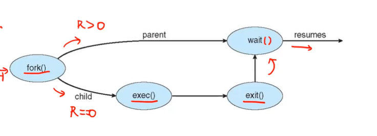

## fork()

- fork()라는 system call은 new process를 생성한다 (cloning)

system call : 사용자가 os커널한테 요청하는 api

#### fork() process

1. 현재 프로세스 중지하고 state를 저장
2. 현재 프로세스의 code, data, stack, heap + pcb를 복사해서 새로운 프로세스를 생성 (**전부 똑같은건 아니고 PID에 차이를 준다. os는 pid를 가지고 구분. fork()의 return value도 바꿔준다**)
3. 새로운 프로세스를 레디큐에 삽입

#### fork() return value

1. r < 0 : 오류
2. r > 0 : 부모 프로세스일 경우 chd의 pid를 반환
3. r = 0 : 자식 프로세스일 경우

## exec()

새 프로세스의 메모리 공간을 바꿔치기

(새로운 프로그램의 경로)

ex) execlp("/bin/ls", "ls", NULL)

- 오버헤드 단점 : 복사 비용이 너무 큼

- COW ( copy on write)

  전부 복사하지말자!

​ 실제로는 pointer structure를 만들어서 부모의 code, data 영역을 가리키게 해줌

​ (**stack은 복제해야함** : 두 프로세스를 다르게 관리해야하므로)

​ 해당 데이터 영역을 수정해야할때 복제, 부모랑 데이터가 달라지는 순간 실제 복사가 일어남

​ windows는 아예 새로 만듦...?

## Process Termination

### exit()

프로세스가 정상적으로 종료됐는지는 exit()안에 담아서 보낸다

1. status data를 parent에게 전달

   parent는 wait()로 받음

2. 해당 프로세스는 자신의 리소스를 전부 deallocated

#### exit return value

- 0이면 정상종료

- 0이 아니면 비정상 종료

(사실 os가 진짜 비정상 종료라고 인식하진않고 관습적인... 표현임. 부모 프로세스한테 그냥 0이 아니라고 알려줄뿐)

- wait() 호출하면 자식의 종료 상태가 wait(\$status)로 전달

정상적으로 종료되지않았을 때 exit()외에 abort()라는 시스템 콜을 호출할 수도 있다

### abort()

비정상 종료를 명시적으로 호출

명시적 : 시스템 자체적으로 비정상 알림

ex. 메모리를 과도하게 요청함

#### 좀비 프로세스

부모가 wait을 안해줘서, 안거둬줘서 자식이 죽었는데 pcb에 계속 남아 있음

다른 데이터는 모두 deallocate하고,

나에게 남은건 부모에게 보낼 exit status뿐...⭐

#### 고아 프로세스

부모가 wait을 하기전 먼저 죽음

1번 프로세스인 init이 좀비랑 고아를 거둬들어서 정상적인 종료를 돕는다

- 웹 예시
- 여러 개의 탭 : renderer
- 왜 멀티 프로세싱?
- 하나의 프로세스로 하면 특정 페이지의 로딩이 길어질 때 전체의 pending time에 영향을 줌
- 프로세스간 통신 필요 : **Inter-process Communication (IPC)**
  - 정보 공유 ex. shared memory, message passing
  - 모듈화

**shared memory**

진짜 같은 메모리의 주소를 공유

**message passing**

message queue에 메세지를 보냄... 우체통같은거임

## CPU 스케줄러

**하나의 프로세스의 전체 시간은 cpu burst와 I/O burst로 나뉜다**

- cpu burst(cpu execution) : cpu를 연속적으로 계속 사용하는 상태

  보통 5ms 이하

- I/O burst (I/O wait) : I/O를 기다릴 때, I/O를 기다릴 때는 cpu를 사용하지않음

### CPU 스케줄러는 언제 실행되나?

1. I/O 요청을 하고 기다리게 되는 경우 : (running -> waiting)
2. 계속 돌 수 있는데 쫓겨나는 경우 : (running -> ready)
3. I/O 요청이 다 끝난 경우 : ( waiting -> ready)
4. 돌던 프로세스가 종료 : (terminates)

1,4번은 현재 cpu에서 돌고있는애가 자리를 내어줌(좀 더 능동적...?) : **nonpreemptive**

1 : 나 아이오 기다려야돼~

4 : 나 끝남~

2,3번은 잘돌고있었는데 영문도 모르고 쫓겨남

2 : ? 더 돌 수 있는데 시간 끝남

3 : ? 전에 하던에 아이오끝나서 쫓겨남

cpu 스케줄러는 polict(shedulling policy)랑 mechanism(dispatcher)을 잘 구별해서 만드는게 중요하다!

1. scheduling policy : 선택(한 프로세스) : 여러개가 선택될수도?
2. dispatcher : 바꿔주는 행동 그 자체

바꿔주는 동작 그 자체는 계속 쓰면 되지만

policy는 시간이 지나면 바뀔수도있음

하나의 시스템 안에서도 여러가지의 policy를 사용할수도있다
