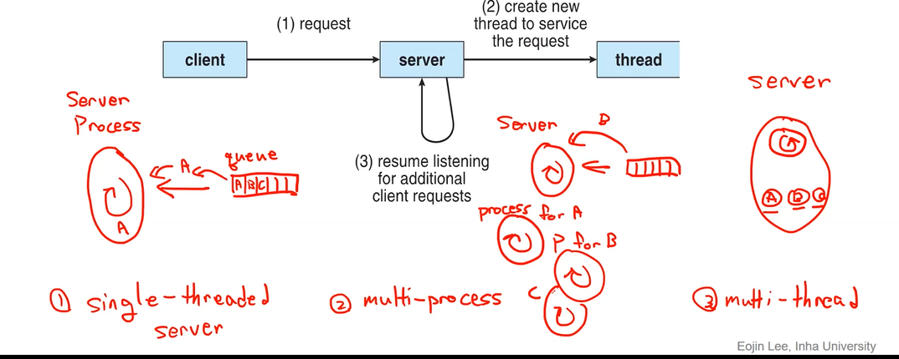

7-1

스레드! 멀티스레드! 스레드를 어떻게 구현하는지!

#### 스레드라는게 왜 나왔나요?

cpu 하나의 성능 개선 : 한계에 다다름

cpu를 여러개? 멀티 코어 = 멀티 프로그래밍

여러개의 프로그램을 돌릴 수 있게 됨

1. A와 B가 각기 다른 일을 수행(멀티 프로그래밍)
2. 여러 개의 책상에서 동일한 목표를 위해 일을 수행(멀티 쓰레드)

여러개의 코어에서 한 프로그램이 하는 일을 분배해서 수행

#### 스레드가 생기고 나온 문제

- Dividing activites (일을 어떻게 나눌지)
- Balance (혼자 팀플 ...)
- Data splitting (데이터를 어떻게 나눠줄지)
- Data dependency (한 명이 수정했는데 다른 사람들이 그 수정한 파일에 기반을 두고 있을 경우 어떻게 할 것 인지)
- Testing and debugging

Parallelism : 여러 코어에서 동시에 수행 (멀티 코어)

Concurrency : 하나의 코어에서 수행

#### 기존 프로세스의 특성

**하나의 프로세스는 두 가지 특성으로 나눌 수 있다**

_an execution stream in the context of a particular process state(resource)_

- unit of resource ownership

> resource ownership을 가진 애를 process라고 부르자!

- unit of execution stream

> execution stream은 나눌 수 있지않을까?
>
> 외부에서 돌아가는 excuted stream을 thread라고 부르자!
>
> 하나의 프로그램 안에서 execution stream을 여러 개로 나눔

- execution stream이 여러 개라면 각각의 stack과 register가 필요하다! stack, reg 스레드마다 분리 (code, data, files는 공유함)

#### 스레드의 특징

- 스레드는 state 3개 (running, ready, stopped(brocked = wait))

  - 그럼 생성 종료는 어떻게?

    실제로 os상에서 구현할 때는 라이브러리 같은걸 제공하게되는데 거기서는 생성, 종료 state를 추가적으로 만들긴함. 기본적인 state임 신경안써도 ㄱㅊ

- 프로세스 state는 5개 (new, run, wait, ready, terminate)

- 프로세스가 termination되면 당연히 그 안의 스레드도 termination

- 스레드마다 context(reg, stack에 대한 정보들)를 따로 관리해야한다

- stack이 따로 있고 static memory(for local vairables)도 존재할수도 있음

- 그러나 사실상 접근하는 메모리 공간은 process의 메모리 공간에 공유함

  

  - 프로세스의 모든 스레드들은 이걸 공유함 (그림의 share부분 참고)

- 여러 os에서 다양한 형태의 스레드를 사용한다
- MS-DOS : 싱글유저 - 싱글스레드
- 초창기 유닉스 : 여러 개의 프로세스 but 프로세스당 스레드 하나
- 현대 유닉스 : multiple threads

멀티스레드 어디서 사용? 보통서버 아키텍처에서 많이사용

ex. 이메일 서비스

멀티스레드.......... vs 멀티프로세스

뭔 차이냐....... 이 말이여

프로세스 생성에 대한 오버헤드가 큼! 프로세스에 필요한 공간 할당. 메모리에 올려야 함

멀티 스레드는 a,b,c도 같은 프로세스안에서 돌게하므로 성능상의 이득을 취하면서도 프로세스 생성에 대한 오버헤드도 줄일 수 있다!

#### 멀티 스레드의 이점

- Responsiveness(응답성)

  - 위 예시에서 싱글스레드는 a를 처리해야 b처리 가능

- Resource sharing
  - 멀티 프로세스의 경우 각기 독립적인 메모리 공간을 사용

> 멀티 프로세스는 각각 abc리퀘스트를 처리하기 위해서 프로세스를 따로 만들어줌. 각기 독립적인 메모리 공간. 따라서 프로세스들간 소통을 하기위해선 커널을 거쳐서 shared memory 나 message passing을 통해서 소통해야함
>
> 그러나 멀티 스레드는 같은 프로세스안 Resourcce sharing에 유리.

- economy

  - takes less time

     뉴 스레드를 만드는게 프로세스를 만드는 것보다 빠름

     프로세스는 모든 컨텍스트를 새로 만들고 초기화

     스레드는 스레드 컨텍스트(stack)만 서로 만듦

     마찬가지로 종료도 스레드가 유리

     한 프로세스내에서 두 개의 컨텍스트를 스위치하는 시간도 빠름

    코어가 늘어나는것에대해서 성능도 증가

  - Uses very little resources

    스레드가 필요한건스택과 per-thread staticy memory 뿐

스레드가 많아지면 멀티프로세서같이 코어가 많은 아키텍처에서는 프로세스가 advantage를 얻을 수 있다

## Threads Implementation

1. user-level : 사용자가 코드에 작성하는 것(사용자가 나눈 일의 단위)
2. kernel-level : 커널이 관리하는 스레드(cpu 자원 할당 단위)

두 개를 나눠서 구현하게 됨

### User-Level Threads : Multi thread using only user-level thread

- 100% 유저 레벨

- 커널은 얘의 존재를 모름. 커널이 보기에는 프로세스 하나

- 유저레벨에서 코드를 나눠서 작성함

- 이걸 위해 user-level library 존재

**user-level library**

    - 스레드 만들고 소멸
    - 스레드간의 스케줄링
    -
    - 스레드 컨텍스트 스위칭될 때 컨텍스트를 saving and restore
    - 스레드 간의 데이터 소통

실질적으로 cpu할당은 프로세스단위로 이루어짐

- 어플리케이션은 유저레벨 스레드를 사용해서 모든 스레드를 관리한다
- 스케줄링도 어플리케이션안에서 다 함 ( 어플리케이션 맞춤)
- 커널은 유저레벨스레드의 존재를 모르고 프로세스 하나가 동작하는줄 앎
- 어떤 스레드가 blocking system call을 할 때 커널은 그 프로세스를 통째로 block, waiting시킨다
- 장점
  - 스레드간 스위칭을 할 때 커널이 관여를 안함 (오버헤드 없음 mode switching없음 usermode <-> kernel mode)
  - 스케줄링이 베스트 알고리즘을 선택할 수 있다
  - os에서 스레드모드를 지원하지않아도 라이브러리만 있으면 구현을 할 수 있다
- 단점
  - 어떤 스레드가 시스템콜을 날리면 모든 스레드가 block
  - 코어가 여러개여도 활용을 모함 (한 책상을 여러명이 돌려씀)
- 사실상 초기 스레드 모형이며 지금은 사용하지않음. 너무 구림

### Kernel-Level Threads

- one to one mapping between user-level and kernel-level
- 유저레벨 스레드와 커널레벨 스레드가 둘 다 존재
- 유저레벨 스레드와 커널레벨 스레드가 1대1 매핑
- 유저 레벨 스레드 라이브러리를 쓰지않고 커널의 기능을 호출(api - kernel function)
  - 커널이 프로세스뿐만아니라 스레드에 대한 컨텍스트 정보도 유치
  - 스레드간 스위칭 지원
  - 스레드 스케줄링
  - synchronization
- 사용자가 어플리케이션 내부적으로 따로 스레드를 생성하고 관리하는건 없고 사용자가 스레드를 만들고싶을 때는 시스템한테 요청을 함. 시스템이 스레드를 관리를 온전히 다 한다. 유저레벨에선 관리할 필요가 없음.
- cpu 자원할당이 스레드 위주로 돌아감
- 모든 스레드를 커널이 관리
- 코드에서 유저레벨 스레드를 생성하면 실제 커널 레벨 스레드가 생성된다는 말
- 장점:
  - 여러개의 스레드를 여러개의 cpu코어에서 동시에 돌릴 수 있다
  - 어떤 스레드 하나가 block되어도 다른 스레드가 돌아간다
  - 커널에 대한 여러가지 루틴들도 멀티스레드처럼 만들 수 있다(뭔 소리?)
- 단점:
  - 스레드 스위칭자체가 컨텍스트 스위칭과 같은 오버헤드를 야기한다
- modern linux, windows가 원투원 매핑 사용

### Combined Threads

`Many-to-Many`

커널레벨모드도 유저레벨모드도 존재

유저가 나눠놓은 일의 단위와 cpu가 할당한 주체의 단위를 다르게 가져간다

커널은 사실상 스레드의 존재를 크게 의식하지않음

커널은 단지 유저에게 virtual processor같은

커널은 유저가 요청한대로 커널레벨스레드를 만들어주고 커널레벨스레드단위로 스케줄링하고 관리해줌

유저레벨 스레드는 커널레벨 스레드가 가상의 프로세서라고 생각하고 활용

어떤 스레드를 어떤 프로세서에 넣을지 관리를 해줌
