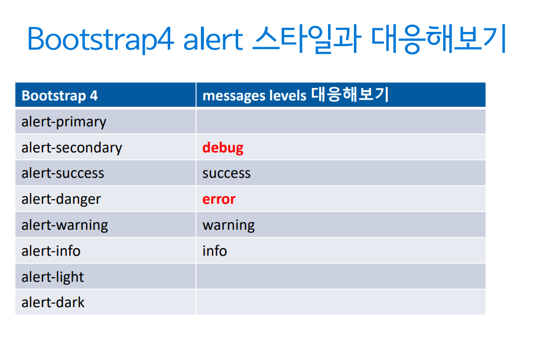

## Messages Framework

---

현재 User를 위한 1회성 메시지를 담는 용도

- `HttpRequest` 인스턴스를 통해 메시지를 남긴다.

​ 즉, View에서만 사용 가능

- 메시지는 1회 노출되고 사라진다

- View를 통한 템플릿 시스템을 통해 노출을 하면 템플릿 내에서 JS를 통한 노출도 가능

### Message Levels를 통한 메시지 분류

---

파이썬 로깅 모듈의 Level을 차용

레벨에 따라 로깅 여부 판단

​ 혹은 템플릿에서 다른 스타일로 노출

**레벨 종류**

- DEBUG : 디폴트 설정으로 무시되는 레벨, 개발 관련된 메세지이며, 실서비스에서는 무시
- INFO : 해당 유저에 대한 정보성 메세지
- SUCCESS : 액션이 성공적으로 수행되었음을 알림.
- WARNING : 실패가 아직 발생하진않았지만, 임박했다.
- ERROR : 액션이 수행되지 않았거나 다른 Failure가 발생했다.

### Messages 등록

---

\# views.py

```python
from django.contrib import messages

def post_new(request):
    ...
    if form.is_valid():
        post = form.save()
        #messages.add_message(request, messages.SUCCESS, "새 글이 등록되었습니다.")
        message.success(request, "새 글이 등록되었습니다.")
        return redirect(post)
```

### Messages 소비

---

**messages context_processor를 통해 messages 목록에 접근**

.tag 속성을 통해 레벨을 제공

.message 속성을 통해 내용을 제공 (=str(message))\

\# template/post_new.html

```html

<ul class="messages">
  
  <li>[{{ message.tag }}] {{ message.message }}</li>
  
</ul>

```

### Bootstrap4 스타일과 대응

---



부트스트랩4와 바로 대응 시키려면 **messages tag**를 변경하면된다!

#### messages tags 변경하기

---

\# settings.py

```python
from djangp.contrib.messages import constants as messages_constants

MESSAGE_TAGS = {
    messages_constants.DEBUG : 'secondary',
    messages_constants.ERROR : 'danger',
}
```

\# html

```html
 

<div class="alert alert-{{ message. tag }}">{{ message.message }}</div>

 
```
