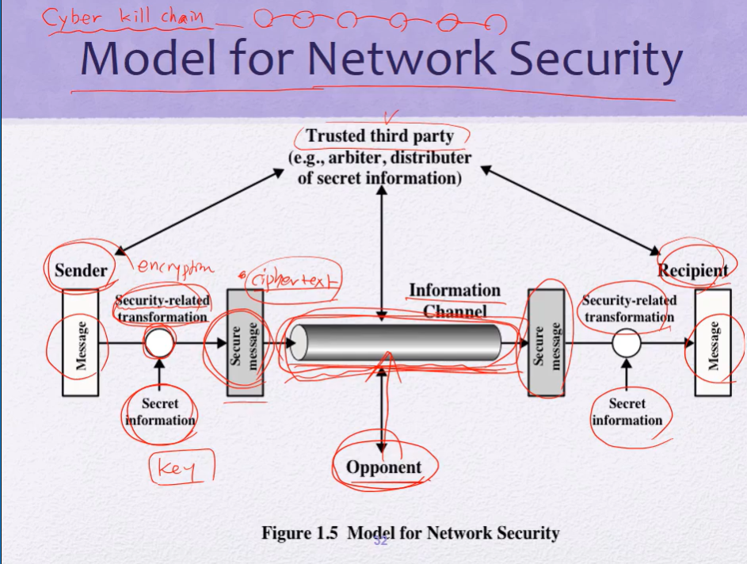

# 보안 1

보안이란? 자동화된 정보 시스템을 보호

정보 시스템 자원의 integrity, availabliry, confidentiality 보존

## 보안의 요구 조건 : CIA + AA

---

#### 기밀성 (Confidentiality)

​ `* Data Confidentialiy`

​ 중요한 정보가 허가받지않은 개인 주체에 의해서 공개되거나 가용될 수 없다.

​ 허가받은 사람만 중요한 정보를 볼 수 있어야 한다

​ `* Privacy`

​ 개인이 자신과 관련되어 어떤 정보들이 저장되는지, 누구에게 공개될 수 있는 지 제어를 하고 영향을 미친다

​ 정보의 주권을 자신이 가지고있다

#### 무결성 (Integrity)

​ `* Data Integrity`

​ 미리 정의되거나 허가된 방법으로 integrity되어야 한다.

​ 허가 받지 않은 상태로 변경이 불가하다.

​ 변경이 되었을 때 바로 확인이 가능해야한다.

​ `* System Integrity`

​ 시스템의 허가받지않은 변경을 막을 수 있어야한다.

​ 시스템의 허가받지않은 변경이 불가하다

#### 가용성 (Availability)

​ 정상적인 유저에게 정상적인 서비스를 제공한다

\+ AA

#### Accountability

​ 어떤일이 벌어졌을 때 책임 소재를 가릴 수 있다

#### 인증 (Authentication)

​ 누가 진짠지 아닌지 확인할 수 있다

## 컴퓨터 보안의 어려움

---

- 항상 공격자가 유리, 잠재적 공격에 모두 반응해야함

- 계속 지켜봐야함
- 시큐리티 매커리즘 : 여러 알고리즘의 조합이 어려움
- 보안에 대한 투자 비용 대비 효용성 떨어짐

## OSI 보안 구조

---

1. Security attack
2. Security mechaism
3. Security service

## Threat & Attack

### Security attack

---

#### **passive attack**

-> 공격이 일어난 뒤 시스템에 변형이 일어나지않음

​ ex) 메세지 도청, 메세지 복사

- `메세지 내용 유출`
  - 암호화로 방어
- `traffic analysis` : 암호화된 패킷 자체가 유통되고있다는게 약점이 됨, 어느 시간대에 패킷이 많이 유통되는지도 힌트가 될 수 있음
  - Tor로 방어

#### **active attack**

-> 시스템 자원이나 동작을 변형시킴

​ ex) 메세지 가로챔, 메세지 전송자 흉내내서 다른 메세지 전송

- `Masquerade` : 다른 사람인척 (수신자인척 메세지 보냄)

- `Replay` : 100원 보내는 동작이 있다면 이걸 10000번 수행

- `Modification of messages` : 메시지 내용 수정

- `Denial of service` : 메시지 수신 막기

#### 그렇다면 active attack이 더 치명적일까?

답은 경우에 따라 다르다!

패시브 어택의 경우 공격받았는지 조차 모름

피해를 받았음을 알면 대응이 가능할수도있음

### Security service

---

#### Data Cofidentiality

패시브 어택에 대한 방어, 트래픽도 보호(어디서부터 어디로 가는지, 빈도, 패킷길이등)

#### Data Integrity

메세지 스트림이나 단일 메세지에 적용 가능

커넥션이 있는 경우 : 메세지 스트림 - reordering(메세지 순서를 바뀜)

커넥션이 없는 경우 : 단일 메세지 - 메세지 변조에 초점, 어떤 부분이 복제, 삭제, 추가 되었는가

**원래의 상태가 바뀌지않는것에 중심을 둔다**

#### Availability Service

DOS(denial-of-service attack) 공격에 초점

#### Authentication

`Peer entity authentication` : 양방향 소통중 상대방이 누구인지 인증. 사용자를 인증

`Data origin authentication` : 데이터가 전송될 때 그 데이터가 내가 기대하는 사람으로부터 받은게 맞는지 확인 (Masquerade등 막음:진위여부판단)

#### Nonrepudiation (for accountability)

사용자가 부인하지않게. 누군가 메세지를 보냈다면 보냈다는걸 확인할 수 있게

#### Access Control

(CIAAA 의 조건에 들어가진않지만 다섯개와 연결된 개념)

커뮤니케이션 링크를 통해 호스트 시스템&app에 접근들을 제어

identified : 이 사람이 누구인지 먼저 신원 확인

authenticaticated : 이 사람이 누구라고 주장할 때 맞는지 검증

**Attacks** : 보안 공격의 종류

**Security Services** : 보안이 제공하는 서비스

**Security Mechanisms** : 서비스 목적을 달성시키기위한 재료. 도구

`Message authentication` 또는 `Digital signature`를 사용해 **Integrity**와 **Authenticity** 를 지킬 수 있다.

`Digital signature`는 `Message authentication` 와 달리 **Accountablility (Nonrepudiation)**도 달성할 수 있다

## Fundamental Security Design Principle

---

보안 디자인 설계 룰

- Economy of mechanism : 작고 간단하게. 비용적&관리적측면에서 경제적으로!
- Fail-safe defaults : 보안의 기본 정책은 exclusion이 아닌permission에 기본해야한다. ex) 이건 안돼(x) 이것만 허용(o)
- Complete mediation : access 할 때 마다 모든 access 확인, 각각의 자원마다 체크한다.
- Open design : 개방형 설계, 보안 시스템을 열고 모두가 볼 수 있게한다. 집단 지성
- Separation of priviledg : 권한 세분화, 하나 뚫렸을 때 전체가 망가지지않게
- Least privilege : 권한 최소화
- Least common mechanism : 공유 메커니즘 최소화
- Psychological acceptablility : 심리적으로 받아들일수있게 , 심리적 압박감&불편함 최소화 - 사용자 편의성 관련, 사용자에게 투명해야함. 사용자는 시큐리티 매커리즘이 있는지 모르게 해주는게 좋음
- Isolation : 분리, public과 critical 분리. 중요한 시스템은 public이 접근할 수 없게 분리해야한다
- Encapsulation : 캡슐화. 안의 내부적인 구성에 대해서는 알려주지않아도된다.
- Modularity : 모듈별로 설계, 한 쪽의 에러가 다른 쪽에 영향을 끼치지않게
- Layering : 겹치는 보호
- Least astonishment : 사용자를 놀라게하면안됨. 사용자가 예상할 수 있는 범위내에서 동작해야함

## Attack Surfaces

---

시스템이 있을 때 거기에 존재하는 취약점들을 말함

공격자가 뚫고 들어갈 수 있는 표면

### Attack Surface Categories

---

#### Network attack surface

네트워크를 통해서 공격

#### Software attack surface

프로그래밍이 잘못되었다는 등의 이유로 소프트웨어를 통해 공격

#### Human attack surface

사람을 공격!

중요 시스템을 다루는 사람을 공격!

## Attack Tree

---

어떤 대상을 공격하는 체계

branching과 계층이 있다

\+ Cyber kill chain : 어택 트리와 마찬가지로 공격의 절차를 보여준다. 어택 트리가 공격의 목표에 다다르기위해 어떤 기술들을 쓸 수 있는지 트리형식으로 보여줬다면 사이버 킬 체인은 실제로 공격에 도달하기 위해 공격자가 뭐하고 뭐하고 뭐해야하는지 쭉 나열되어있음

### Model for Network Security

---

### Standards

표준을 정하는 기관들

(이미지)

TTA, KS-, IEEE 등 더 있음
