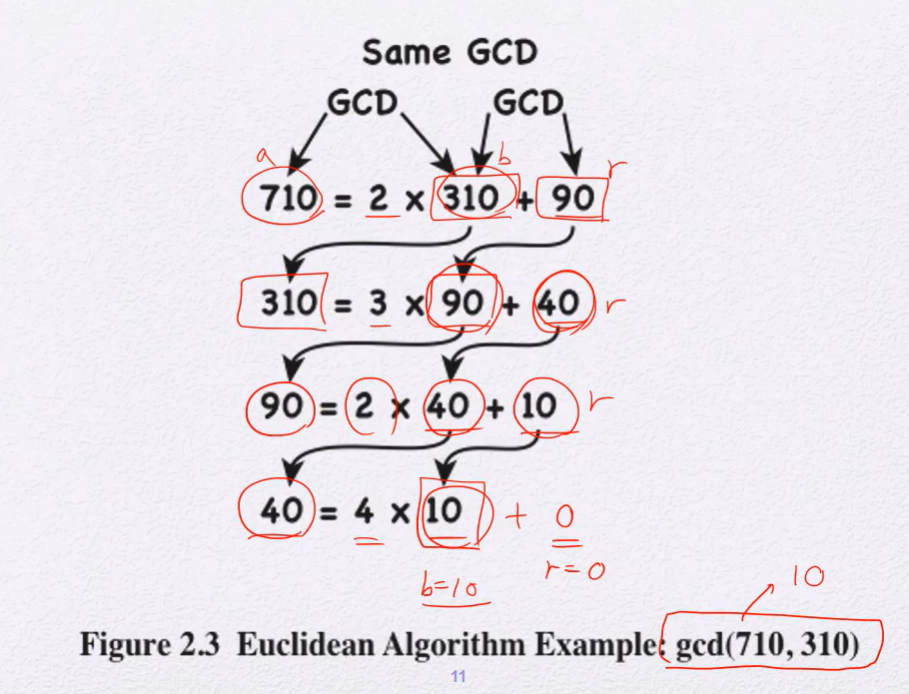
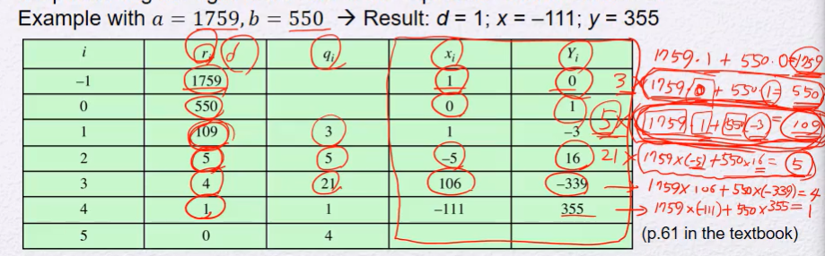
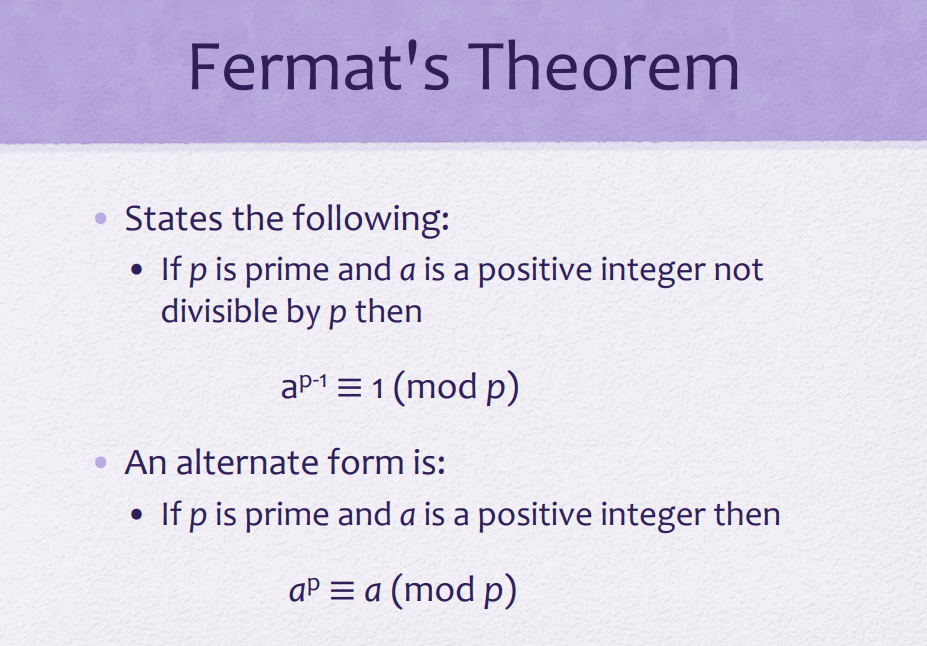
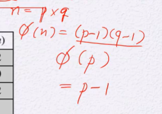
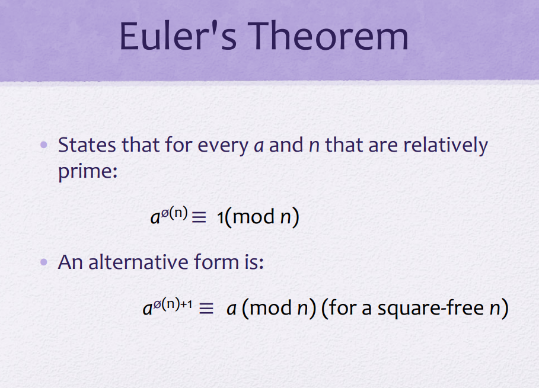
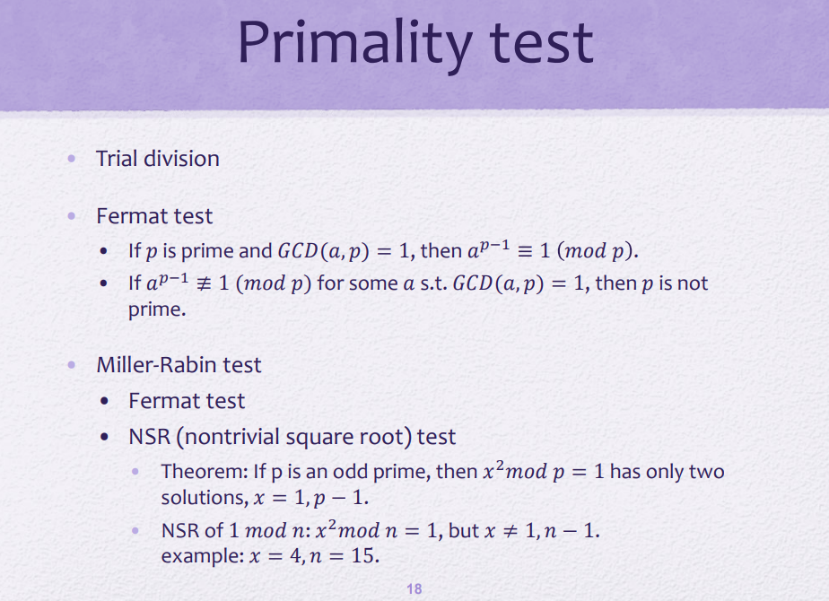
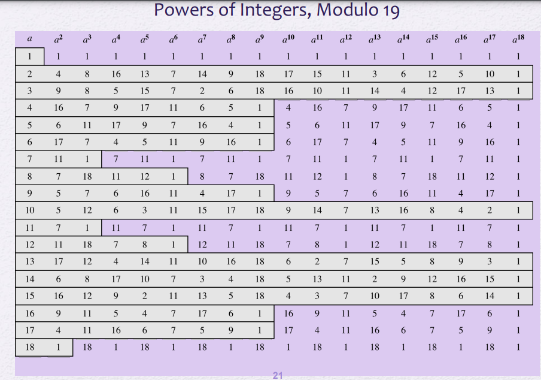
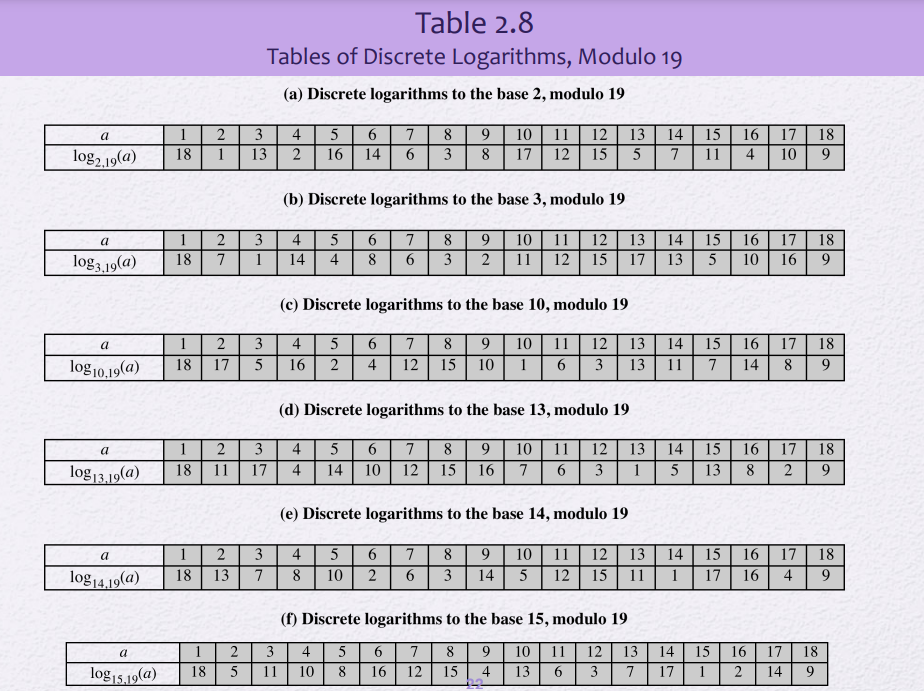

## Divisibility

---

```
`a/b` = `a=mb` = `b|a`
```

_b는 0이 아니다_

b는 a의 divisor, a는 b의 multiple

ex) 17|0, -5|30

- a|1 이면 a는 ±1
- a|b, b|a 이면 a = ±b
- 0이 아닌 모든 정수 b는 0의 약수가 된다 ( 나머지가 0이긴하니까... )
- b|g and b|h 이면 b|(mg + nh)

### Division Algorithm

---

```
a = qn +r 일 때
 0 ≤ r < n;
 q = [a/n] (작거나 같은 수 중 최대)
```

### 📌 Euclidean Algorithm : `for GCD`

---

for `GCD`

gcd(a,b) -> gcd(b, a mod b)

a>b 일 때, r이 0이 될 때까지 반복한다



### 모듈러 연산

---

```
a = qn +r
0≤ r < n
```

-11 mod 7 = 3

-11 = 7\*-2 +3

### 📌 합동(congruent)

---

(a mod n) = (b mod n)

-> `a ≡ b (mod n)` : 우와! 합동이다!

만약 `a ≡ 0 (mod n)`이라면, n|a이다.

-> a를 n으로 나눴을 때 나머지가 0이라는 뜻이므로

ex)

> 73 ≡ 4 (mod 23)
>
> : 73을 23으로 나눴을 때의 나머지와 4를 23으로 나눴을 때의 나머지가 같다
>
> 21 ≡ -9 (mod 10)

#### 📌 Properties of Congruences

---

1. a ≡ b (mod n) iff n|(a-b)
2. a ≡ b (mod n) 이면, b ≡ a (mod n)
3. a ≡ b (mod n) & b ≡ c (mod n) 이면, a ≡ c(mod n)

1번 증명 : 만약 `n | (a-b)` 이면 `(a-b) = kn`

-> `a = b + kn`

> `(b + kn) mod n` = b mod n

따라서 `a mod n` = `b mod n`, 즉 `a ≡ b(mod n)`

### 📌 Modular Arithmetic

---

1. [(a mod n) + (b mod n)] mod n = (a + b) mod n
2. [(a mod n) - (b mod n)] mod n = (a - b) mod n
3. [(a mod n) * (b mod n)] mod n = (a \* b) mod n

**증명**

a = r1 + jn,

b = r2 + kn 이라고 할 때

(a+b) mod n = (r1 + jn + r2 + kn) mod n

= ( r1 + r2 +(j+k)n ) mod n \# mod n 에 의해 (j+k)n 은 0이 된다.

= ( r1 + r2 ) mod n

= a (mod n) + b (mod n)

### 📌 Arithmetic Modulo 8

---

항등원 : 연산을 해도 처음 값과 똑같이 나오게 해주는 수

> 덧셈의 항등원 : 0, 곱셈의 항등원 : 1

📌 역원 : 연산을 했을 때 항등원이 나오게 해주는 수

덧셈의 역원은 모든 수에게 있지만 곱셈의 역원은 특정한 수에게만 있다

**곱셈의 역원이 존재하려면 Modulo와 서로소여야한다.**

> 덧셈의 역원 : [ a + (역원) ] mod n = 0
>
> ex) modulo 8에서 3의 역원은 5이다 : **(3+5) mod 8 = 0**
>
> 곱셈의 역원 : [ a * (역원) ] mod n = 1
>
> ex) modulo 8 에서 5의 역원은 5이다. : **(5\*5) mod 8 = 1**

### Properties of Modular Arithmetic for Int in Zn

---

Z : 모든 정수의 집함

Zn : Z를 n으로 나눴을 때 나머지가 되는 정수들의 집합

= {0, 1, 2, ... , n-1}

교환 법칙, 결합 법칙, 분배 법칙, 항등원, 역원

(곱셈의 역원은 있을 수도 있고 없을 수도 있으니 정의되어있지않음)

### 📌 Extended Euclidean Algorithm : `for 곱셈의 역원`

---

```
for 곱셈의 역원
```



> modulo 1759에서 550의 곱셈의 역원은 355이다
>
> modulo 550에서 1759의 곱셈의 역원은 439이다
>
> 원래 1759 \* -111 이지만 -111은 음수이므로 -111을 mod 550해서 양수로 만든다
>
> -111 mod 550 = 439

### 📌 Fermat's Theorem

---

**prime numbers**

어떤 정수 a는 (n제곱 형태의 ) prime numbers들의 곱 형태들로 표현할 수 있다

편의상 앞으로 prime number를 **p**로 나타내겠음



- p는 prime이고 a는 p로 나눠지지않는 양의 정수일 때 :a와 p가 서로소

  a mod p = 0

  **a(^p-1) mod p 를 했을 때 1이 나옴**

- p는 prime이고 a는 양의 정수

  a(^p) ≡ a (mod p)

### Euler totient function

---

1부터 n까지의 양수 중 n과 서로소가 되는 수들의 개수



p와 q가 prime number라면 서로소가 되는 수들의 개수는 p-1, q-1이다



### Primality test

---

prime인지 아닌지 test



#### Trial division

처음부터 무식하게 다 나눠보기

#### Fermat test

확률적인 방법

페르마의 정리 : 만약 p가 prime이고 a와 p가 서로소라면,

무조건 `a(^p-1) ≡ 1 (mod p)` 이다. (a는 유클리드 알고리즘을 사용해 구한다)

`a(^p-1) ≡ 1 (mod p)` 가 아니라면 p는 prime이 아니다

`a(^p) ≡ a (mod p)`

왜냐면 a(^p-1) 였을 때 mod p 하면 1이었으니까 ...

그 1에다가 a곱하고 mod p하면 a가 나올 수 밖에 없음 (둘이 서로소니까 나눠질 가능성은 0)

#### Miller-Rabin test

- Fermat test (기본적으로는 페르마 테스트)
- NSR (nontrivial sqare root) test (에 추가)

      `x² mod n = 1` 이 참일 때 x가 1 또는 n-1이 아니라면 n은 prime이 아니다

​ ex) 4² mod 15 = 1 , 그러므로 15는 prime이 아니다

#### Deterministic algorithm

miller-rabin은 틀릴 확률이 조금이지만 있음. trial처럼 100%맞는 알고리즘은 없을까?

AKS 알고리즘

trial보다는 빠르지만 miller-rabin보다 느림

#### Hybrid

ex) trialdivison + MR/Fermat

prime인지 test할 수 n을 루트n까지 다 하지하고 어느정도만 trial division을 수행하다가 어느정도까지 수행을 했으면 MR/Fermat로 넘어가는

### 📌 Power of Integers, Modulo 19

거듭 제곱



- 페르마의 정리에 의해 18제곱에서는 모두 1 `a(^p-1) ≡ 1 (mod p)`

- 수마다 특정 사이클이 존재한다

- 사이클 내 중복인 수는 존재하지 않는다

- 18까지 사이클이 유지되는, 사이클내에 1부터 17까지 전부 있는 수들은 `generator`라고 부른다. ex) 2, 3, 10, 13, 14, 15

- `generator`의 n제곱 형태인 수들은 `generator`의 사이클을 축약해서 가지고 있다

- 이전 mod 결과값?에 a를 곱해서 바로 다음의 mod 결과값을 구할 수 있다.

  ex) 2를 예시로 볼 때 2의 5제곱 mod 19값인 13에서 바로 2를 곱한 26을 mod 19하면 2의 6제곱 mod 19값인 7이 나온다.

### 📌 Discrete log



ex) 2와 17과 19를 인자로 주고 (2^n) mod 19 = 17일 때, n은 몇인가? 를 구하는 것을 디스크립트 로그라고한다. : 답은 10

이후 정수 소인수분해와 디스크리트 로그에 기반한 암호화가 나옴

수학적으로 풀기 어렵기 때문
