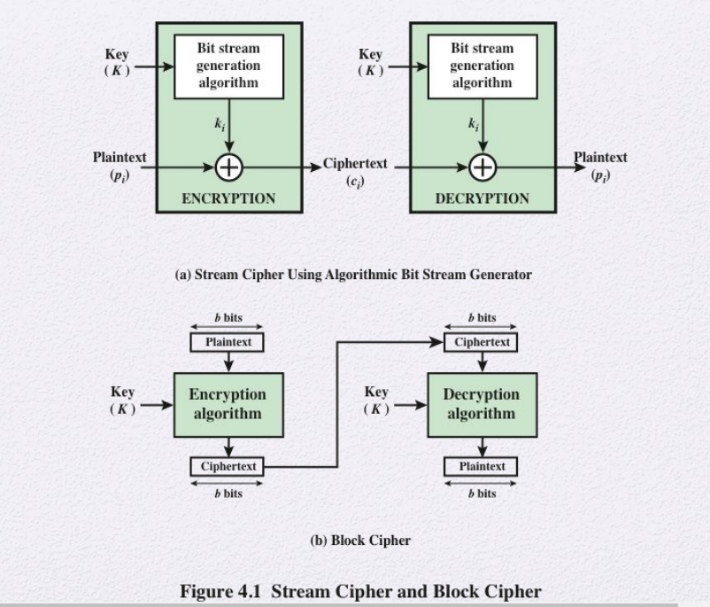
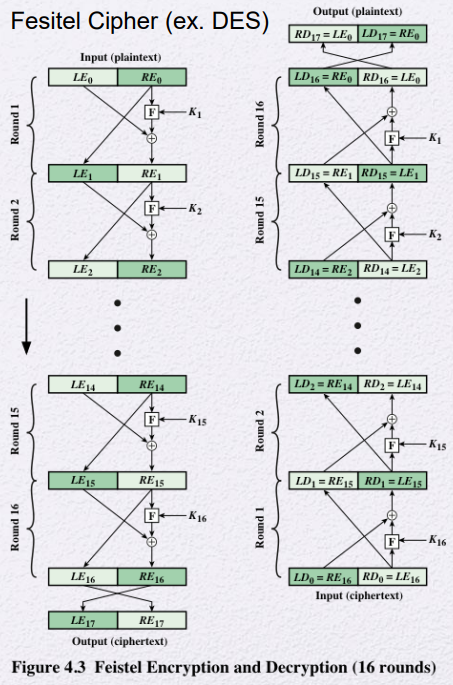
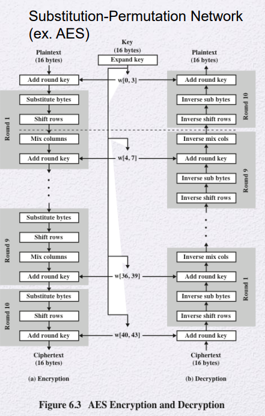

## classification of Symmetric Encryption

현대에서 쓰이는 Symmetric Encryption은 Stream Cipher와 Block Cipher로 나뉜다.

- **Stream Cipher** : key를 seed값으로 써서 bit stream generation 알고리즘을 돌림. 평문과 key를 `xor`연산

  ideal case : One-time pad

- **Block Cipher** : 평문을 128bit단위로 잘랐다면 또 다른 128bit로 변경. 어떻게 변경할건지의 규칙이 key.

  같은 평문이라도 어떤 key냐에 따라서 다른 cipher text생성

  **key에 의해서 block cipher의 동작이 결정됨.**

  **동작은 본질적으로 block 단위를 다른 블록으로 덮어쓰는 역할을 함**

  (이 두 개가 중요함. 다른건 그냥 흐름정도만 이해)

### Feistel Cipher

**Block Cipher의 일종**

- 많은 블록암호가 Feistel Cipher 형식을 취한다.

- 물론 Feistel Cipher 형식이 아닌 블록암호도 있다 (ex. AES)

- 내부적으로 substitution과 permutation으로 구성되어있다

* Substitutions : 각 plaintext의 요소나 그룹 bit들을 다른 ciphertext 그룹으로 대체. 치환
* Permutations : 각 원소의 순서를 바꿈. 위치이동. 전치. (permutation cipher와 혼동하면 안됨. 걔는 substitution의 일종)
* 암호화와 복호화가 키 순서를 제외한 전체가 같은 계산을 반복한다

ex) DES

치환, 전치 (두 개로 자르고 교차한다)

라운드키, 서브키

### Substitution-Permutation(ex. AES)

교차가 없음

ex) AES

