## AES

### AES structure

128bit input -> E -> 128 output

key값에 따라 output차이

#### AES에서 사용되는 연산

- Substitution : 3가지
- Transposition(permutation) : 1가지
- Multiple rounds : 여러 라운드로 진행됨
- Simple bit operations (such as XOR)

#### 궁극 목적

**Bit randomizion effect**  
Block Cipher : finite field 사용
비트를 랜덤해보이도록 만들어서 최대한 연관관계가 없어보이게

- Field multiplication과 Field inversion을 통해 랜덤하게 변형
  -> 그래서 finite field를 사용한다!
  _덧셈(뺄셈)은 반복하면 같아지는 효과가 있어서 제외_

why?

field : 사칙연산 덧셈 : randomize효과가 실질적으로 없음. 무작위로 바뀌지않고 계속 유지되는 성질 XOR 같은거 더하면 상쇄됨 연산을 반복한다고해서 복잡도가 올라가지않음

### Rationale for Binary Field

n비트의 int는 2^n 개 표현 가능
그러나 모듈러 2^n은 field가 될 수 없음 ex) 2^3 = 8
-> GF(2^n)사용 GF안의 모든 polynomial들이 n비트 넘버를 표현

irreducible polynomial :
(GF기준으로 x2 + 1도 인수분해 가능.)
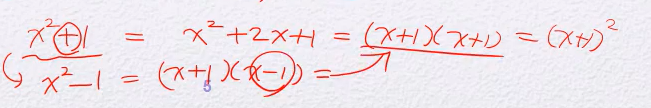

1. 모드2 이므로 2x 추가
2. `+`와 `-`가 같으므로 `x^2 - 1`로 변환

### AES?

Advanced Encryption의 표준
DES : 56bit크기의 key 키 크기가 작아서 취약
키의 크기도 늘리고 성능 유지한게 AES

#### State

AES에서 쓰는 기본 자료구조  
128bit byte를 16개(4x4) 128bit단위로 암호화됨 plain text, ct

round key == subkey  
round key의 비트는 똑같지만 개수가 많아짐 : expanded key

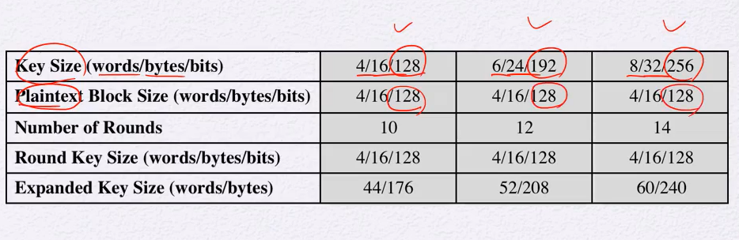  
key는 bit 수가 다른 여러가지 key가 있지만 plaintext는 항상 128bit로 고정이다  
key 비트수에 따라 반복되는 round수도 커진다  
round수가 늘어나면 라운드마다 쓰일 서브키(라운드키) 역시 증가한다

첫라운드전 한 번 + 각 라운드별로 서브키가 하나씩 사용됨  
라운드 개수+1만큼 필요  
서브키가 16byte 라운드가 11일경우  
16\*11 = 176

### AES Encryption Process

---

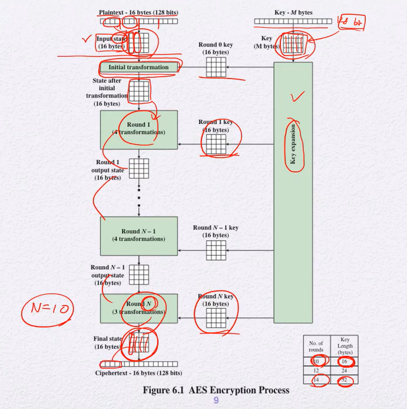
State (4x4)  
: 평문을 열로 나열해서 자름

**initial transformation**  
: 평문state와 key state를 xor

**round**

**key expansion(key schedule)** = 서브키를 만들어내는 과정

### Detailed Structure

---

결과적으로 AES에서 내부적으로 하는일은 전체적인 데이터의 블록(4x4)들을 substitution과 permutation을 이용해서 업데이트함

key가 128bit = 4 word일 때,  
필요한 라운드키는 4\*11 word 총 44개가 필요  
이를 w[0] ~ w[43]으로 표현할 것임

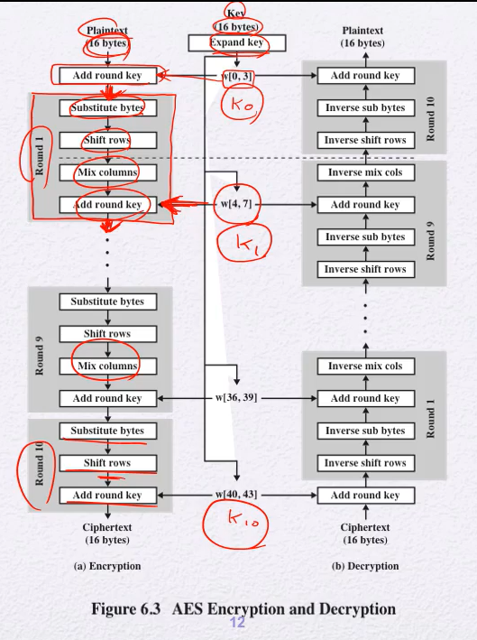
구현상의 편의성때문에 마지막 프로세스에선 Mix columns없음

### 4개의 프로세스

---

#### 1. Sub Bytes

---

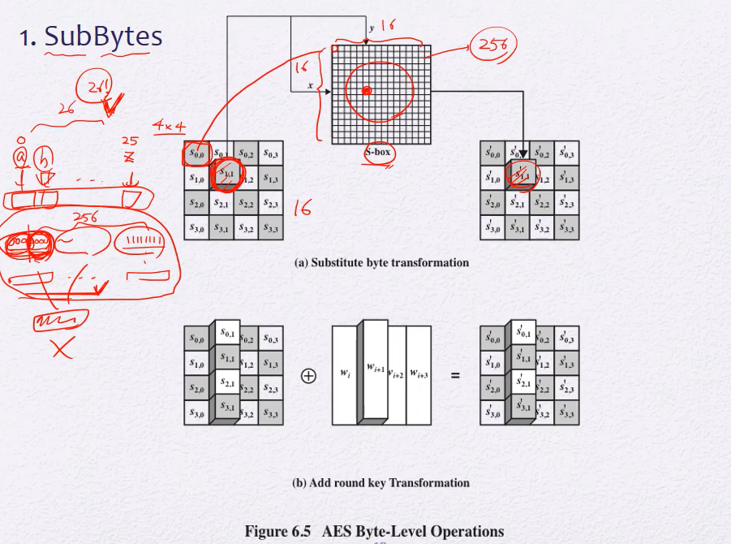
byte단위로 업데이트. 치환을 해준다.
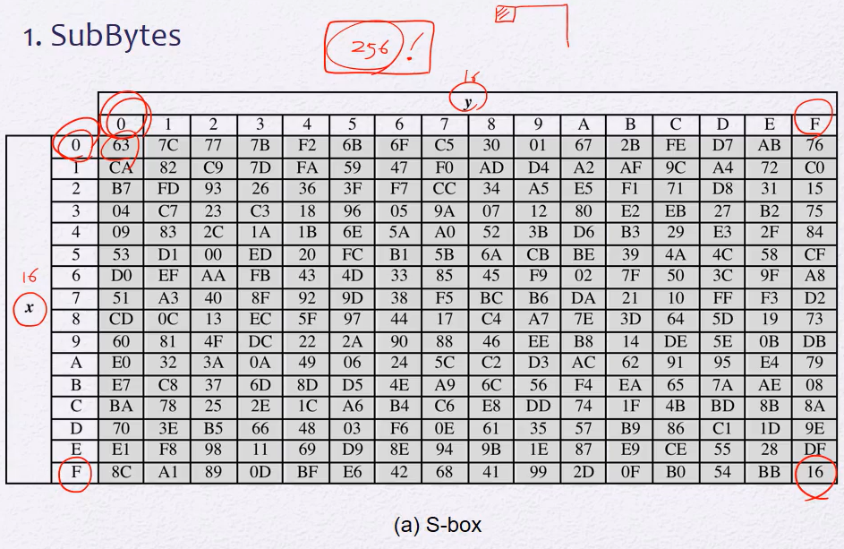  
S-box각 바이트들을 다른 바이트로 대체해주는 규칙  
모든 S-box사용자들이 같은 규칙을 씀(key의 일부가 아니라 정해진 방법) : 서로 다른 8bit가 다른 8bit와 1대1연결되어있다

4x4의 state의 각 byte, 총 16개의 byte를 S-box에 보낸다

16개의 byte를 독립적으로.

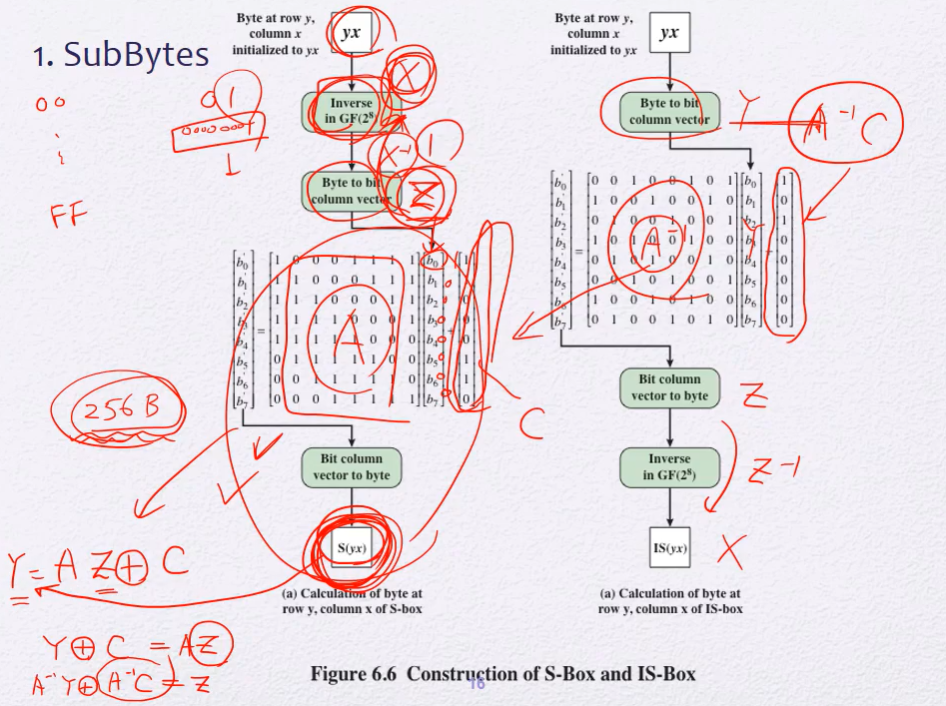

`Inverse in GF(2^8)`

각 byte에 대한 역원을 구한다.

00000000 : 0의 역원은 0이므로 0은 그대로 0

`(1)`**00000000**이 들어갔다고 칠 때, 옆에 bit가 `(2)`**11000110**

`(1)`의 끝 bit와 `(2)`의 앞 bit부터 `xor`시킨다

결과값은 01100011으로 0을 S-box에 통과시키면 63이 된다.

인풋과 아웃풋의 상관관계를 예측하기 어려운 암호가 좋은 암호

-> linear 함수를 사용 자제. 곱셈이나 곱셈의 역원 사용

#### 2. Shift Rows

---

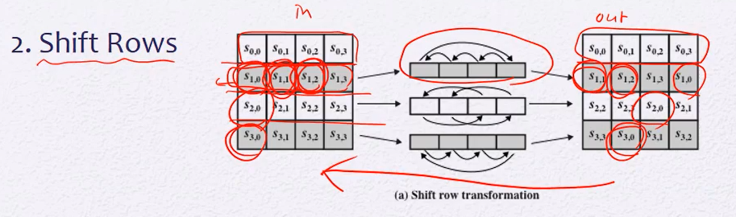

Row, 행만 움직임. 열은 움직이지않음

동작 자체는 간단하나 column에 대한 연산만 반복하면 잘 안섞임

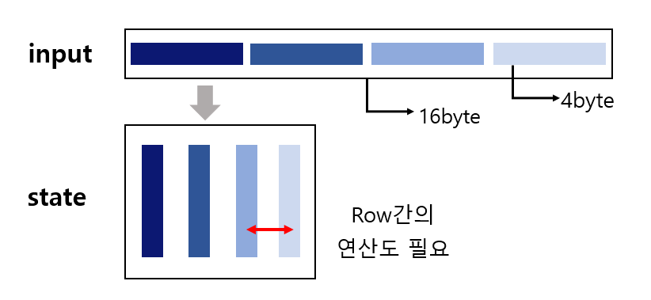

#### 3. Mix Columns

---

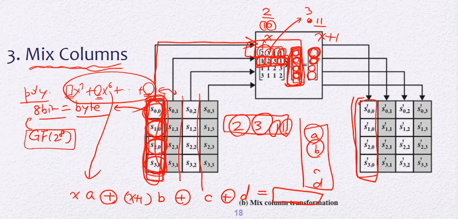

마찬가지로 Columns만 움직임

cell하나가 하나의 byte

8bit를 다항식의 개수로 본다.(GF(2^8)의 폴리노미얼로 표현되는 원소가 된다)

일종의 substitution연산

#### 4. Add Round Key

---

단순히 `xor` : 128bit의 State를 128bit 라운드키와 `xor`

그러나 Round key expansion은 복잡

### 전체적인 프로세스

---

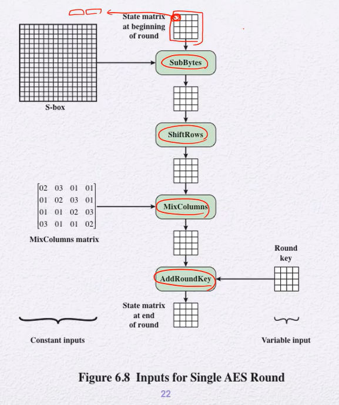

Add Round Key 전에는 input이 같으면 모두 똑같이 나오지만 Round key에 따라 같은 input이더라도 다른 output이 나온다.

**AES의 안전성을 보장하는 가장 큰 요인은 key이다**

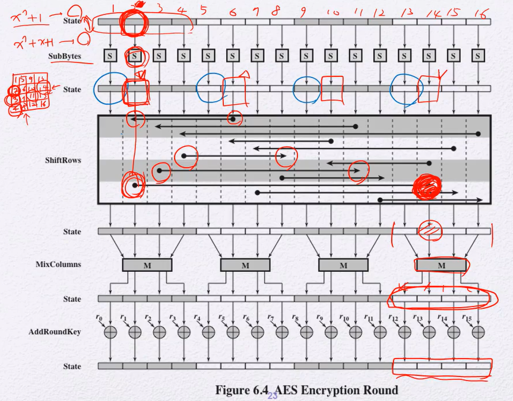

`ShiftRows`로 인해

1. 첫 번째 행은 이동 안함.
2. 두 번째 행은 오른쪽으로 세 칸(=왼쪽으로 한 칸) 이동
3. 세 번째 행은 오른쪽으로 두 칸 이동
4. 네 번째 행은 오른쪽으로 한 칸 이동

바뀐 한 byte로 인해 `MixColumns`를 하면 더 다른 다항식이 만들어진다.

#### key expansion

---

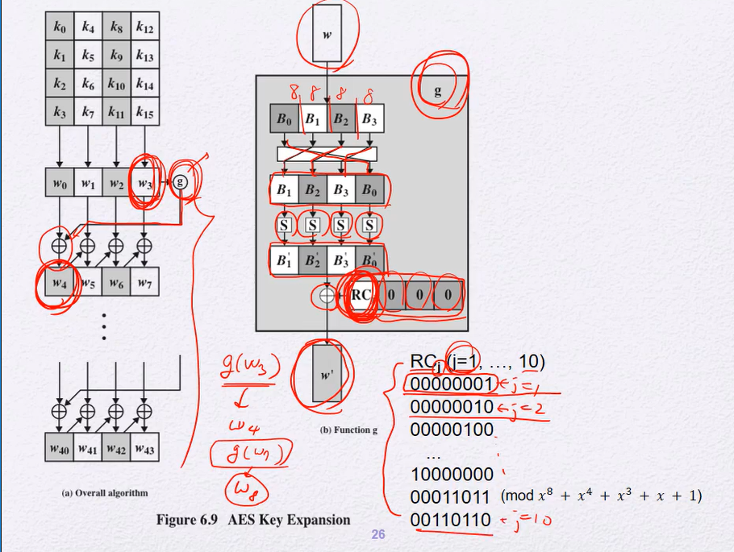

nonlinearity

Diffusion: 어떤 한 비트의 변화가 여러 비트에 영향을 미치게 만드는 효과

### AES의 장점

안전성도 안전성이지만 여러가지 프로세스적면에서 효율적

1. 8bit의 기본 연산을 사용하는 cpu에서 잘동작한다.
2. xor이나 shift 오퍼레이션등 간단한 연산 사용

_우리가 사용하는건 32-bit processor인데 8bit연산이 효율적일까?_  
32bit에서도 잘동작함.  
BS, SR, MC의 세 오퍼레이션을 하나로 합칠수있음  
4table lookups + 4XORs로 끝낼 수 있다
