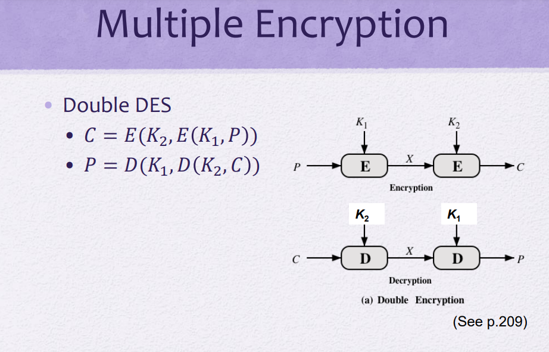
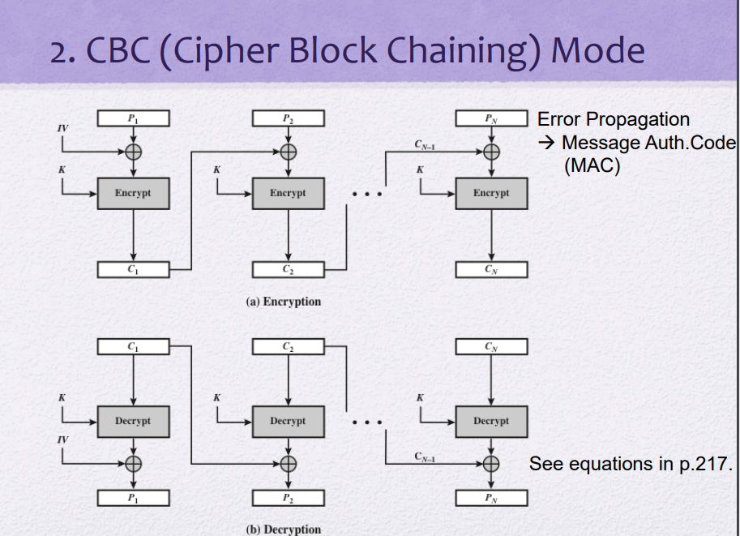
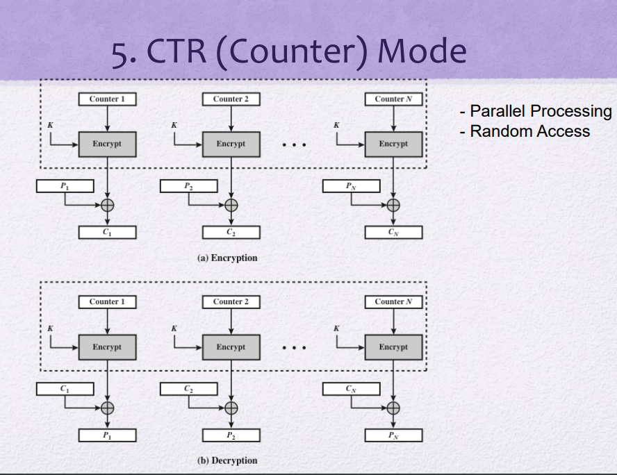

## Multiple Encryption

암호화를 두 번 적용하면 더 강력해지지않을까? 를 실현!

암호화를 두 번 적용 - 키가 두 개 존재

K1를 써서 나온 결과에 또 K2를 써서 암호화 두 번

C = E(K2, E(K1, P ))

P = D(K1, D(K2,C))

파훼법: **Meet in the Middle Attack**

중간 결과 X = E(K1, P ) = D(K2,C)

중간 결과가 같은 쌍을 찾는다

## Triple-DES with two keys

세 번 돌리자!

그러나 세 번 돌리니까 너무 오래 걸림 ...ㅠㅠ

다른 방법!!! -> AES 표준

## Modes of Operation

모든 Block Cipher에게 적용됨 ex) DES AES

### 1. ECB(Electronic CodeBook) Mode

> 암호화하려는 메시지를 여러 블록으로 나누어 각각 암호화함
>
> 어떤 입력이 들어오면 어떤 출력이 테이블처럼 나감
>
> same input -> same output

- 만약 Plain text가 128bit보다 커진다면? 한 블록으로 안돼서 여러 블록으로 자를것

- 각각의 블록들에 대해 같은 key를 적용한다(key는 여러개의 서브키로...)
- Permutation cipher처럼 입력과 출력이 대응되어 있음 : 같은 key를 넣고 같은 plaintext를 넣으면 같은 ciphertext가 나옴

- 병렬진행가능
- 블록모드

- 양이 많은 데이터를 암호화하는것은 추천하지않음. 짧은 데이터에서 사용됨
- 모든 블록이 같은 암호화 키를 사용하기 때문에 보안에 취약함

### 2. CBC (Cipher Block Chaining) Mode

> 각 블록은 암호화되기 전에 이전 블록의 암호화 결과와 XOR됨

- block ciphering이 여러번 수행됨, xor사용

- 문제 : 에러가 전파됨

- CBC로 쉽게 MAC (=MIC)을 구현할 수 있다

​ Message Actheticate Code

​ Message Integrity Code

- 블록 모드

> **암호화가 목적이 아닌 Integrity, Athentication이 목표일 때:**
>
> 여러 C 1...n중 마지막 Cn만 취한다.
>
> key를 가지고 Encryption을 순방향으로 돌린다. 돌려서 얻은게 C'n
>
> Cn과 C'n이 같은지 확인한다
>
> 만약 P1...n중 뭐든 1bit라도 오류가 생겼다면 둘은 같지않다.
>
> 이걸로 올바른 key를 가진 사람에게서 데이터가 전송된 것이므로 Authentication 가능 & 데이터가 문제없이 전송됐는지 확인 가능 Integrity

 

### 3. CFB (Cipher FeedBack) Mode

> 암호화된 결과를(그림의 C) 피드백
>
> CFB 모드에서는 암호 알고리즘이 생성하는 비트열을 키 스트림이라고 부름
>
> 키 스트림을 생성하기 위해 의사난수 생성기(암호 알고리즘)를 사용함
>
> 초기화 벡터(IV)가 의사난수 생성기의 seed에 해당

- Block Cipher를 Stream Cipher처럼 사용 - 스트림 모드
- 실제로 block이 적용되는건 xor할때뿐

- CBC Mode와 비슷해 보이지만 Stream Mode이다

- Plain text가 생성되기 전까지 그 다음 key stream을 만들 수 없다. (Stall)
- 이를 개선한 것이 OFB. 피드백하는 부분이 바뀜
- CBC처럼 에러가 전파됨 (MAC 구현 가능)
- ECB, CBC 모드에서는 암호 알고리즘을 이용하여 평문 블록을 암호화했지만 CFB는 평문블록을 암호 알고리즘으로 직접 암호화하지않는다. (평문블록과 암호문블록 사이 암호화가 없음 )

> 📌 **Tip!**
>
> Stream Mode인지 Block Mode인지 구별하려면?
>
> `Decryption`을 할 때 **Encrypt**를 똑같이 사용한다면 Stream Mode이다

### 4. OFB (Output FeedBack) Mode

> 암호 알고리즘(그림의 Encrypt)의 출력을 암호 알고리즘의 입력으로 피드백
>
> CFB는 암호화된 결과를(그림의 C) 피드백

- Block Cipher를 Stream Cipher처럼 사용
- Stream Mode이다
- Cipher에 피드백이 아니라 Output에 피드백

- No Stalling (Preprocessing) : plaintext가 오기전에 쭉 해둘수있다
- 병렬화가 안됨. 결국 앞 단계에서 결과가 나와야 뒷 단계가 진행됨 (No Parallelism) 자원이 많아도 성능을 향상시키는데 한계가 존재
- 에러 전파가 안됨 (아웃풋을 피드백하는거라서)

### 5. CTR (Counter) Mode

- Stream Mode

- 병렬화하면서 동시에 같은 블럭이 다른 블럭으로 나올 수 있게 되어있음(Plaintext가 같더라도 Ciphertext가 다르게 나온다)
- 카운터를 입력으로 줌. 카운터는 숫자 ex) 1
- 피드백이 없지만 Counter들끼리 연관되어있다 1, 2, 3 ...
- Counter가 달라서 Plaintext이 같아도 다른 Ciphertext이 나옴
- Random access : 꼭 첫번째 Plaintext부터 Encryption 안해도 됨. 150번째 P부터 하고싶다면 Counter를 150으로 시작하면된다

### 다섯가지 특징 비교

> Pre-processing
>
> 복잡한 연산을 먼저 할 수 있는가
>
> ECB, CBC,CFB 는 plain text가 있어야 Encrypt할 수 있으므로 불가

> CTR : Confidentiality
>
> CBC : MAC - Integrity, Authenticataion
>
> CCM (CTR with CBC-MAC)

Mode, Block Cipher의 실제 사례를 봐보자!

### IEEE 802.11 (WPA2/3)

> 무선 통신 표준
>
> AES-CCMP

무선랜을 검색해보면 access point들 뜸.

WPA2를 이용해서 보호됨 : 암호를 입력해야 access가능

삼성 스마트폰, 애플 모두 무선랜에 접속가능. 표준이 있기 때문

### TLS v1.3 (IETF RFC 8446)

> Transport Layer Security
>
> Transport층에 보안을 제공한다

- AES 128bit

- 이전에는 SSL이라 불렸으나 버전이 올라가면서 TLS로 변경

- `https` : http프로토콜을 TLS위에 올린 어플리케이션
