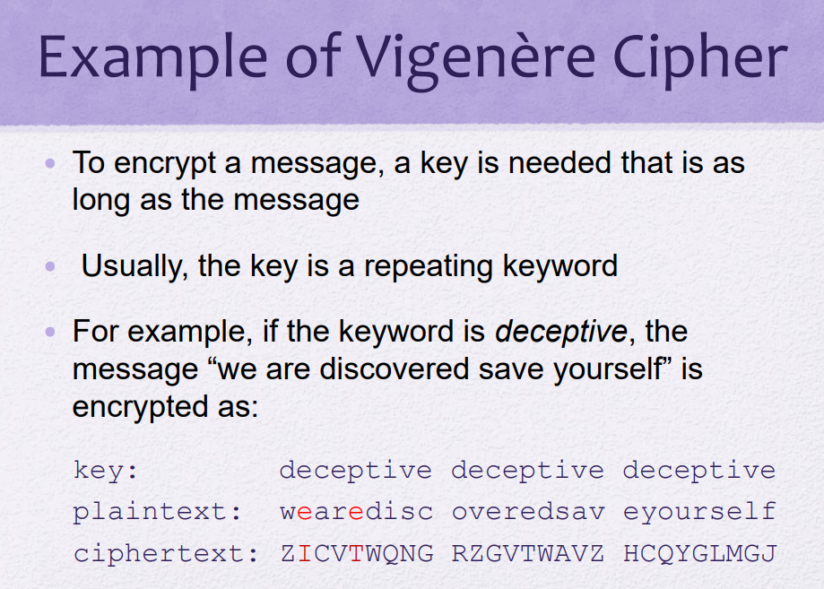

## Symmetric Cipher Model

> 대칭 암호 모델
>
> 시메트릭 : 대칭
>
> 어시메트릭 : 비대칭

고전 암호는 무조건 시메트릭이다

고전 암호는 크게 `Substitution`과 `Transposition`으로 나뉜다

- `Substitution` : 평문을 치환 - 아예 다른 글자로 대체
- `Transposition ` : 평문안의 각 글자들을 지들끼리 위치 이동시킨다

`Substitution`은 아예 다른 글자로 바뀌지만 `Transposition`은 원래 있던 글자들은 유지된다

> 특징 :
>
> encryption 알고리즘이 강해야한다.
>
> 수신자와 송신자는 secret key를 가지고 있어야한다

### 공격자의 공격 분류

---

(위로 올라갈수록 어렵)

## Substitution Technique

---

평문을 치환 - 대체

ex) Caesar Cipher

- Monoalphbetic ciphers : 인풋이 같다면 미리 정해진 규칙에 의해 똑같이 변환된다.

- Polyalphabetic ciphers : 인풋이 같더라도 아웃풋이 다를 수 있다.

### 🔒 Caesar Cipher

---

알파벳을 3칸 옮김

C = E(3,p) = (p+3) mod 26 : 알파벳이 26개

> `일반화` C = E(k,p) = (p+k) mod 26
>
> `복원` P = D(k,C) = (C-k) mod 26

`파훼법` Brute-Force : key의 모든 후보들을 다 돌려서 모든 경우를 구해봄

key의 수가 작아서 가능함

그래서 발전한게 `Monoalphabetic Cipher` ex) Permutation

### 🔐 Monoalphabetic Ciphers

---

인풋이 같다면 미리 정해진 규칙에 의해 똑같이 변환된다.

#### 🔒 Permutation

각 알파벳마다 임의의 글자 할당

**그럼 안전할까?**

NO!!!

1. 암호화된 글자가 나오는 빈도수에 따라 추정
2. 두글자, 세글자씩 짝 지어서 나오는 글자로도 추정 가능 ex) th, the

**이런 약점을 없애려면?**

1. 통계적인 정보를 없애거나

   ▶ **글자를 묶어서 치환시킨다** ex) Playfair Cipher

2. 완화시켜야한다

   ▶ **날마다 다른 글자로 대응시킨다**

### 🔒 Playfair Cipher

---

두글자를 두글자로 바꿔준다

5x5 행렬 사용

**규칙!**

1. 두 글자씩 잘랐을 때, 똑같은 두 글자가 연속이면 잘 안나오는 다른 글자를 껴넣는다

   > ba ll oo n -> ba lx lo on
   >
   > ll이 연속되었으므로 l과 l 사이 x를 넣어 연속되지않게한다

2. 두 글자가 같은 열일 때

   > 오른쪽으로 한 칸씩 옮긴다.
   >
   > ex) 'ar' 은 'RM' 으로 변환된다

3. 두 글자가 같은 행일 때

   > 2번과 같은 규칙. 아래로 한 칸씩 옮긴다.
   >
   > ex) 'mu' 는 'CM' 으로 변환된다

4. 두 글자의 열과 행이 다를 때

   > 두 글자를 포함시킨 사각형 구조를 만들어 대칭되는 꼭지점으로 변환한다.
   >
   > ex)
   >
   > 'hs' -> 'BP'
   >
   > 'ea' -> 'IM'

I/J중 뭘로 하든 상관없음

**두 개씩 짝지어서 변환했으므로 통계 추정하기가 더 힘들어짐**

### 🔐 Polyalphabetic Ciphers

---

- 한글자씩 대응

- `but` 대응 규칙이 여러개임

- `monoalphabetic substitution` 규칙을 여러개 사용할 것

- `key`에 따라 여러 개의 규칙 중 어떤 것을 선택할지 결정하게됨

ex) vigenere cipher

### 🔒 Vigenere Cipher

---

- 시저 암호를 여러 개 사용함

- message를 암호화하기 위해서 message와 길이가 똑같은 key가 필요

- 현실적으로 그 만큼 긴 길이의 key를 만들긴 힘들어서 일정 길이의 key를 반복시킨다

- **key의 번호에 맞게 각 글자를 암호화한다.** (a = 0, b = 1, ...)



**파훼법**

1. 사이클 길이를 가정한다 (key는 어떤 단어가 반복되므로 사이클이 존재)
2. 사이클 길이에 맞는 통계분석을 실시

그러나 `autokey`가 등장했다면?

key다음에 평문을 이어붙여 길게만든다

: 사이클 추정이 불가능하다!!!

**but ... 어쨌든 key에서 가장 많이 나오는 글자로 추정이 가능하다**

key도 plaintext도 영어이기때문에 가장 많이 나오는 글자가 존재

어렵겠지만 추정이 가능한듯??

### 🔒 Vernam Cipher

---

알파벳을 그대로 사용하지않고 알파벳을 어떤 코드 체계를 통해서 bit 시퀀스로 바꾼다. 그 bit 시퀀스를 keyword에 해당하는 다른 bit 시퀀스와 더한다.

```
(p + k) mod 2
```

mod 2의 재미난 성질 ~ 더하기와 빼기가 같답니다~

```
+` = `-` = `xor
```

**key bit stream을 사용해 최대한 key의 길이를 길게!**

### 🔒 One-Time Pad

---

key를 극단적으로 길게 만들어서 사이클이 없게

```
random key
```

`unbreakable` : 깨지지않음. 랜덤이라 파훼불가능. perfect secrecy!!!

문제 : 현실적이지않음... 실용적x, 엄청 긴 램덤키가 필요하기때문

데이터가 적고 안전성이 좋은 채널에서 사용

## Transpostion Cipher

---

평문안의 각 글자들을 지들끼리 위치 이동시킨다

ex) Rail Fence Cipher

### 🔒 Rail Fence Cipher

---

plaintext를 대각선 형태로 쓰고 행으로 읽음

depth(몇 개의 행)

### 🔒 Row Transposition Cipher

---

레일 펜스보다 복잡함

key는 1~n까지의 수, key에 해당하는 열 순으로 읽음

### 🔒 Steganography

---

평범한 메시지인척 비밀 메시지 숨겨놓기~

- 캐릭터 마킹 : 타자가 된 글자에 연필로 일부 글자 덮어쓰기
- Invisible ink : 열 가하면 보이는 잉크
- Pin punctures : 잘안보이는 구멍
- Typewriter correction ribbon : 타자된 글자기에 리본...을 흡수 ..뭐요? 어쨌뜬 타자기를 활용해서 글자를 보일락말락하게

`단점` :

오버헤드, 조그만 양을 숨기기위해 많은 데이터 필요

숨겼다는 사실만 알면 들키기 쉬움

`장점` :

평범하게 보임. 암호문이라는 것을 눈치채기어려움
