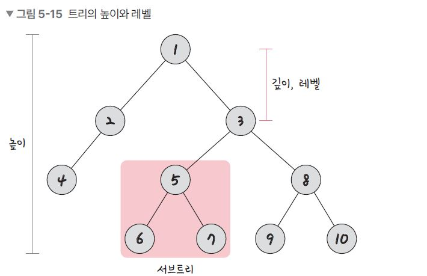
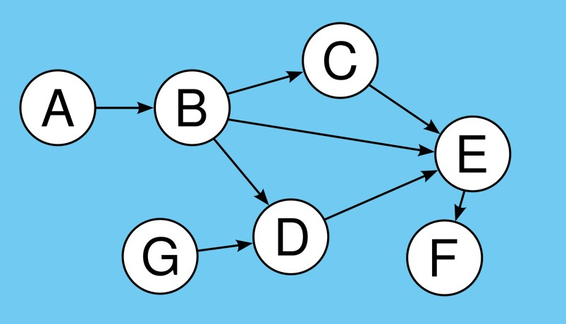
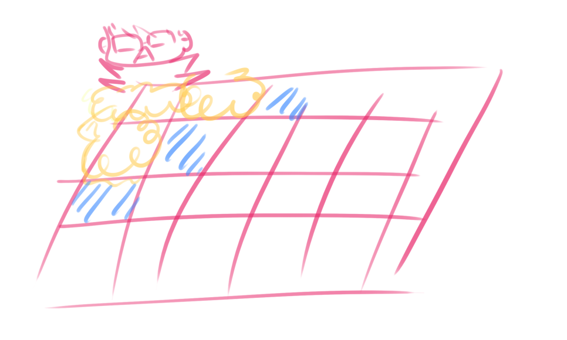
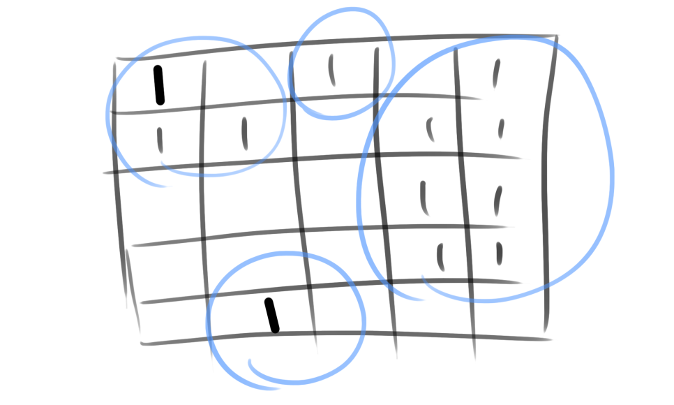
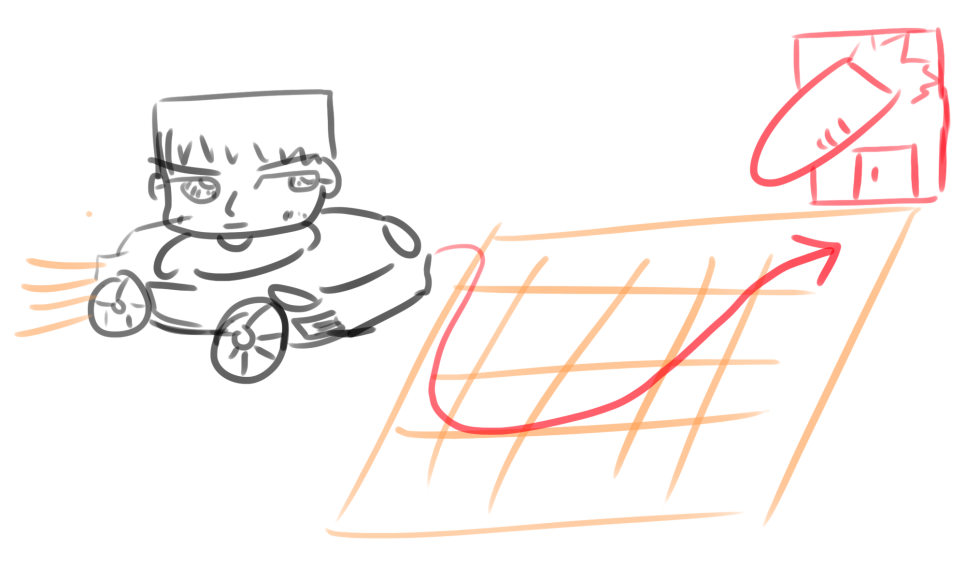
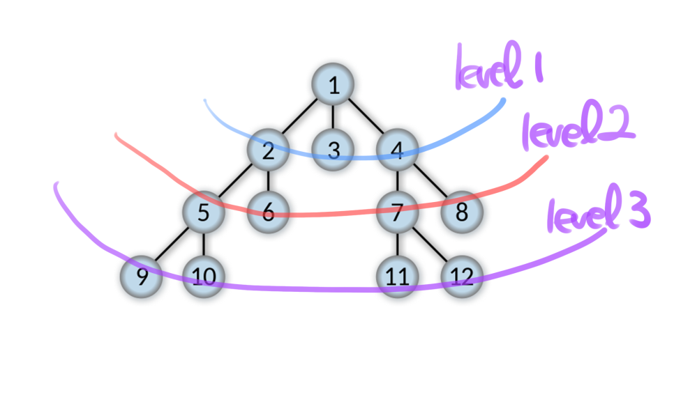
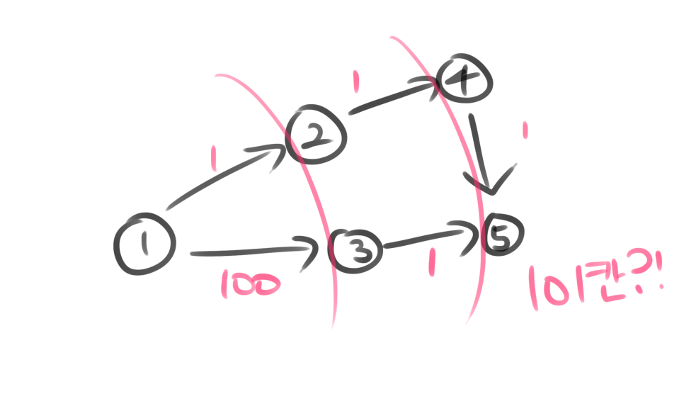

## 트리

> 트리는 그래프 이론에서 사이클이 없는 무방향 그래프 또는 사이클이 없는 방향그래프인 DAG(Directed Acyclic Graph)를 지칭한다.



- 깊이: 트리에서의 깊이는 각각의 노드마다 다르며 루트 노드에서 특정 노드까지 최단거리로 갔을 때의 거리를 말합니다. 예를 들어 4번 노드의 깊이는 2입니다.
- 높이: 트리의 높이는 루트 노드부터 리프 노드까지의 거리 중 가장 긴 거리를 의미하며 앞 그림의 트리 높이는 3입니다.
- 레벨: 트리의 레벨은 주어지는 문제마다 조금씩 다르지만 보통 깊이와 같은 의미를 지닙니다. 1번 노드를 0레벨이라고 하고 2번 노드, 3번 노드까지의 레벨을 1레벨이라고 할 수도 있고, 1번 노드를 1레벨이라고도 할 수 있습니다. 예를 들어 1번 노드를 1레벨이라고 한다면 2번 노드와 3번 노드는 2레벨이 됩니다.
- 서브트리: 트리 내의 하위 집합을 서브트리라고 합니다. 트리 내에 있는 부분집합이라고도 보면 됩니다. 지금 보면 5번, 6번, 7번 노드가 이 트리의 하위 집합으로 "저 노드들은 서브트리다"라고 합니다.

## DAG (Directed Acyclic Graph)

> 방향성이 있고 사이클이 없는 그래프



- **추후 DP를 배울 때 무조건 DAG를 만들어서 합니다.** 예를 들어 문제에서 양방향 그래프로 주어졌고 이 해당 그래프에서 DP를 해야한다면 그냥 할 것이 아니라 DAG를 만들어서 해야합니다.

## 그래프 표현 방법

### 📌 인접 행렬

정점과 간선의 관계를 정사각형 행렬을 사용해서 표현한다. <br/>

graph[1] [3] == 1 이라면, 1번 노드에서 3번 노드로 연결된 간선이 존재한다는 의미이다.

```cpp
bool graph[1004][1004];

for (int i = 0; i < V; i++){
    for (int j = 0; j < V; j++){
        if(graph[i][j]){
            cout << i + "에서 "+ j + "까지의 경로가 존재한다.\n";
        }
    }
}
```

공간복잡도와 시간복잡도는 O(V\*2)이다. (모든 V들에 연결될 가능성이 있는 V들을 전부 탐색하기 때문)

### 📌 인접 리스트

정점과 간선의 관계를 연결 리스트를 사용해서 표현한다. <br/>

graph[1].push_back(3)은 1번에서 3번노드로 가는 간선이 있다는 의미이다.

```cpp
vector<int> graph[1004];

for(int i = 0; i < V; i++){
    for(int there : graph[i]){
        cout << i + "에서 "+ there + "까지의 경로가 존재한다.\n";
    }
}
```

공간복잡도와 시간복잡도는 O(V + E)이다. (모든 V들에 연결되어있는 V들만 탐색하기 때문)

> 보통 인접리스트로 할 생각을 하고 문제에서 만약에 인접행렬로 주어졌다면 인접행렬로 푸는 것이 좋다.

### 예제 - 종화는 방구쟁이야!

> 그래프내 컴포넌트의 개수를 구하는 문제



종화는 21세기 유명한 방구쟁이다. 종화는 방구를 낄 때 "이러다... 다 죽어!!" 를 외치며 방구를 뀌는데 이렇게 방귀를 뀌었을 때 방귀는 상하좌우 네방향으로 뻗어나가며 종화와 연결된 "육지"는 모두 다 오염된다. "바다"로는 방구가 갈 수 없다. 맵이 주어졌을 때 종화가 "이러다... 다 죽어!!"를 "최소한" 몇 번외쳐야 모든 맵을 오염시킬 수 있는지 말해보자. 1은 육지며 0은 바다를 가리킨다. <br/><br/>

**입력**<br/>

맵의 세로길이 N과 가로길이 M 이 주어지고 이어서 N \* M의 맵이 주어진다. <br/><br/>

**출력**<br/>

"이러다... 다 죽어!!"를 몇번외쳐야하는지 출력하라. <br/><br/>

**범위**<br/>

1 <= N <= 100<br/>

1 <= M <= 100 <br/>

### dfs로 구현

```cpp
#include <bits/stdc++.h>

using namespace std;

int m, n;

int dx[4] = {0, 1, 0, -1};
int dy[4] = {1, 0, -1, 0};

int graph[101][101];
int visited[101][101];

void dfs(int x, int y) {
	int cx, cy;
	for (int i = 0; i < 4; i++) {
		cx = x + dx[i];
		cy = y + dy[i];

		if (cx < 0 || cy < 0 || cx >= n || cy >= n) {
			continue;
		}

		if (graph[cx][cy] && !visited[cx][cy]) {
			visited[cx][cy] = visited[x][y] + 1;
			dfs(cx, cy);
		}
	}
}

int main() {
	cin >> n >> m;

	for (int i = 0; i < n; i++) {
		for (int j = 0; j < m; j++) {
			cin >> graph[i][j];
		}
	}

	int cnt = 0;
	for (int i = 0; i < n; i++) {
		for (int j = 0; j < n; j++) {
			if (graph[i][j] && !visited[i][j]) {
				visited[i][j] = 1;
				dfs(i, j);
				cnt++;
			}
		}
	}
	cout << "\n";
	cout << cnt << "번 필요\n";
}
```

```
// 입력
5 5
1 0 1 0 1
1 1 0 0 1
0 0 0 1 1
0 0 0 1 1
0 1 0 0 0

// 출력
4번 필요
```

<br/>

이처럼 그래프내에서 컴포넌트를 구하는 문제는 dfs를 사용하면 쉽게 해결할 수 있다.



### 예제 - 당근마킷 엔지니어 승원이

> 가중치가 같은 그래프에서 최단 거리를 구하는 문제



승원이는 당근을 좋아해서 당근마킷에 엔지니어로 취업했다. 당근을 매우좋아하기 때문에 차도 당근차를 샀다. 이 당근차는 한칸 움직일 때마다 당근을 내뿜으면서 간다. 즉, "한칸" 움직일 때 "당근한개"가 소모된다는 것이다. 승원이는 오늘도 아침 9시에 일어나 당근마킷으로 출근하고자 한다. 승원이는 최단거리로 당근마킷으로 향한다고 할 때 당근몇개를 소모해야 당근마킷에 갈 수 있는지 알아보자. 이 때 승원이는 육지로만 갈 수 있으며 바다로는 못간다. 맵의 1은 육지며 0은 바다를 가리킨다. 승원이는 상하좌우로만 갈 수 있다. <br/><br/>

**입력**<br/>

맵의 세로길이 N과 가로길이 M 이 주어지고 이어서 N \* M의 맵이 주어진다. 그 다음 줄에 승원이의 위치(y, x)와 당근마킷의 위치(y, x)가 주어진다. <br/><br/>

**출력**<br/>

당근을 몇개 소모해야 하는지 출력하라.<br/><br/>

**범위**<br/>

1 <= N <= 100<br/>

1 <= M <= 100 <br/>

### dfs로 구현

```cpp
#include <bits/stdc++.h>
#include <unordered_map>
using namespace std;

int m, n, ax, ay, bx, by;
int cnt;

int dx[4] = {0, 1, 0, -1};
int dy[4] = {1, 0, -1, 0};

int graph[101][101];
int visited[101][101];

void dfs(int x, int y) {
	int cx, cy;
	for (int i = 0; i < 4; i++) {
		cx = x + dx[i];
		cy = y + dy[i];

		if (cx < 0 || cy < 0 || cx >= n || cy >= n) {
			continue;
		}

		if (graph[cx][cy] && !visited[cx][cy]) {
			visited[cx][cy] = visited[x][y] + 1;
			dfs(cx, cy);
		}
	}
}

int main() {
	cin >> n >> m;
	cin >> ax >> ay;
	cin >> bx >> by;

	for (int i = 0; i < n; i++) {
		for (int j = 0; j < m; j++) {
			cin >> graph[i][j];
		}
	}

	visited[ax][ay] = 1;
	dfs(ax, ay);

	cout << "\n";
	cout <<  visited[bx][by] << "개 필요\n";

	for (int i = 0; i < n; i++) {
		for (int j = 0; j < n; j++) {
			cout << visited[i][j] << ' ';
		}
		cout << "\n";
	}
}
```

```
// 입력

5 5
0 0
4 4
1 0 1 0 1
1 1 1 0 1
0 0 1 1 1
0 0 1 1 1
0 0 1 1 1

// 출력

9개 필요
1 0 5 0 9
2 3 4 0 8
0 0 5 6 7
0 0 12 13 8
0 0 11 10 9
```

<br/>

첫 번째 문제에서 사용한 코드를 거의 똑같이 재활용했다. 정답인 9가 나오는 것을 볼 수 있다. 하지만 dx와 dy를 다음과 같이 수정하면 어떻게 될까?

```cpp
int dx[4] = {0, -1, 0, 1};
int dy[4] = {-1, 0, 1, 0};
```

- 똑같이 상하좌우를 전부 탐색하지만, 하 -> 좌 -> 상 -> 우 순으로 탐색하게 변경됐다.

```
// 입력
5 5
0 0
4 4
1 0 1 0 1
1 1 1 0 1
0 0 1 1 1
0 0 1 1 1
0 0 1 1 1

// 출력
13개 필요
1 0 5 0 9
2 3 4 0 8
0 0 5 6 7
0 0 10 9 8
0 0 11 12 13
```

- 결과는 위와 같다.
- dfs는 한 노드를 기준으로 쭉 파고들어가기 때문에 만약 최단 거리인 9보다 더 거리가 긴 노드부터 탐색한다면, 우리가 원하는 결과값이 나오지않을 수도 있다.

<br/>

물론 dfs의 코드를 아래와 같이 바꾸면 올바른 탐색이 가능하긴하다.

```cpp
void dfs(int x, int y) {
	int cx, cy;
	for (int i = 0; i < 4; i++) {
		cx = x + dx[i];
		cy = y + dy[i];

		if (cx < 0 || cy < 0 || cx >= n || cy >= n) {
			continue;
		}

		if (graph[cx][cy] && !visited[cx][cy]) {
			visited[cx][cy] = visited[x][y] + 1;
			dfs(cx, cy);
		}

        // 이미 방문한 노드라도 지금 탐색중인 루트가 더 최단거리일경우, 재탐색
		if (graph[cx][cy] && visited[cx][cy]) {
			if (visited[cx][cy] > visited[x][y] + 1) {
				visited[cx][cy] = visited[x][y] + 1;
				dfs(cx, cy);
			}
		}
	}
}
```

- 이미 방문한 노드라도 지금 탐색중인 루트가 더 최단거리일경우, 재탐색하게하면 최단 거리를 구할 수 있다.
- 그러나 if문이 이중으로 들어가서 가독성이 떨어지고, 이미 탐색한 루트를 다시 탐색할 수도 있으니 시간이 좀 더 걸린다.
- 그럼 어떤 방법으로 푸는게 더 좋을까? 답은 bfs로 구현하는 것이다.

### bfs로 구현

이 문제처럼 `가중치가 같은 그래프 내의 최단거리알고리즘` 같은 문제는 dfs로 구현하는 것보다 bfs로 구현하는게 메리트가 있다.

<br/>



bfs는 위처럼 레벨별로 탐색을 수행하기에 최단 거리를 구하는 데에 최적인 알고리즘이다. bfs는 queue를 사용해 구현한다.

```cpp
#include <bits/stdc++.h>
#include <unordered_map>
using namespace std;

int m, n, ax, ay, bx, by;
int cnt;

int dx[4] = {0, -1, 0, 1};
int dy[4] = {-1, 0, 1, 0};

int graph[101][101];
int visited[101][101];


int main() {
	cin >> n >> m;
	cin >> ax >> ay;
	cin >> bx >> by;

	for (int i = 0; i < n; i++) {
		for (int j = 0; j < m; j++) {
			cin >> graph[i][j];
		}
	}

	visited[ax][ay] = 1;

	queue<pair<int, int>> q;
	visited[ax][ay] = 1;
	q.push({ ax, ay });
	int x, y, cx, cy;
	while (!q.empty()) {
		pair<int, int> cur = q.front();
		q.pop();
		x = cur.first; y = cur.second;
		for (int i = 0; i < 4; i++) {
			cx = x + dx[i];
			cy = y + dy[i];

			if (cx < 0 || cy < 0 || cx >= n || cy >= n) {
				continue;
			}

			if (graph[cx][cy] && !visited[cx][cy]) {
				visited[cx][cy] = visited[x][y] + 1;
				q.push({ cx,cy });
			}
		}
	}

	cout << "\n";
	cout <<  visited[bx][by] << "개 필요\n";

	for (int i = 0; i < n; i++) {
		for (int j = 0; j < n; j++) {
			cout << visited[i][j] << ' ';
		}
		cout << "\n";
	}
}
```

```
// 입력
5 5
0 0
4 4
1 0 1 0 1
1 1 1 0 1
0 0 1 1 1
0 0 1 1 1
0 0 1 1 1

// 출력
9개 필요
1 0 5 0 9
2 3 4 0 8
0 0 5 6 7
0 0 6 7 8
0 0 7 8 9
```

<br/>

### 가중치가 다른 그래프내의 최단거리 문제라면?



1번 노드에서 5번 노드까지의 최단 거리는 3이지만 레벨별로 탐색한다면 101이 나오게 된다. 즉, bfs는 가중치가 다른 그래프에서는 사용할 수 없다.

> 가중치가 다른 그래프 내에서 최단거리 알고리즘은 다익스트라, 벨만포드 등을 써야 한다.

## dfs와 bfs 비교

| 이름 | 설명                                                                                                    |
| ---- | ------------------------------------------------------------------------------------------------------- |
| DFS  | 메모리를 덜 씀. 그래프내 컴포넌트의 개수를 구할 수 있음. 코드가 좀 더 짧으며 완전탐색의 경우에 많이 씀. |
| BFS  | 메모리를 더 씀. 가중치가 같은 그래프내에서 최단거리를 구할 수 있음. 코드가 더 김                        |

문제에서 "퍼져나간다", "탐색한다" 이 2글자가 있으면 반드시 DFS, BFS가 생각이 나야 한다.

## 참고

**[출처]** [[알고리즘 강의\] 2주차. 그래프이론, DFS, BFS, 트리순회](https://blog.naver.com/jhc9639/222289089015)|**작성자** [큰돌](https://blog.naver.com/jhc9639)
