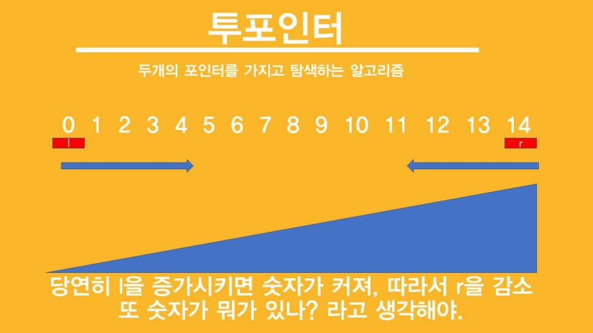

## 투포인터

> 두 개의 포인터를 가지고 탐색하는 알고리즘


* 시작 지점과 끝 지점에 두 개의 포인터를 사용해서 `범위`를 지정할 수 있다.
* 사진 처럼 시작과, 끝 지점에 각각의 포인터가 있을수도 있지만 시작지점에서 두 개의 포인터가 같이 시작할 수도 있다.

<br/>



* 투포인터는 원소를 정렬한 다음에 주로 사용한다.
* 원소가 오름차순으로 정렬되어 있다면, 왼쪽으로 갈수록 값이 작은 원소이고 오른쪽으로 갈수록 값이 큰 원소일 것이다.
* 투포인터를 활용하면, 숫자의 범위를 조정해 원하는 값의 숫자를 찾을 수 있다.

<br/>

글로만 보면 이해가 안가니 문제를 풀면서 이해해보자!


## 백준 1644 소수의 연속합

[백준 1644 소수의 연속합 링크](https://www.acmicpc.net/problem/1644) <br/>

어떤수 n이 주어졌을 때 연속되는 소수들의 합으로 n을 만들 수 있는 경우의 수가 몇 개인지를 출력하는 문제이다.

* ex) 41의 경우, 2+3+5+7+11+13 = 11+13+17 = 41 (세 가지)
* ex) 10의 경우 3 + 7 로 나타낼 수 있으나 두 소수는 연속되는 소수가 아니므로 경우의 수에 포함되지 않는다.

<br/>

이 문제는 연속되는 소수들의 합을 구해야 하므로, 어떤 `범위`를 지정하는 것이 중요하다. 투포인터는 `범위`를 정할 수 있는 좋은 알고리즘이다.

* low와 high는 각각 포인터이며, 둘 다 시작 지점에서 출발한다.
* 구간의 합이 n보다 작다면 high를 증가시켜 오른쪽의 원소를 합에 포함시킨다.
* 구간의 합이 n보다 크다면 low를 증가시켜 합에서 왼쪽 끝 원소의 값만큼 감소시킨다.

위 투포인터 로직을 사용해, 연속된 구간의 합을 구할 수 있다.

```cpp
#include <bits/stdc++.h>

using namespace std;

int n, low, high, sum, ans;
bool notPrime[4000001];
vector<int> v;

int main() {
	cin >> n;
	for (int i = 2; i <= sqrt(n); i++) { // 에라토스테네스의 체를 사용해 n이하인 소수들을 모두 구함
		for (int j = i * i; j <= n; j += i) {
			if (notPrime[j]) {
				continue;
			}
			notPrime[j] = 1;
		}
	}
	
	for (int i = 2; i <= n; i++) { // v에 n이하 소수들을 삽입
		if (!notPrime[i]) {
			v.push_back(i);
		}
	}
	
	while (true) { // 투포인터를 활용해서 n을 만들 수 있는 연속된 소수들의 합을 구함
		if (sum > n) {
			sum -= v[low++];
		}
		else if (high == v.size()) {
			break;
		}
		else if (sum <= n) {
			sum += v[high++];
		}

		if (sum == n) {
			ans++;
		}
	}
	cout << ans;
}
```


### 📌 에라토스테네스의 체

```cpp
for (int i = 2; i <= sqrt(n); i++) {
		for (int j = i * i; j <= n; j += i) { 
			if (notPrime[j]) {
				continue;
			}
			notPrime[j] = 1;
		}
	}
```

* 2부터 sqrt(n)까지 수로 만들 수 있는 모든 배수들을 구하면, 반대로 n이하의 자연수 중 소수인 수들도 구할 수 있다.
* `for (int j = i * i; j <= n; j += i)` : i \* k (k < i)의 수들은 이전 for문에서 미리 체크가 되므로, i \* i 부터 배수를 체크한다. 


### 📌 발생한 에러 : OutOfBound

```cpp
while (true) { // 투포인터를 활용해서 n을 만들 수 있는 연속된 소수들의 합을 구함
		if (sum > n) {
			sum -= v[low++];
		}
		else if (high == v.size()) {
			break;
		}
		else if (sum <= n) {
			sum += v[high++];
		}

		if (sum == n) {
			ans++;
		}
	}
```

<br/>

해당 부분의 코드를 아래와 같이 변경하면 `OutOfBound`에러가 난다.

```cpp
while (true) { // 투포인터를 활용해서 n을 만들 수 있는 연속된 소수들의 합을 구함
		if (sum > n) {
			sum -= v[low++];
		}
		else if (high > v.size() - 1) {
			break;
		}
		else if (sum <= n) {
			sum += v[high++];
		}

		if (sum == n) {
			ans++;
		}
	}
```

<br/>

`else if (high == v.size()) `와 `else if (high > v.size() - 1)`에 차이가 없는 것 같은데 왜 OutOfBound가 날지 고민했다.

* 결론은 벡터 v의 사이즈가 0일 경우, 에러가 나는거였다.
*  v가 1이라면, 1이하의 소수가 없어 v에 어떤 원소도 들어가지 않고, 아래 v[high++]부분에서 v[0]번 원소에 접근하려고 하기에 OutOfBound에러가 난다.
* 모든 경우의 수를 생각하며 코드를 작성하자 .... ㅠㅠ!


## 참고

* https://blog.naver.com/jhc9639/222319124359

