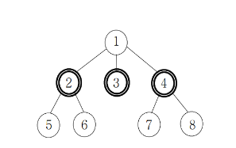

## 문제 : 사회망 서비스

[백준 2533 사회망 서비스(SNS)](https://www.acmicpc.net/problem/2533)

> - SNS의 친구 관계를 트리형태인 친구 관계 그래프로 표현한다.
> - 친구 관계 그래프에 속한 사람은 얼리어답터이거나 얼리어답터가 아니다.
> - 얼리 아답터가 아닌 사람들은 자신의 모든 친구들이 얼리 아답터일 때만 아이디어를 받아들인다.
> - 그래프안의 모든 사람들이 아이디어를 받아들이기 위해 필요한 최소 얼리어답터의 수를 구한다.

<br/>

친구 관계 그래프가 아래와 같을 경우, `2, 3, 4`번이 얼리어답터라면 그래프내의 모든 사람들이 아이디어를 받아들일 수 있다.



<br/>

## 풀이 방법

풀이 방법은 생각해봐도 모르겠어서 다른 분들의 풀이를 참고했다. 😋

- 각 노드들의 성질은 두 가지로 분리할 수 있다. (얼리어답터이거나, 얼리어답터가 아니거나.)
- dp[node]가 node를 포함한 `sub graph`내의 모든 노드들이 아이디어를 전파받기 위한 최소 얼리어답터의 개수라고 해보자.
- node는 두 가지의 성질을 가질 수 있으므로, dp\[node][0]과 dp\[node][1]로 나눌 수 있다.
  - dp\[node][0] 은 node가 얼리어답터가 아닐 경우, node를 포함한 `sub graph`내의 모든 노드들이 아이디어를 전파받기 위한 최소 얼리어답터의 개수로 보고,
  - dp\[node][1]은 node가 얼리어답터일 경우, node를 포함한 `sub graph`내의 모든 노드들이 아이디어를 전파받기 위한 최소 얼리어답터의 개수로 보자!

### 📌 어떤 노드 A가 얼리어답터가 아닐 경우

A와 연결된 모든 친구들이 얼리어답터이어야 아이디어를 받아들일 수 있다! <br/>

즉, A가 얼리어답터가 되기 위해서 필요한 최소 얼리어답터 개수는 연결된 노드들이 얼리어답터일 때 필요한 최소 얼리어답터 개수들의 합이다.<br/>

코드로 나타내면 이와 같다. dp\[node][0] += dp\[child][1]

### 📌 어떤 노드 A가 얼리어답터인 경우

A가 얼리어답터이므로, A와 연결된 친구들이 얼리어답터여도, 얼리어답터가 아니어도 A는 아이디어를 전파받는다.<br/>

즉, A를 포함한 `sub graph`내의 모든 노드들이 얼리어답터가 되기 위해서 필요한 최소 얼리어답터 개수는 dp\[node][1] += min(dp\[child][0], dp\[child][1])이 된다.

## 코드

```cpp
#include <bits/stdc++.h>

using namespace std;

int n, m, a, k, b, t;
int ans;

vector<int> graph[1000001];
bool visited[1000001];
int dp[1000001][2];

void go(int num) {
	visited[num] = 1;
	dp[num][0] = 0;
	dp[num][1] = 1;

	for (int next : graph[num]) {
		if (visited[next]) {
			continue;
		}
		go(next);
		dp[num][0] += dp[next][1];
		dp[num][1] += min(dp[next][0], dp[next][1]);
	}
}

 int main() {
	cin.tie(NULL); cout.tie(NULL); ios_base::sync_with_stdio(false);
	cin >> n;
	for (int i = 0; i < n - 1; i++) {
		cin >> a >> b;
		graph[a].push_back(b);
		graph[b].push_back(a);
	}
	go(1);
	cout << min(dp[1][0], dp[1][1]);
}

```
