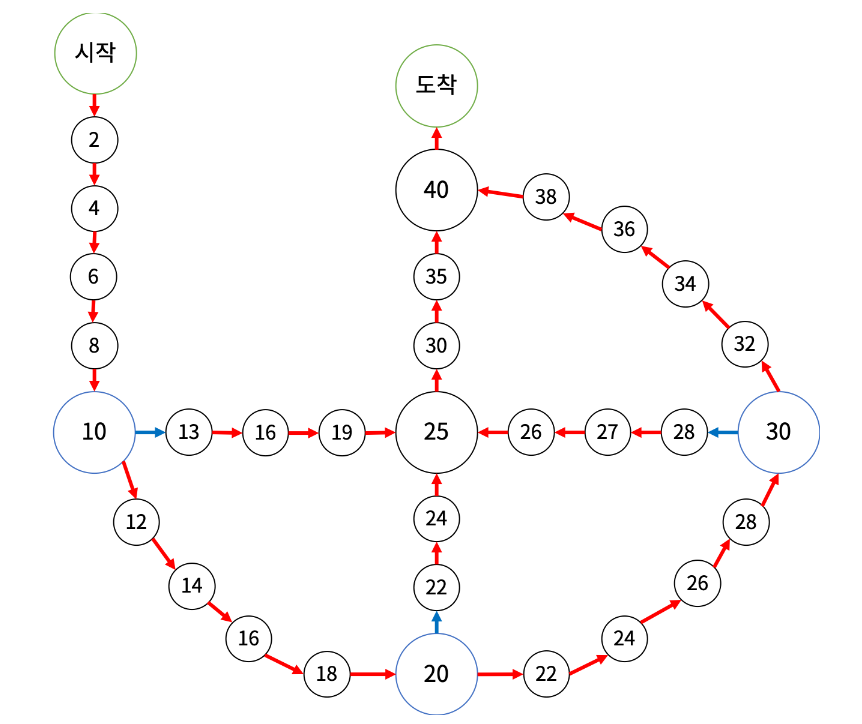

## 문제

[백준 17825 주사위 윷놀이](https://www.acmicpc.net/problem/17825)<br/>



이번 문제는 윷놀이 게임에서 얻을 수 있는 최대 점수를 구하는 문제였다. 

* 주사위 윷놀이는 윷이 아니라 주사위를 던져 나온 수 만큼 전진한다. (그럼 그냥 주사위 놀이 아니에요?)
* 주사위로 나올 수 있는 수는 1 ~ 5이다.
* 말은 4개 존재하며, 시작과 도착칸을 제외하고 두 개 이상의 말이 같은 칸에 있을 수 없다.
* 말이 이동을 마칠 때마다 밟고있는 칸의 점수를 획득할 수 있다.
* 말이 이동을 마친 칸이 파란색 칸이라면 다음 순서에서 무조건 파란색 화살표 방향으로 이동한다.
* 주사위는 총 10번 굴리며, 10번동안 나온 주사위의 수가 미리 제공된다.


## 풀이

이번 문제에서 제일 어려웠던 것은 게임 보드(위 그림)를 표현하는 것이었다. 저걸 어떻게 표현해야할지 감이 안왔는데 그냥 그래프로 표현하면 되는 것이었다; 나는 바보? <br/>


### 📌게임 보드 표현

```cpp
int board[40];
vector<int> boardGraph[40];

void setBoard() {
	board[0] = 0;
	for (int i = 1; i <= 20; i++) { // 빨간 화살표로만 갈 수 있는 루트
		boardGraph[i - 1].push_back(i);
		board[i] = 2 * i;
	}

	board[21] = 13; boardGraph[21].push_back(22);
	board[22] = 16; boardGraph[22].push_back(23);
	board[23] = 19; boardGraph[23].push_back(29);

	board[24] = 22; boardGraph[24].push_back(25);
	board[25] = 24; boardGraph[25].push_back(29);

	board[26] = 28; boardGraph[26].push_back(27);
	board[27] = 27; boardGraph[27].push_back(28);
	board[28] = 26; boardGraph[28].push_back(29);

	board[29] = 25; boardGraph[29].push_back(30);
	board[30] = 30; boardGraph[30].push_back(31);
	board[31] = 35; boardGraph[31].push_back(20);

	boardGraph[20].push_back(destIdx);

	// 파란 화살표
	boardGraph[5].push_back(21);
	boardGraph[10].push_back(24);
	boardGraph[15].push_back(26);

}
```

이렇게 노가다로 인덱스와 각 칸을 1대1 매칭한뒤, 그래프 형태로 연결해주면 되는거였다...


## 📌 말이 전진하는 로직

```cpp
int getNextSpace(int pieceIdx, int diceCost) {
	int curSpace = pieceSpace[pieceIdx];

	if (boardGraph[curSpace].size() >= 2) {
		curSpace = boardGraph[curSpace][1];
		diceCost--;
	}
	while (diceCost > 0) {
		if (curSpace == destIdx) {
			return curSpace;
		}
		curSpace = boardGraph[curSpace][0];
		diceCost--;
	}

	return curSpace;
}
```

현재 게임 보드의 칸 중에서 두 개 이상의 방향으로 갈 수 있는 칸은 파란칸뿐이다. 그렇기에 `boardGraph`의 사이즈가 2인경우는 파란칸뿐이다. 그래프에 화살표 정보를 푸쉬할때, 파란 화살표를 가장 나중에 푸쉬했으므로 `boardGraph`의 2번째 원소가 파란 화살표로 갈 수 있는 칸이 된다. 말이 파란칸에서 출발할 때는 무조건 파란 화살표를 거쳐야 하므로 `boardGraph`의 사이즈가 2이상일 경우 `boardGraph`의 2번째 원소로 향하게 설정한다.<br/>

나머지는 주사위로 얻은 수만큼 말을 계속 전진시키면 된다.


## 📌 재귀 함수

```cpp
int n = 10;

int go(int diceIdx) {
	if (diceIdx == n) { // 10만큼 했으면 종료
		return 0;
	}
    
	int ret = 0;
	for (int pieceIdx = 0; pieceIdx < 4; pieceIdx++) {
		int curSpace = pieceSpace[pieceIdx];
		int nextSpace = getNextSpace(pieceIdx, diceCosts[diceIdx]);
		if (!isValidSpace(nextSpace, pieceIdx)) { // 다른 말이 있는 칸이면 이동하지 못함
			continue;
		}
		pieceSpace[pieceIdx] = nextSpace;
		ret = max(ret, go(diceIdx + 1) + board[nextSpace]);
		pieceSpace[pieceIdx] = curSpace; // 해당 경우의 수를 구했다면 원래 상태로 돌려놓음
	}
	return ret;
}
```

주사위를 열 번 굴리고 말이 4개 있으므로 총 경우의 수는 4^10이다. 재귀함수를 사용해 모든 경우의 수를 체크했다. 


## 전체 코드

```cpp
#include <bits/stdc++.h>

using namespace std;

int n = 10;
int destIdx = 32;
int board[40];
vector<int> boardGraph[40];
int diceCosts[10];
int ans = 0;
int pieceSpace[4];

void setBoard() {
	board[0] = 0;
	for (int i = 1; i <= 20; i++) {
		boardGraph[i - 1].push_back(i);
		board[i] = 2 * i;
	}

	board[21] = 13; boardGraph[21].push_back(22);
	board[22] = 16; boardGraph[22].push_back(23);
	board[23] = 19; boardGraph[23].push_back(29);

	board[24] = 22; boardGraph[24].push_back(25);
	board[25] = 24; boardGraph[25].push_back(29);

	board[26] = 28; boardGraph[26].push_back(27);
	board[27] = 27; boardGraph[27].push_back(28);
	board[28] = 26; boardGraph[28].push_back(29);

	board[29] = 25; boardGraph[29].push_back(30);
	board[30] = 30; boardGraph[30].push_back(31);
	board[31] = 35; boardGraph[31].push_back(20);

	boardGraph[20].push_back(destIdx);

	//blue line
	boardGraph[5].push_back(21);
	boardGraph[10].push_back(24);
	boardGraph[15].push_back(26);

}


int getNextSpace(int pieceIdx, int diceCost) {
	int curSpace = pieceSpace[pieceIdx];

	if (boardGraph[curSpace].size() >= 2) {
		curSpace = boardGraph[curSpace][1];
		diceCost--;
	}
	while (diceCost > 0) {
		if (curSpace == destIdx) {
			return curSpace;
		}
		curSpace = boardGraph[curSpace][0];
		diceCost--;
	}

	return curSpace;
}

bool isValidSpace(int space, int pieceIdx) {
	if (space == destIdx) {
		return true;
	}
	for (int i = 0; i < 4; i++) {
		if (pieceIdx == i) {
			continue;
		}
		if (pieceSpace[i] == space) {
			return false;
		}
	}
	return true;
}

int go(int diceIdx) {
	if (diceIdx == n) {
		return 0;
	}
	int ret = 0;
	for (int pieceIdx = 0; pieceIdx < 4; pieceIdx++) {
		int curSpace = pieceSpace[pieceIdx];
		int nextSpace = getNextSpace(pieceIdx, diceCosts[diceIdx]);
		if (!isValidSpace(nextSpace, pieceIdx)) {
			continue;
		}
		pieceSpace[pieceIdx] = nextSpace;
		ret = max(ret, go(diceIdx + 1) + board[nextSpace]);
		pieceSpace[pieceIdx] = curSpace;
	}
	return ret;
}

int main() {
	ios_base::sync_with_stdio(false);
	cin.tie(NULL); cout.tie(NULL);
	setBoard();
	for (int i = 0; i < n; i++) {
		cin >> diceCosts[i];
	}
	cout << go(0);
}
```


## 주절주절

오늘 문제의 게임 보드처럼 방향이 있는 특정 상황의 경우 인덱스와 value를 1대1로 대응시키고 인덱스를 그래프로 나타내면 쉽게 풀 수 있다는 것을 배웠다. ㅋㅋ if(10이면), 파란화살표로 간다~ 이런거 생각하고 있었는데 단순하게 그래프로 연결하는게 제일 쉬운 방법인 것 같다. 보드판을 건너는 핵심 로직과 섞이지도 않고 초반에 setBoard()로 깔끔하게 끝나는게 아주 보기가 좋다!<br/>

초반에는 재귀 함수로 로직을 구현하는게 어려워서 while문 반복을 즐겨 사용했는데 점점 재귀에 익숙해지면서 재미가 들리는 것 같다! 재귀 함수가 while문보다 더 깔끔하기도 하고, 반환값을 뭐로 설정하면 좋을지... 어떤식으로 파고 들어갈지등 고민해야하는 요소가 더 많은 것 같아서 재밌는 것 같다.(아직 코딩 초보라 이런것도 재밌음.ㅎㅎ...) <br/>

이번 문제도 푸는데 거의 한 시간걸린 것 같다... 나중에 코테 통과하려면 제시간에 다 풀어야하는데 걱정이다. ㅋㅋ ㅠㅠ 문제를 많이 풀면서 빨리 푸는 연습을 해야겠다.

