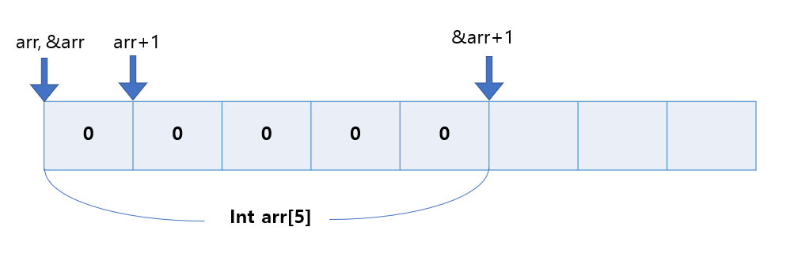
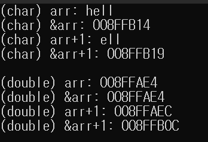

## arr과 &arr의 차이

* int arr[5]가 있을 때 arr과 &arr을 출력해보자

```c++
#include<bits/stdc++.h>

using namespace std;

int main(){
    int arr[5] = {0, };
    cout << arr << "\n";
    // output : 00F9FB30
    
    cout << &arr << "\n";
    //output : 00F9FB30
}
```

둘 다 같은 주소값으로 배열 `arr`의 시작 주소를 가리킨다.


* arr과 &arr에 1을 더해보자

```c++
#include<bits/stdc++.h>

using namespace std;

int main(){
    int arr[5] = {0, };
    cout << arr+1 << "\n";
    // output : 00F9FB34

    
    cout << &arr+1 << "\n";
    //output : 00F9FB44
}
```

* arr + 1은 기존 주소 `00F9FB30`에서 4만큼 늘어난 값이다.
  * int는 4byte이므로 즉 arr[1]의 시작주소를 가리킨다.
* &arr + 1은 기존주소 `00F9FB30`에서 20만큼 늘어난 값이다.
  * 20은 4byte \* 5이므로 arr[5]의 끝 주소를 가리킨다.

즉 arr + 1은 arr의 1번째 원소의 시작주소를 가리키고 &arr + 1은 배열 arr자체의 끝 주소를 가리킨다.

<br/>




<br/> <br/>

다른 예시

```c++
int main() {
    char arr[5] = "hell";
    cout <<"(char) arr: "<< arr << "\n";
    cout << "(char) &arr: " << &arr << "\n";
    cout << "(char) arr+1: " << arr+1 << "\n";
    cout << "(char) &arr+1: " << &arr+1 << "\n";

    double arr2[5] = { 0, };
    cout << "(double) arr: " << arr2 << "\n";
    cout << "(double) &arr: " << &arr2 << "\n";
    cout << "(double) arr+1: " << arr2 + 1 << "\n";
    cout << "(double) &arr+1: " << &arr2 + 1 << "\n";
}
```




| 1    | 2    | 3    | 4    | 5    | 6    | 7    | 8    |
| ---- | ---- | ---- | ---- | ---- | ---- | ---- | ---- |
| 1    | 1    | 1    | 1    | 1    |      |      |      |
|      |      | 1    | 1    |      |      |      |      |
|      | 1    | 1    | 1    | 1    | 1    | 1    |      |

5 3 1 1 3 5 5 

5 + 3 + 3 + 3 + 3 + 6 + 5 + 5

15

21

