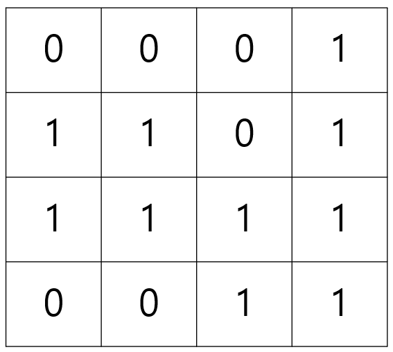

## 사전 지식

### 1. 이진수를 사용해서 bool 배열을 표현할 수 있다.

- `0001`의 경우 0번째 value가 true이고 1, 2, 3번째 value는 false라고 볼 수 있다.
- `1010`의 경우 1, 3번째 value가 true이고, 0, 2번째 value는 false라고 볼 수 있다.

이처럼 이진수를 사용해서 불리언 배열을 표현할 수 있다.

### 2. 비트연산자

시프트 연산자 `<<`는 수의 자릿수를 왼쪽으로 이동시킨다는 의미이다. 이진수를 활용하는 비트마스킹에서 (1<<n)의 의미는 2^n승을 하겠다는 의미가 된다.

| 설명                           | 코드                |
| ------------------------------ | ------------------- |
| idx번째 비트끄기 (false)       | S &= ~(1 << idx)    |
| idx번째 비트를 켜기 (true)     | S \|= (1 << idx)    |
| idx번째에 대한 XOR연산         | S ^= (1 << idx)     |
| n인 집합의 모든 비트를 켜기    | (1 << n) - 1        |
| 최하위에 켜져있는 idx 찾기     | idx = (S & -S)      |
| idx번째 비트가 있는지 확인하기 | if (S & (1 << idx)) |

#### 📌 n인 집합의 모든 비트를 켜기

0, 1, 2, 3의 idx를 가지는 4개의 집합의 모든 비트를 켜고 싶다고 해보자. <br/>

- ex) `00001111`

(1 << 4) 를 하면 00010000이 된다. 여기서 1을 빼면 00001111이 되므로 0~3번째 idx의 비트를 한 번에 켤 수 있다.

#### 📌 최하위에 켜져있는 idx 찾기

-S는 ~S + 1과 동일하다. (1의 보수를 취하고 1을 더함)

- S가 0110일 때, 1의 보수는 비트를 모두 뒤집은 1001이다.
- 1001에 1을 더하면 1010이 되고 이게 -S를 나타내는 비트이다.

S(0110)과 -S(1010)을 &연산하게 되면 가장 끝에 켜져있는 비트를 뽑아낼 수 있다. (0010)

## 비트마스킹

어떠한 특정원소를 찾을 때 시간복잡도는 다음과 같다.

- 배열의 어떤 요소를 찾을 때 선형적인 시간 : O(N)이 걸린다.
- sorted array에서 이분탐색으로 찾을 때는 O(logN)이 걸린다.
- 해싱테이블에서는 O(1)이 걸린다.

<br/>

그렇다면 불리언 배열에서 무언가를 찾는 등의 연산은 어떻게 될까? 마찬가지로 배열이므로 어떤 요소를 찾으려면 O(N)이 걸린다. 그러나 불리언배열의 역할을 하는 "하나의 숫자"를 만들어서 "비트 연산자"를 통해 탐색, 수정 등의 작업을 하면 불리언 배열을 만드는 것보다 더 빠른 시간내에 연산을 수행할 수 있다. 이를 비트마스킹이라고 한다.

- 101은 1과 4의 합집합이며 이는 {0, 2}로 표현이 가능함.
- 111은? {0, 1, 2}로 표현이 가능함.

<br/>

즉, 불리언배열을 만들어서 {0, 1, 0, 1} 이렇게 만들지 않고 **0101 이라는 하나의 수, 5** 등을 이용해 **하나의 숫자로 불리언 배열같은 역할**을 할 수 있다. 또한 앞서 배운 비트연산자를 통해 해당 요소가 포함되어있는지 안되어있는지 등을 쉽게 알 수 있다.

### 📌 비트마스킹을 이용한 경우의 수

{사과, 딸기, 포도, 배}라는 문자열 배열이 있을 때 모든 경우의 수를 출력해보자.

* 비트는 0과 1로 표현할 수 있으므로, 선택했을 때는 1, 선택 하지 않았을 때는 0과 같이 경우의 수를 표현할 수도 있다.

```cpp
#include <bits/stdc++.h>
using namespace std;

const int n = 4;

int main() {
	ios::sync_with_stdio(0);
	cin.tie(NULL);
	cout.tie(NULL);
	string arr[n] = { "사과", "포도", "딸기", "귤" };
	for (int i = 0; i < (1<<n); i++) { // 1 << n 은 16가지의 경우의 수
		string ret = "";
		for (int j = 0; j < n; j++) { // j번째 bit가 true인지 확인
			if (i & (1 << j)) {
				ret += arr[j];
			}
		}
		cout << ret << "\n";
	}
}

/*
사과
포도
사과포도
딸기
사과딸기
포도딸기
사과포도딸기
귤
사과귤
포도귤
사과포도귤
딸기귤
사과딸기귤
포도딸기귤
사과포도딸기귤
*/

```

### 📌 비트마스킹을 이용한 매개변수 전달

{사과, 딸기, 포도, 배}에서 사과는 무조건 선택되어 있고 나머지중 하나를 선택해야 할 때

* 그래프 문제를 풀 때 어떤 노드를 visit한 상태에서 다른 노드를 체크할 때가 있다. 이런 상황에서 비트마스킹을 활용할 수도 있다.

```cpp
#include <bits/stdc++.h>
using namespace std;

const int n = 4;
string arr[n] = { "사과", "포도", "딸기", "귤" };

void go(int num) {
	string ret = "";
	for (int j = 0; j < n; j++) {
		if (num & (1 << j)) {
			ret += arr[j];
		}
	}
	cout << ret << "\n";
	return;
}

int main() {
	ios::sync_with_stdio(0);
	cin.tie(NULL);
	cout.tie(NULL);

	for (int i = 0; i < n; i++) {
		go(1 | (1<<i));
	}
}

/*
사과
사과포도
사과딸기
사과귤
*/
```

## 비트마스킹 문제 풀이

### 📌 백준 1285 동전뒤집기

* [백준 1285 동전 뒤집기](https://www.acmicpc.net/problem/1285)

- 앞면인 H를 0, 뒷면인 T를 1이라고 본다.
- 한 행을 하나의 int형으로 저장한다.
  - ex) HHT -> 001 -> 4
  - ex) THH -> 100 -> 1
  - ex) THT -> 101 -> 5
- 동전의 모든 경우의 수는 어떤 행과 어떤 열을 뒤집거나 뒤집지 않은 모든 경우의 수이므로, 2^40인것처럼 보인다. (행과 열이 최대 20)
- 그러나 행을 뒤집는 모든 경우의 수를 구한다면, 열은 최소의 T개를 가지는 루트가 명백해지기에 시간복잡도는 2^20 \* 20이 된다. (물론 열을 먼저 뒤집어도 마찬가지이다.)

```cpp
#include <bits/stdc++.h>
using namespace std;

int arr[21];
int n, v;
int minValue = INT_MAX;
string str;

void go(int depth) {
	if (depth == n) { // 마지막 depth까지 행 뒤집기가 완료
		int sum = 0;
		for (int i = 0; i < n; i++) {
			int cnt = 0;
			for (int j = 0; j < n; j++) {
				if (arr[j] & (1 << i)) { // 해당 자릿수가 T이면 카운트
					cnt++;
				}
			}
			sum += min(cnt, n - cnt); // 만약 T가 더 많다면 해당 열을 뒤집게 된다. 열을 뒤집으면 T의 개수는 n-cnt가 된다. cnt와 n-cnt중 최솟값이 해당 열에 있을 수 있는 T의 최소 개수가 된다.
		}
		minValue = min(minValue, sum);
		return;
	}
    // 행을 뒤집는 모든 경우의 수를 구함
    // 해당 depth의 행을 뒤집지 않은 경우
	go(depth + 1);

    // 해당 depth의 행을 뒤집은 경우
	arr[depth] = ~arr[depth];
	go(depth + 1);
}

int main() {
	ios::sync_with_stdio(0);
	cin.tie(NULL);
	cout.tie(NULL);
	cin >> n;
	for (int i = 0; i < n; i++) {
		cin >> str; // HTT
		v = 1;
		for (int j = 0; j < n; j++) {
			if (str[j] == 'T') { // T를 1이라고 가정
				arr[i] |= v; // T의 자릿수를 1로 변환
			}
			v *= 2; // 자릿수 증가
		}
	}
	go(0);
	cout << minValue;

}
```


### 📌 백준 14391 종이접기

* [백준 14391 종이접기](https://www.acmicpc.net/problem/14391) 

</img>

* 위와 같은 1x1의 정사각형으로 이루어진 직사각형 모양의 종이안에서 칸을 나눠 여러개의 직사각형을 만들어 각 직사각형의 안에 적혀있는 수들의 합이 최대가 되게 직사각형을 나눠야한다.
* 종이 조각의 세로 크기 N과 가로 크기 M의 최대 사이즈는 4이다. (1 ≤ N, M ≤ 4)

> 동전뒤집기 문제와 같이 비트마스킹은 경우의 수를 생성해내는데 유용하다. 주어진 숫자의 범위가 작고, 경우의 수를 만들어야하는 문제라면 비트마스킹으로 풀 수 있을지 생각해보자! <br/>

<br/>

#### 😵 아이디어

이 문제를 어떻게 풀 수 있을까? 고민을 굉장히 많이 했다... 나눠야하는 건 알겠는데... 나누는 코드를 어떻게 짜야하는가... 결국 좋은 생각이 나지 않아서 다른 사람의 풀이를 참고했다.😂😂😂

<br/>

* **1은 세로로, 0은 가로로**

</img>

짜잔~ 0과 1로 이루어진 bitbox이다. 이 박스는 위 예시 사진으로 들어간 종이가 나눠진 모양을 표현하는 박스이다. 어떻게 표현했을까? 0으로 시작하는 구간은 가로로 읽고, 1로 시작하는 구간은 세로로 읽으면 된다. 이 bitbox를 보면 이 문제를 어떻게 풀어야할지 감이 올 것이다.<br/>

종이의 원소만큼의 수, 위 예시의 경우 (4x4)인 16개의 bit로 표현할 수 있는 모든 경우의 수를 구하면 된다.

* 0000 0000 0000 0000
* 0000 0000 0000 0001
* ...
* 1111 1111 1111 1110
* 1111 1111 1111 1111

그리고 n개씩 나눠진 m개의 비트들이 종이 상자의 한 줄에 해당한다고 보면 된다. 위 예시의 경우 아래와 같이 표현이 된다.

* 0001 1101 1111 0011 (물론 나중에 코드에서는 편의상 bit를 거꾸로 할당할거임)


#### ✨ 코드

```cpp
#include <bits/stdc++.h>
using namespace std;

int n, m, ret;

int paper[4][4];

int main() {
    // 종이에 수 입력
	scanf("%d %d", &n, &m);
	for (int i = 0; i < n; i++) {
		for (int j = 0; j < m; j++) {
			scanf("%1d", &paper[i][j]);
		}
	}

	for (int s = 0; s < (1 << (n * m)); s++) { // 모든 경우의 수 s생성
		int sum = 0; // 해당 경우의 수에서 얻을 수 있는 숫자들의 합
		
        // row - 가로로 된 숫자들의 합을 구함
		for (int i = 0; i < n; i++) {
			int cur = 0;
			for (int j = 0; j < m; j++) {
				int k = i * m + j; // bit가 한 줄로 되어있으므로 offset을 구함
				if ((s & (1 << k)) == 0) {
					cur = cur * 10 + paper[i][j];
                    continue;
				}
                sum += cur;
                cur = 0;
			}
			sum += cur;
		}

		// column - 세로로 된 숫자들의 합을 구함
		for (int j = 0; j < m; j++) {
			int cur = 0;
			for (int i = 0; i < n; i++) {
				int k = i * m + j; // bit가 한 줄로 되어있으므로 offset을 구함
				if (s & (1 << k)) {
					cur = cur * 10 + paper[i][j];
                    continue;
				}
                sum += cur;
                cur = 0;
			}
			sum += cur;
		}
		ret = max(ret, sum);
	}
	cout << ret << "\n";
}
```

* int k는 offset을 의미한다. 
* 현재 bit는 r x c 형태로 되어있지않고 0001 1101 1111 0011 와 같이 1열로 되어있으므로, 
* 이차원 형태의 종이와 매칭하려면 m(열)만큼 띄워주어야 한다.
  * 가로 count의 경우 한 줄을 다 세면 m(열)만큼 띄워주면 되고,
  * 세로 count의 경우 하나의 줄을 세기위해 하나의 원소를 세면 m(열)만큼 띄워준다. 다음 줄을 셀 때 다시  0에서부터 m까지 원소를 체크하면 된다.


## 비트마스킹의 한계

비트마스킹은 31번 idx까지 가능하다는 한계가 있다. int형 숫자의 한계이다. long long은 어떠냐 하는 의견도 있는데 보통 2^ 30승정도만 해도... 10억이 되기 때문에 그 이후의 경우의 수를 센다는 것 자체가 이미 시간복잡도를 많이 초과하기 때문에 보통은 30 ~ 31 까지의 경우의 수만을 표현할 수 있다고 볼 수 있다.

## 참고

- [[알고리즘 강의\] 4주차. 비트마스킹](https://blog.naver.com/jhc9639/222310927725)|**작성자** [큰돌](https://blog.naver.com/jhc9639)
