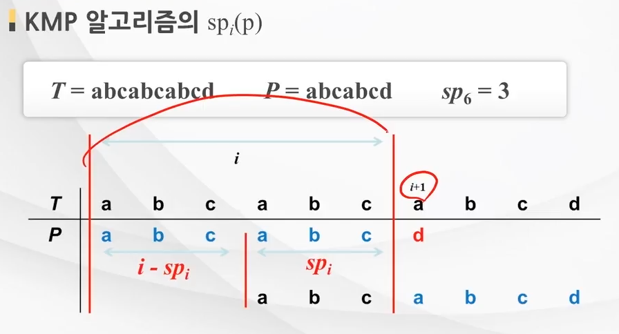

## KMP 알고리즘

> 문자열 탐색 알고리즘

* Brute force 알고리즘보다 빠르게 문자열을 탐색할 수 있다.

<br/>

### Brute force 알고리즘으로 문자열 탐색하기

* 무작정 어떤 문자열  "abcabcabcd"라는 text가 있다고 하자. 여기서  "abcabcd"라는 문자열 pattern이 있는지 탐색하려면, "abcabcabcd"의 첫 번째 인덱스부터 차례대로 "abcabcd"와 비교하는 방법이 있다.
* 즉, text의 인덱스 0부터 (text.size() - target.size() + 1) 번째 인덱스까지 총 4번의 탐색이 필요하다.

| text                | a    | b    | c    | a    | b    | c    | a    | b    | c    | d    |
| ------------------- | ---- | ---- | ---- | ---- | ---- | ---- | ---- | ---- | ---- | ---- |
| 0번 인덱스부터 체크 | a    | b    | c    | a    | b    | c    | d(x) |      |      |      |
| 1번 인덱스부터 체크 |      | a(x) |      |      |      |      |      |      |      |      |
| 2번 인덱스부터 체크 |      |      | a(x) |      |      |      |      |      |      |      |
| 3번 인덱스부터 체크 |      |      |      | a    | b    | c    | a    | b    | c    | d    |


## KMP 알고리즘으로 문자열 탐색하기

* KMP 알고리즘은 pattern의 접두사와 접미사가 얼마나 일치하는지의 정보를 가지고 탐색한다.
* 탐색하고자 하는 문자열 pattern이 "abcabcd" 라고 해보자.

<br/>

#### pi

| pi(index) | pattern[:i] (i = 1 to pattern.size()) | 접두사 == 접미사 count |
| --------- | ------------------------------------- | ---------------------- |
| 0         | a                                     | 0                      |
| 1         | ab                                    | 0                      |
| 2         | abc                                   | 0                      |
| 3         | **a**bc**a**                          | 1                      |
| 4         | **ab**c**ab**                         | 2                      |
| 5         | **abc** **abc**                       | 3                      |
| 6         | abcabcd                               | 0                      |

* pattern의 접두사 == 접미사 count를 담은 배열을 pi 라고 하자.
* pi를 구했다는 가정하에 다시 문자열을 탐색해보자.

<br/>

* 아까 사용했던 표이다. 0번 인덱스부터의 탐색 결과이다.

| text                | a    | b    | c    | a    | b    | c    | a    | b    | c    | d    |
| ------------------- | ---- | ---- | ---- | ---- | ---- | ---- | ---- | ---- | ---- | ---- |
| 0번 인덱스부터 체크 | a    | b    | c    | a    | b    | c    | d(x) |      |      |      |

* 브루트 포스 알고리즘을 사용했을 때는 여기서 바로 1번 인덱스 탐색으로 넘어갔지만 pi를 사용하면 바로 3번 인덱스로 넘어갈 수 있다.


### 어떻게? 

* 현재 패턴의 5번째 인덱스까지는 문자가 일치했다. 
* pi[5]의 값은 3이다. 이는 pattern[:6]까지의 문자열의 접두사와 접미사가 3만큼 일치했다는 의미이다.




* 그러므로 위 사진과 같이 3번째 인덱스로 껑충 넘어갈 수가 있다.
* abc가 문자열 맨 앞의 abc와 일치하기 때문에 3번째 인덱스로 바로 넘어갈 수가 있다.


### 만약 pi[5]가 0이었다면? (접두사와 접미사가 일치하는 구간이 없음)

오히려 좋다.  바로 6번째 인덱스로 넘어가 탐색하면 된다.<br/>

접두사와 접미사가 일치하는 구간이 없었다는 건, 패턴이 해당 구간의 그 어느부분과도 일치하지 않았다는 보장이 된다.<br/>

접두사와 접미사가 일치하는 구간을 찾아 해당 인덱스로 넘어가 시작하는 이유는, 해당 구간의 접두사 부분과 패턴의 접미사 부분이 같기 때문에 접두사 이후부분이 패턴의 접미사 이후부분과 같을 수도 있기 때문이다. 만약 접두사와 접미사가 일치하는 구간이 없다면, 그냥 탐색한 부분을 모조리 다 껑충 뛰어넘어가도된다. (베스트)


### 만약 pi[5]가 5였다면? (접두사와 접미사가 최대로 일치)

워스트 케이스다... 그렇다면 브루트포스 알고리즘처럼 바로 그 다음 인덱스부터 탐색해야 할 것이다.


## KMP 알고리즘 구현해보기

`text`문자열에서 `pattern`문자열의 개수를 찾아 리턴해보자

> ex)<br/>
>
> *  text는 abcdabc 이고 pattern은 abc일 때, 
> * abc가 text에서 두 번 등장하므로 출력 결과는 2가 된다.

```cpp
#include <bits/stdc++.h>

using namespace std;

string text, pattern;
int cnt; // text에 등자한 pattern 문자열의 개수

vector<int> getpi(){
    int start = 1; // 인덱스 0부터 비교하면 같은 문자열이므로 무조건 일치하니 1부터 탐색
    int match = 0;
    int m = pattern.length();
    vector<int> pi(m,0); // 0으로 초기화 필수.
    
    while(start+match < m){
        if(pattern[start+match] == pattern[match]){
            match++;
            // start+match-1번째 인덱스까지가 match만큼 일치함
            // start+match는 이후 비교해볼 인덱스임
            pi[start+match-1] = match; 
        }
        else{
            if (!match){
               start++; 
            }
            else{
                start = start + match - pi[match-1]; // 바로 이전 접두사 일치길이 만큼 되돌아감
                match = pi[match-1];
            }
        }
    }
    return pi;
}

void kmp(){
    vector<int> pi = getpi();
    int start = 0;
    int match = 0;
    
    while(start+match < text.size()){
        if(text[start+match] == pattern[match]){
            match++;
            if(match == pattern.size()){ // text에서 pattern 찾기 성공
                cnt++;
                start = start + match - pi[match-1]; // pattern 문자열을 끝까지 다 찾았으므로 그 다음 인덱스부터 다시 pattern을 탐색한다.
                match = pi[match-1];
            }
        }
        else{
            if(!match){
                start++;
            }
            else{
                start = start + match + pi[match-1];
                match = pi[match-1];
            }
        }
    }
}

int main(){
    getline(cin, text);
    getline(cin, pattern);
    
    kmp();
    cout << cnt;
}
```


## KMP 알고리즘 문제 풀어보기 

### 백준 1701 Cubeditor

[백준 1701 Cubeditor](https://www.acmicpc.net/problem/1701)

> 주어진 문자열에서 두 번 이상 나오는 부분문자열의 최대 길이를 구하는 문제이다. 이 때 한 문자열내에서 나오는 부분문자열들은 겹쳐도 된다.
>
> ex)<br/>
>
> * aabcdabc 문자열에서 abc라는 문자열이 두 번 나온다. (ab, bc도 두 번 이상 나오지만 abc가 가장 긴 부분 문자열이므로 출력결과는 3이된다.)
> * aaaaa 문자열에서 aaaa라는 문자열이 두 번 나온다. (출력결과는 4가 된다.)

<br/>

* Cubeditor문제는 KMP알고리즘 방식의 접두사 접미사 일치 구간을 구하는 방법을 사용해 풀 수 있다.


### 😨 첫 번째 풀이

```cpp
#include <bits/stdc++.h>

using namespace std;

int start, match, ans;
string str;
int main() {
	ios_base::sync_with_stdio(false); cin.tie(NULL); cout.tie(NULL);
	cin >> str;
	int n = str.length();
	vector<int>pi(n, 0);
	start = 1;
    
	while (start + match < n) {
		if (str[match] == str[start + match]) {
			match++;
			pi[start+match-1] = match;
			ans = ans < match ? match : ans;
		}
		else {
			if (!match) {
				start++;
			}
			else {
				start = start + match - pi[match - 1];
				match = pi[match-1];
			}
		}
	}

	ans = ans < 2 ? 0 : ans;
	cout << ans;
}
```

결과는... 실패!<br/>

* baaa 문자열이 들어올 경우, aa라는 문자열이 두 번이상 반복되어 2가 출력되어야 하지만
* 위 코드의 경우 첫 번째 인덱스인 b부터만 검사를 하므로 0이 출력된다.


### 😀 두 번째 풀이

* 문자열의 [i:] (i=0 to size-1) 의 모든 부분 문자열을 탐색하면 된다.
* baaa의 경우 1. baaa, 2. aaa, 3. aa 총 세 번의 탐색이 일어난다.

```cpp
#include <bits/stdc++.h>

using namespace std;

int start, match, ans, n;
string str;

void getpi(string cmpstr) {
	int m = cmpstr.length();	
	vector<int>pi(m, 0);
	start = 1;  match = 0;

	while (start + match < m) {
		if (cmpstr[match] == cmpstr[start + match]) {
			match++;
			pi[start + match - 1] = match;
			ans = ans < match ? match : ans;
		}
		else {
			if (!match) {
				start++;
			}
			else {
				start = start + match - pi[match - 1];
				match = pi[match-1];
			}
		}
	}
	return;
}
int main() {
	ios_base::sync_with_stdio(false); cin.tie(NULL); cout.tie(NULL);
	cin >> str;
	n = str.length();
	getpi(str);
	for (int i = 0; i < n; i++) {
		string cmpstr = str.substr(i);
		getpi(cmpstr);
	}
	ans = ans < 2 ? 0 : ans;
	cout << ans;
}
```


### 백준 1786 찾기

[백준 1786 찾기](https://www.acmicpc.net/problem/1786)<br/>

```cpp
#include <bits/stdc++.h>
#include <unordered_map>
using namespace std;


int start, match, cnt;
string str, pattern;
vector<int> ans;

vector<int> getpi(string cmpstr) {
	int m = cmpstr.length();	
	vector<int>pi(m, 0);
	start = 1;  match = 0;

	while (start + match < m) {
		if (cmpstr[match] == cmpstr[start + match]) {
			match++;
			pi[start + match - 1] = match;
		}
		else {
			if (!match) {
				start++;
			}
			else {
				start = start + match - pi[match - 1];
				match = pi[match-1];
			}
		}
	}
	return pi;
}

void kmp() {
	vector<int> pi = getpi(pattern);
	start = 0; match = 0;
	while (start + match < str.length()) {
		if (pattern[match] == str[start + match]) {
			match++;
			if (match == pattern.size()) {

				cnt++;
				ans.push_back(start+1);
				start = start + match - pi[match-1];
				match = pi[match-1];
			}
		}
		else {
			if (!match) {
				start++;
			}
			else {
				start = start + match - pi[match - 1];
				match = pi[match-1];
			}
		}
	}
}
int main() {
	ios_base::sync_with_stdio(false); cin.tie(NULL); cout.tie(NULL);
	getline(cin, str);
	getline(cin, pattern);

	kmp();

	cout << cnt << "\n";
	for (int i : ans) {
		cout << i << " ";
	}
	
}
```


## 참고

https://medium.com/@peteryun/algo-week11-kmp-knuth-morris-pratt-3243c0654831
