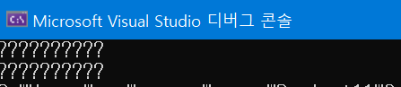

## 한글을 한 글자씩 출력해보자!

* 처음 시도한 방법 : str[0], str[1]... str[n] 이런식으로 출력하면 한 글자씩 나오지않을까?

```c++
string str = "한글이에요";

// 이렇게 하거나
for (char c : str) {
	cout << c << " ";
}
cout << "\n";

// 저렇게 하면 되겠지?
for (int i = 0; i < (int)str.size(); i++) {
	cout << str[i] << " ";
}
```

* 출력결과




원하는 출력이 아닌 웬 물음표들이 등장함<br/>

영어는 아스키코드에 있어 위 방식으로 해도 출력이 잘 되지만 한글은 아스키코드에 없어서 출력이 되지않음

> 영어는 한 글자당 1byte(char)이지만 한글은 1byte보다 크기때문에 출력이 제대로 되지않는다.


## 그럼 어떻게 출력해야할까?

* 한글의 크기를 구해보자!

```c++
cout << (int)str.size();
```

위 코드를 통해 str `"한글이에요"`의 사이즈를 출력해보면 `10`이 나오는 것을 볼 수 있다.<br/>

즉, 한글 한 글자의 크기는 2byte이다.

> CP949와 EUC-KR은 한글 한 글자를 2byte로 저장하고, UTF-8은 한글 한 글자를 3byte로 저장한다.
>
> UTF-8이었다면 위 코드를 돌렸을 때 한 글자당 3byte이므로 15가 나온다.


* 즉, 한글을 한 글자씩 출력하려면 다음과 같이 하면 된다!

```c++
// 한 글자당 2byte이므로 두 개씩 출력
for (int i = 0; i < (int)str.size(); i += 2) {
	cout << str.substr(i, 2)<<" ";
}

// 한 글자당 3byte라면 이렇게
for (int i = 0; i < (int)str.size(); i += 3) {
	cout << str.substr(i, 3)<<" ";
}
```

코드를 실행하면 `"한 글 이 에 요"`로 잘 출력되는 것을 볼 수 있다.


* char 배열에 담을 때도 한글의 크기를 고려해서 공간을 할당한다.

```c++
//출력이 잘 되지않음
//char c[6] = "안녕하세요";

//출력이 잘 됨
char c[11] = "안녕하세요";


for (int i = 0; i < (int)sizeof(c) / 2; i++) {
    cout << i+1 << "번째 글자입니다.\n";
    cout << c[i * 2] << c[i * 2 + 1] << "\n";
}
```

