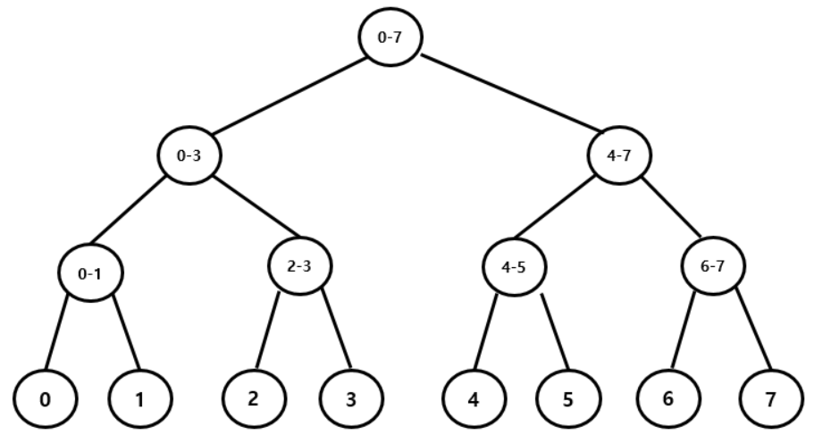
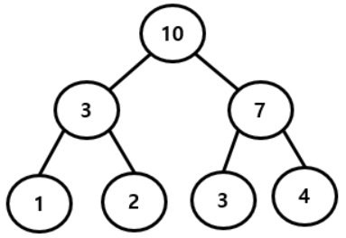

## 세그먼트 트리... 그게 뭐죠?

세그먼트 트리는 **구간을 저장하기 위한 트리**라고 한다. 잘 이해가 안가니 아래 사진을 봐보자!



구간을 저장한 세그먼트 트리이다. 리프 노드들은 인덱스를 나타내고 리프노드가 아닌 노드들은 하위 노드로부터 가지는 인덱스 구간을 저장하고 있다.

- 4번 노드의 경우, 8번과 9번이 각각 인덱스 0과 1이므로 8번과 9번의 부모 노드인 4번 노드는 0-1구간을 저장한다.

<br/>

**이처럼 세그먼트 트리에서는 부모 노드가 자식 노드들의 정보를 나타내고 있다. 또한 실제로 값을 지니는 노드들은 리프노드뿐이고 리프노드를 제외한 노드들은 이를 가공한 정보(누적합 등)를 나타내는 노드들이다.**

## 세그먼트 트리 생성 방법

이러한 특징을 지니는 세그먼트 트리는 어떻게 생성해야 할까? <br/>

앞서 말했듯이 세그먼트 트리는 부모 노드가 자식 노드들의 정보를 나타내고 있다. 즉, 부모 노드의 값을 할당하기 위해서는 자식 노드의 값이 먼저 할당되어야한다는 것이다.<br/>

여기서 우리는 세그먼트 트리를 생성하기 위해서는 재귀 함수를 사용하면 된다는 힌트를 얻을 수 있다!<br/>

### 🔨 생성 예시

구간합을 나타내는 세그먼트 트리를 생성해보자!

- 아래 사진처럼 부모 노드는 하위에 포함되는 노드들의 value 합을 가지고 있다.

- 리프노드를 기준으로 왼쪽부터 차례대로 인덱스 1, 2, 3, 4라고 가정한다. (1-based-index)



<br/>

```cpp
#include <bits/stdc++.h>
using namespace std;

int tree[4*4];
int arr[5];

int sum(int a, int b){
    return tree[a] + tree[b];
}

int createTree(int start, int end, int node){
    if(start==end){
        return tree[node] = arr[start]; // start는 index가 됨
    }

    int mid = (start + end) / 2; // 이진트리이므로

    return tree[node] = sum((createTree(start, mid, node*2), createTree(start, mid, node*2 + 1)); // 두 자식 노드들의 value 합
}

int main(){
    for(int i=1; i<=4; i++){
        cin >> arr[i] = 1;
        // 사진의 리프노드처럼 차례대로 value 1, 2, 3, 4를 할당
    }
}
```

이처럼 재귀 함수를 사용해 세그먼트 트리를 구현할 수 있다.

### 🔨 효율적인 세그먼트 트리 공간 할당

- 원소의 개수인 N이 2^n의 형태라면 리프노드가 전부 채워진 완전 이진 트리가 되므로 트리의 공간은 `2 x N - 1`개가 된다.
- N이 2^n의 형태가 아니라면, 트리의 공간은 트리의 높이를 H라고 할 때 `2^(H+1) - 1`개가 된다.
  - 트리의 높이는 log2(N)개가 된다. (노드가 루트에서부터 계속 두 개로 쪼개지니까)
  - 높이가 커질수록 노드의 개수는 2제곱씩 증가한다. (1, 2, 4, 8 ...)
  - h는 0부터 시작하므로 H에 1을 더해주고 2를 (H+1)번만큼 제곱하고 -1을 하면 최대 2^(H+1) - 1개의 공간이 필요하게 된다.

```cpp
// N을 알 때
int N = 4;
int treeSize = 2*N - 1;

// H를 구하고 공간 할당
int H = ceil(int)ceil(log2(N));
int treeSize = (1 << (H+1)) // 비트마스킹
```

<br/>

예제에서는 `4*N`만큼 할당을 했다. 어떤 N이 오든 4\*N보다는 적게 공간이 할당되기 때문이다.

## 세그먼트 트리를 활용한 문제 풀이

[백준 14427 수열과 쿼리 15](https://www.acmicpc.net/problem/14427)

<br/> 이 문제또한 세그먼트 트리를 사용해 푸는게 가능하다.

- 부모 노드는 하위 노드들 중에서 작은 value를 가지는 인덱스를 값으로 지닌다.
- i번째 수열의 값을 업데이트 하는 기능의 경우, 세그먼트 트리를 리프노드에서부터 다시 비교하며 update해야한다.
- 그러나 타겟인 i가 거치는 루트가 아니라면 값에 변경이 생기지 않기 때문에, i가 거치는 루트만을 탐색해서 update하면 되므로 선형탐색하는 것보다 시간이 단축된다.

```cpp
#include <bits/stdc++.h>
using namespace std;

int n, v, m, query, idx;
int tree[100000 * 4 + 1];
int arr[100001];

int minIndex(int a, int b) {
	if (arr[a] < arr[b]) {
		return a;
	}
	if (arr[a] > arr[b]) {
		return b;
	}
	return min(a, b);
}

int init(int start, int end, int node) { // 1, n, 1
	if (start == end) {
		return tree[node] = start;
	}
	int mid = (start + end) / 2;
	tree[node] = minIndex(init(start, mid, node * 2), init(mid + 1, end, node * 2 + 1));
	return tree[node];
}

int update(int start, int end, int node, int idx) {
	if (start > idx || end < idx || start == end) {
		return tree[node];
	}
	int mid = (start + end) / 2;
	tree[node] = minIndex(update(start, mid, node * 2, idx), update(mid + 1, end, node * 2 + 1, idx));
	return tree[node];
}

int main() {
	ios_base::sync_with_stdio(false);
	cin.tie(NULL);
	cout.tie(NULL);

	cin >> n;
	for (int i = 1; i <= n; i++) {
		cin >> arr[i];
	}
	init(1, n, 1);

	cin >> m;
	while (m--) {
		cin >> query;
		if (query == 1) { // update value
			cin >> idx >> v;
			arr[idx] = v;
			update(1, n, 1, idx);
		}
		if (query == 2) { // print min
			cout << tree[1] << "\n";
		}
	}
}
```
