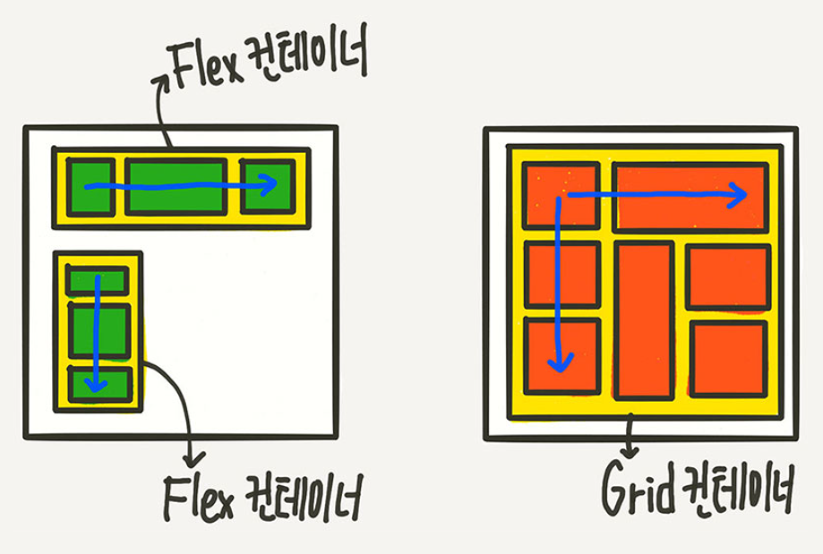
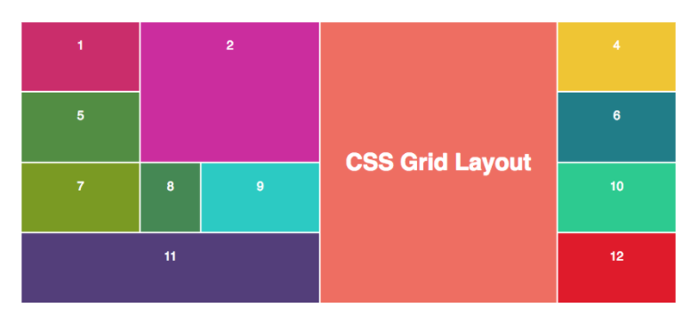
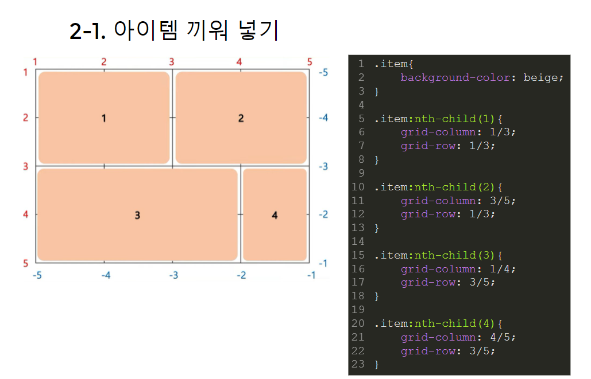

플렉스는 한 방향 레이아웃 시스템

그리드는 두 방향 (가로-세로) 레이아웃 시스템



그리드는 플렉스보다 더 복잡한 레이아웃 표현이 가능하다.



이와 같은 구조를 flex로 구현하려면 매우 힘듦...s

그러나 그리드로는 간단하게 구현 가능!

### 그리드는 어떻게 그리죠?

1. 컨테이너 속성으로 격자를 만들고
2. 아이템 속성으로 격자에 끼워 넣는다

#### 1. 컨테이너 속성으로 격자 만들기

```css
.container {
  display: grid;
  grid-template-columns: 300px 300px 300px 300px;
  grid-template-rows: 200px 200px 200px 200px;
}
```

`grid-template-columns` : 격자의 세로가 몇 개이고 각 격자칸의 크기가 얼마난지 정한다. 위 예시의 경우 세로 4칸이 있고 각 칸은 모두 300px크기이다.

`grid-template-rows` : 격자의 가로가 몇 개이고 각 격자칸의 크기가 얼마난지 정한다.

#### fr과 %

`px`외에도 `fr`, `%`, `em` 등으로 표현할 수 있다.

`fr` : `%`, `px`등으로 공간이 채워지고 남은 공간을 기준으로 할당한다

​ 300px 1fr 2fr 이라면 300px만큼 할당하고 남은 공간을 3으로 나눠 1/3과 2/3만큼 나눠 가진다.

`%`: 남은 공간을 신경쓰지않고 전체 공간을 기준으로 할당한다.

#### repeat

`repeat ` 함수를 사용해서 반복적으로 공간을 할당할 수 있다.

```css
.container{
    display: grid;
    grid-template-columns: repeat(4, 300px)
    grid-template-rows: repeat(4, 200px)
}
```

#### 2. 아이템 끼워 넣기



`grid-column` 을 통해 해당 아이템이 차지할 세로 격자칸을 정할 수 있다

`grid-row` 를 통해 해당 아이템이 차지할 가로 격자칸을 정할 수 있다

`grid-area`를 사용해 `grid-column` 과 `grid-row`를 동시에 선언할 수 있다.

grid-area: r-start / c-start / r-end / c-end

그러나 나는 나눠서 표현하는게 편함

반대로 grid-column과 grid-row를 grid-row-start, grid-row-end이런식으로 나눠서 쓸 수 있다.

#### span

얼만큼 늘린건지도 쓸 수 있다

`grid-column : 1/span3;`

1에서 3개 공간만큼 늘린다는 뜻

참고 (https://studiomeal.com/archives/533)
