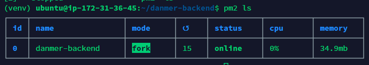

## PM2란?

* 무중단 서버 실행
* 멀티스레딩

**Daemon Process Manager**

> 보통 Node.js 와 같이 사용되며 Node.js 어플리케이션을 쉽게 관리할 수 있게 해주는 Process Manager이다
>
> Node.js 어플리케이션은 단일 CPU 코어에서 실행되기 때문에 CPU의 멀티코어 시스템은 사용할 수 없다
>
> 때문에 Node.js는 클러스터 모듈을 통해 단일 프로세스를 멀티 프로세스로 늘릴 수 있는 방법을 제공한다
>
> 유저는 클러스터 모듈을 사용해 마스터 프로세스에서 워커 프로세스를 생성할 수 있다
>
> 이를 도와주는 것이 PM2이며 PM2를 사용해 하이퍼 스레딩 및 무중단 서비스 제공이 가능해진다 

PM2를 Django 프로젝트에서 사용해보자!


#### 🔨 node 설치

```idl
$ sudo apt install nodejs
```


#### 🔨 npm 설치

```idl
$ sudo apt install npm
# $ sudo npm install npm@latest -g
```


#### 🔨 pm2 설치

```idl
$ sudo npm install pm2 -g
```


#### 🔨 프로젝트 하위에 json 파일 생성 및 작성

```idl
$ vim pm2-appname.json
```


\# project/pm2-appname.json

```json
{ "apps": 
 	[
        { "name": "djnago_with_pm2", 
         "script": "manage.py", 
         "args": ["runserver", "0.0.0.0:8000"],
         "exec_mode": "fork", 
         "exec_interpreter" : "python" }
    ] 
}
```

* args 에는 django 프로젝트를 배포할 때 쓰는 명령어 args를 넣는다


#### 🔨 pm2 start

```idl
$ pm2 start pm2-appname.json
```

* 작성한 json파일을 실행



> * pm2 stop all : 모든 서버 중지
> * pm2 stop {pid} : 해당 pid 서버 중지

