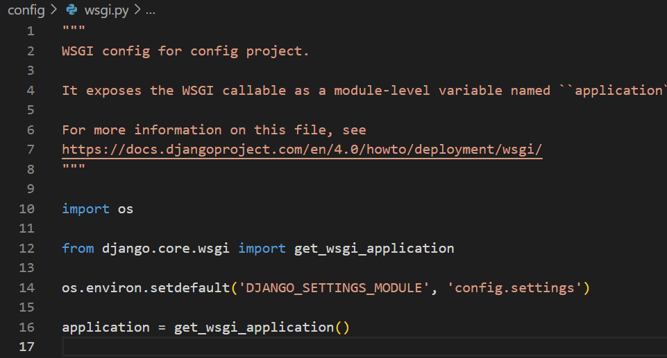

주퍼터에서 아래와 같이 작성하면 된다

```python
import os

# 내 장고 프로젝트의 환경변수 로드
os.environ['DJANGO_SETTINGS_MODULE'] = 'projectname.settings'
import django
django.setup()

```

#### os.environ['DJANGO_SETTINGS_MODULE'] = 'projectname.settings'

<br/>

<br/>
wsgi파일에서 서버가 시작될때마다 필요한 환경변수들을 자동으로 set해준다
외부 스크립트에서 장고 프로젝트의 settings파일 위치를 가리키는 환경변수를 지정하고 `django.setup()`명령어로 장고 환경을 로드하면 장고 프로젝트의 구성 요소들을 외부 스크립트에서 사용할 수 있다
