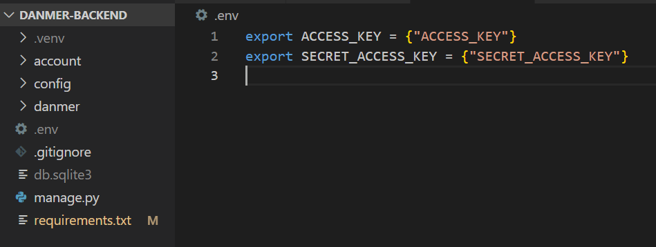

## .env

* vsc의 프로젝트 하위에 .env 파일을 만든다
* .env 파일안에 SECRET KEY를 적어둔다



>  export는 전역변수 선언


## dotenv

* pip install dotenv

```python
from dotenv import load_dotenv

load_dotenv()
AWS_ACCESS_KEY_ID = os.getenv('ACCESS_KEY')
```

> * os.environ['ACCESS_KEY'] : .env에 ACCESS_KEY가 없으면 KEY ERROR 그냥 python 딕셔너리라고 생각하면 됨
>
> * os.environ.get('ACCESS_KEY') : getenv가 그냥 os.envrion.get의 래퍼인듯... 똑같이 작용
>
>   
