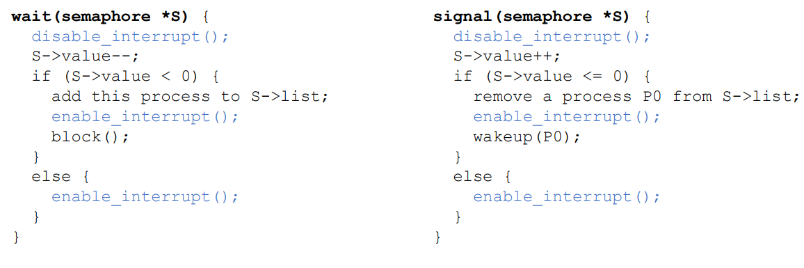
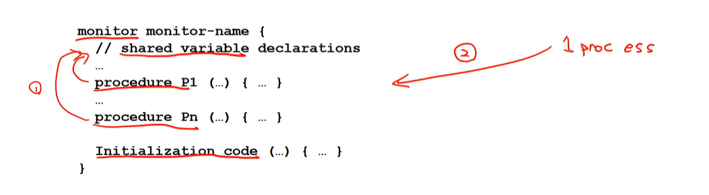
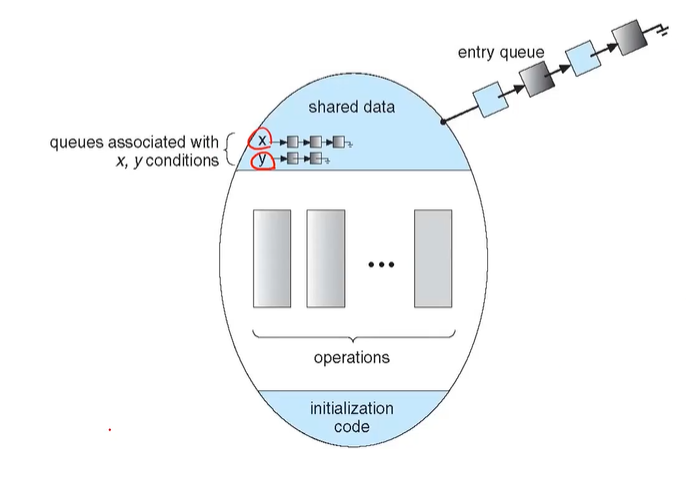
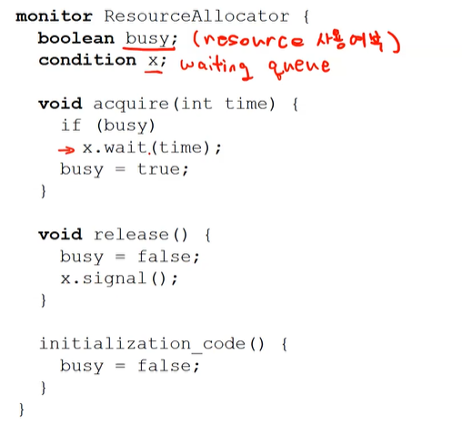
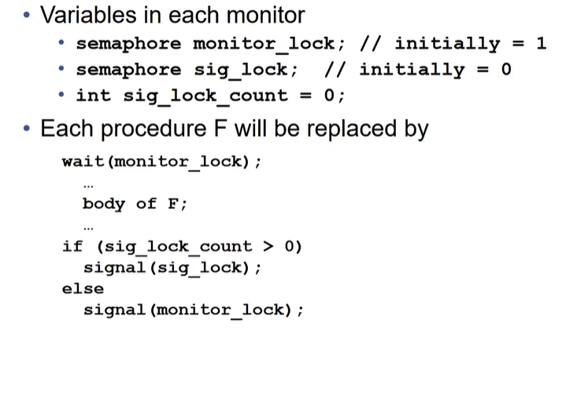
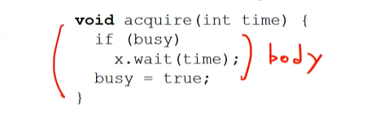
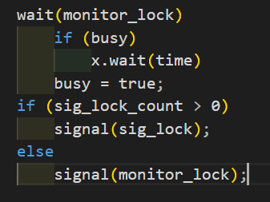
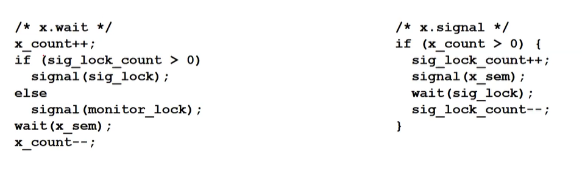

## Semaphore

### disable/enable interrupt

* wait()와 signal()이 실행중일때 다른 프로세스가  S value에 접근하는 것을 막기위해 `disable/enable interrupt`를 수행한다

아래 사진 잘못됨 >=

* 싱글 cpu에서만 사용되는 방법. 멀티 cpu에서는 안됨
  * 멀티 cpu에서는 TAS를 사용하는 방법이 있음
  * 근데 사실 TAS쓰면 busy waiting초래해서 크리티컬 섹션에 진입을 많이하면 cpu 오버헤드가 발생할 수도 있음

* wait()와 signal()은 커널레벨에서 실행중

>  근데 커널 레벨에서는 어차피 컨텍스트 스위칭이 안되는게 아닌가? 왜 disable/enable interrupt를 할까?
>
> 시스템콜 : 소프트 레벨 인터럽트 - 하던일을 멈추고 os한테 권한이 넘어감. 
>
> * 어떤 프로세스가 시스템콜을 호출하면 모드가 커널모드로 바뀌는 것 뿐. os한테 작업이 넘어가는건 아니고 os의 권한을 빌려서 시스템콜에 대응되는 작업을 하는 것뿐임. 커널의 권한을 가지는 것.
> * 그래서 disable/enable interrupt해줘야함

### Semaphore의 단점

* 구조화 되어있지않음
  * wait -> signal 을 해야하는데
  * 저 방식으로 안하고 엉뚱하게 해도 체크하지못한다 (signal -> wait, wait -> wait)
  * 잘못 설계하더라도 알아챌 방법이 없다
  * 이 문제를 monitor가 해결해줄 수 있다!

## Monitor

* 동기
  * Semaphore는 unstructured - too low level, bug 유발가능
  * 좀 더 high level의 mutual exclusion 필요

* OS가 제공하는건 아니고 언어, 랭귀지 - 컴파일러레벨에서 지원

* Abstract data type (ADT)
  * 함수에 의해서만 안에 있는 변수들에 접근 가능
* 모니터안에서는 하나의 프로세스만 active될 수 있다

구조

두 가지 제약 조건이 있는 class라고 생각하면 됨

1. **함수에 의해서만 내부 변수에 접근 가능**

2. **외부에서 하나의 프로세스만 들어올 수 있음**

 

* entry queue : 모니터로 들어고자하는 thread의 queue
* condition variable - type이 condition인 value
  * waiting queue의 일종

 

**# Monitor with condition variables**

* condition variable인 x와 y가 존재
* x라는 이름의 waiting queue와 y라는 이름의 waiting queue 존재
* x.wait() - 다른 누군가가 x.signal()을 해주기전까지 기다림
* x.signal() - wait한 애를 깨워줌

### Code Example

* boolean busy - 리소스가 현재 사용중인지 아닌지
  * 초기화값은 false

* acquire 
  * busy가 false이면 busy를 true로 바꾸고 바로 크리티컬 섹션 진입
  * busy가 true이면 wait()하고 signal()로 깨어나면 busy를 true로 바꾸고 크리티컬 섹션 진입
* release
  * signal을 날려서 x를 깨워줌

* 유저가 유저레벨에서 동기화 코드를 작성한게 됨
  * disable/enable같은 툴 안쓰고 유저레벨에서 동기화 문제 해결 가능

### Condition variable choices

ex) 만약 Process P가 x.signal()을 하고 Process Q가 x.wait()를 했었다면 어떻게 해야할까?  

**1. Signal and wait**

* P는 Q가 자신의 일을 마치고 나올때까지 기다린다 (우리는 이걸로 한다고 가정)

**2. Signal and Continue**

* 반대로 P는 계속 주어진 일을 마저 하고 P가 모니터를 빠져나와서야 Q가 시작된다

### Monitor Implementation

세 개의 큐가 필요 + 각각의 큐에 들어가기 위해 큐를 컨트롤하는 세마포어 lock이 존재 

* monitor queue - monitor 출입 관리 (= entry queue)
  * monitor lock

* condition var의 queue - 특정 공유 변수 접근 권한을 갖기위한 큐
  * x_sem
* signal and wait 를 할 때 signal()을 하고 기다릴 프로세스의 대기 queue
  * sig_lock

* wait(monitor_lock)
  * 누군가 모니터락을 해제하기전까지는 대기
  * 모니터락이 false면 다음라인(body) 수행

* 모니터락에서 누군가 일을 끝내면 기다리고있는 다음 순번을 깨워준다. 다음 순번은 sig_lock에 있는애가 되거나 모니터락에 있는 애가 될 수 있다.

* if (sig_lock_count > 0)

  * 시그 락 카운트가 양수라면 수행하다가 signal()을 호출해서 쫓겨난 프로세스가 있다는 의미. 얘네를 먼저 깨워줌
  * 시그 락 카운트가 0보다 작거나 같다면 모니터락에 있는 애를 깨워준다

  

\# 위 사진의 body는 아래 그림을 의미

#### condition variable lock

* x_count : 초기값 - 0
  * x에 접근하기 위해서 대기하고 있는 스레드 수
* x_sem : 초기값 - 1
  * x semaphore value(자원이 몇 개 있냐)

* wait() : 기다렸다가 lock검 - 어떤 스레드가 자원 쓰려는데 이미 누가 쓰고있으면 대기큐에 들어가서 기다리게하는 함수. 다 기다리면 크리티컬 섹션 진입 가능? (자원 쓰고있는 애 없으면 아무일도 안함. 바로 크리티컬 섹션 진입 가능)
* signal() : 해당 lock을 풀어줌 - 어떤 스레드가 자원 다 써서 크리티컬 섹션 나가려는데 나가려는 김에 리소스 쓰려고 대기하는 애가 있다면 겸사 겸사 깨워주는 함수
* x_wait : 어떤 스레드가 x라는 자원을 사용하고싶다고하면 대기시킴, 대기하는동안 다른 애들 실행하는듯 (x.signal()이 오면 풀려남)
  * x_count++ : x 사용할 스레드 늘어남! 나 x쓸거임! 근데 그 전에 깨워줘야할 애들 있음;ㅎㅎ
  * sig_lock된 애 부터 깨워줌
  * 없으면 monitor 큐에서 대기하는 애 깨워줌
  * 앞에 애들 다 확인했으니까 x하려고 기다리고 있는애 wait()해줌?
* x_signal : 어떤 스레드가 x라는 자원을 기다리고있다면 사용하도록 허락 (= **x.wait()한 프로세스가 있다면 걔 다시 시작함**), 기다리는 애 없으면 아무 일도 안함
  * x_count가 양수라면 x를 사용하기위해 대기중인 스레드가 있다는 말 (너 x 써라!)
  * sig_lock_count++ : x_signal()을 호출한 스레드는 자리를 양보해줘야함. 호출한 애는 sig_lock되어있어라~
  * signal(x_sem) : x_signal해서 x사용할 애 깨워줘야하니까 x_sem에 있는애한테 얼른 쓰라고 깨워줌
  * wait(sig_lock) : x_signal() 호출한 애는 쫓겨나서 기다려야함. 나중에 x.wait() 누가 해주면 깨어날 수 있음
  * 위에다 끝나면 sig_lock_count 다시 마이너스

## 리눅스에서 제공하는 Synchronization 기법

2.6버전 이후 초창기에는 짧은 크리티컬 섹션에서는 인터럽트를 막고 푸는 기법을 썼다

최근에는 fully preemptive한 기법을 사용(누군가 중간에 치고 들어올 수 있는)

* 대부분이 시스템이 멀티프로세서이기 때문
* TAS를 사용해서 spin lock(busy waiting)이 걸리는 형태로

Semaphores 제공

Atomic integers 제공 : 사용자 수준에서 TAS를 사용하기쉽게 변수 타입과 함수들 제공 - atomic 오퍼레이션을 통해서 접근을 하면 다른 애들은 접근을 못하게하는 기능 제공, 간단한 크리티컬 섹션 제어에 사용(변수 하나), 동시에 여러 개의 변수 권한을 설정하려면 세마포어 사용

atomic_t  : 동시에 여러명이 접근할 수 없는 integer이다
