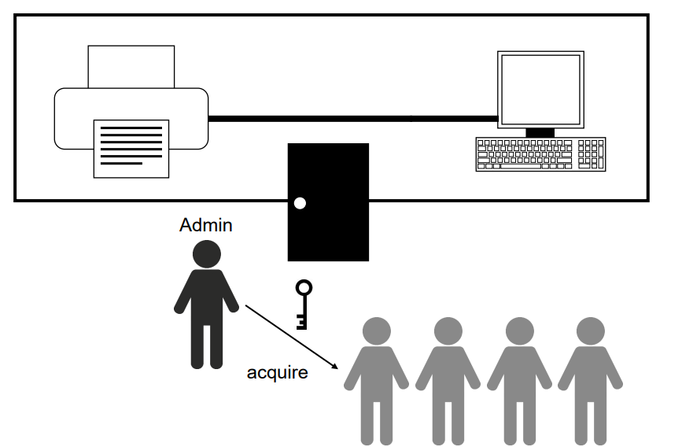

> 이전 내용 요약
>
> * Critical Section with Disable/Enable interrupt
>   * 인터럽트로 인해 다른 프로세스가 참견불가능
>   * 싱글 cpu일 경우 해결 가능
>   * 그러나 너무 강력한 방법
>   * 크리티컬 섹션하자고 모든 인터럽트를 다 막는다?
> * 하드웨어 인스트럭션 : test_and_set
>   * 크리티컬 섹션 문제 해결 가능

## Mutex Lock

> 이전에 배운 test_and_set같은 하드웨어 instruction의 경우 불편한 점이 있다!
>
> * 개발자마다 다 다르게 개발할텐데... 어떻게 구현할지 다 지맘대로
>
> 그래서 api수준의 해결방법을 만들자! 해서 생긴게 mutex, semaphore, monitor들

* race condition - 리소스를 공유하면서 생길 수 있는 문제 상황 그 자체
* critical section - 문제 정의 : 레이스 컨디션을 발생시킬수있는 코드를 정의
* mutex, semaphore, monitor - 해결방법 (high-level) API 수준임 - OS가 제공해줘야함

* **Mutex (Mutual Exclusion) : 공유 변수 + 공유 자원(HW자원, I/O device ) - 변수를 넘어 자원까지 확장됨**

​	

> ex)
>
> 
>
> 하나의 프린터를 여러 사람들이 공유해서 쓴다면 출력되는 내용이 섞일 것. 프린터룸을 "key"를 가진 사람만 접근 가능하게 해서 해결하자!
>
> * 프린터룸 : critical section (프린터기를 공유하면서 문제가 생길 수 있는 공간)
>
> * 프린터기 : 공유 자원
>
> * admin : =os, key(mutex)를 관리한다
> * 각각의 사람들 : process or thread
> * key : mutex
>

os는 mutex권한을 acquire하거나 realease함

* mutex로 Critical section을 보호하는 방법

* acquire()과 release()를 사용해서 섹션에 진입하는 것을 제어한다. (인터페이스 제공)

* Boolean variable == mutex == key 

### acquire() - key를 전달

* admin이 수행

- key가 없으면 대기 - 계속 while문 돌면서 누군가 key를 release() 할 때까지 기다림
- key가 생기면 acquire()이후의 코드를 실행 (크리티컬 섹션으로 진입)

### release() - key를 반납

- 할 일이 끝났으니 available을 true로 만듦

### Busy waiting

>  key를 얻기전에 while문을 계속 도는 것

- available이 참인지 거짓인지 계속 판단
- while을 깨줄 수 있는건 외부의 다른 프로세스가 realease를 해주는 것 뿐
- 만약 프로세스 P0이 waiting상태라면,
  - P0 : time slice를 소진할 때 까지 busy waiting
  - availble을 참으로 바꿔주는 건 다른 프로세스 : 다른 프로세스가 cpu에 올라가서 참으로 만들어줘야하나 이미 P0이 cpu 선점
  - P0은 계속 while문을 돌리면서 cpu에 있어야함
  - 성능 손해

- 이걸 spinlock이라함 == (lock을 위해서 계속 spin중이다.)

## Semaphore

> mutex와 비슷하나 좀 더 진화된 형태

key가 여러개!!!

- P() : wait(), (=acquire)
- V() : signal(), (= release)
- S : int, key가 몇 개인지 개수를 나타냄
  -  0보다 큰 int (S가 1이면 mutex와 같은 기능. mutex에서는 0과 1뿐인 boolean 사용했음)

#### 📌 Binary semaphore 

- S가 0또는 1 (mutex와 같은 기능)

  - for 전통적인 공유 변수 제어

  

#### 📌 Counting Semaphore 

* S가 2보다 크거나 같음

- for   공동의 리소스 자원 관리/제어
- wait()과 signal() 사용 - **스케줄링 필요** : 단순히 공유 자원의 lock개념을 넘어 확장됨(동기화)

  

### Implementation

- wait()과 signail()(P, V)을 수행하는 것도 크리티컬 섹션에 포함시켜야한다 - 특히 S값을 바꾸는 과정
  - S는 공유 자원이므로 S의 값을 변화시키는 wait()와 signal()도 크리티컬 섹션에 포함시켜야함

- 전통적인 방법으로 크리티컬 섹션 문제를 푸는 것은 busywaiting 발생

### 그렇다면, busy waiting을 어떻게 해결해야할까?

#### semaphore waiting queue

busywaiting해결을 위해 세마포어 전용 waiting queue를 만든다

각 세마포어에는 waiting queue가 할당된다.

세마포어 waiting queue의 entry에는 아래 두 개가 존재한다.

* value(int)
* 다음 순서를 가리키는 포인터

> busywaiting 하지말고 그냥 잠들어있어라
>
> 잠든 애들은 웨이팅 큐에 넣어서 os가 관리
>
> 주의! cpu의 waiting queue와 다른 것임
>
> 세마포어 전용 waiting queue를 의미

 

block과 wakeup 두 동작을 수행한다.

#### 📌 block & wakeup

- block == sleep : wait을 호출한 프로세스를 적절한 waiting queue에 넣는다
- wakeup : waiting queue에 있는 애를 제거하고 cpu의 ready queue에 넣는다

#### 📌 wait

​	

​	 

​	\# interrupt 제어 추가버전

​	

* wait - value가 0보다 작으면 키가 없는것!

* 키가 없으니 리스트(웨이팅 큐)에 넣는다

* block() == sleap

#### 📌 signal

​	

​	 

* S의 value가 0보다 작거나 같다면, 누가 대기중이라는 것이므로 하나를 wake up해줌
  * = 가 들어가는 이유는 앞에서 S value를 증가시켜줬으므로 결국 초반에는 마이너스였다는 뜻

* 대기중이 아니라면(S가 0보다 크다면) 그냥 S value 하나 늘려주고 끝

> S는 0보다 크거나 같은 정수라 했는데 왜 0보다작은 S를 고려?
>
> * 어떤 프로세스가 키를 획득할 때 S value값을 줄임
>
> * S가 음수라면 S의 절대값은 wait을 호출하고 대기중이 P의 수를 의미함
>
> * 대기하는 수만큼 마이너스됨

문제 하나 더!

wait과 signal도 크리티컬 섹션이어야한다

> 서로 다른 두 함수가 S value, S list를 공유중

- S의 value랑 list도 크리티컬하게 관리되어야함 -> 싱글 cpu일 경우, disable interrupt, inable interrupt 사용

>  앞에서는 disable interrupt하는거 오버헤드 크다고 했는데 여기선 쓰는 이유 : disable해두는 시간이 짧음
>
> 그러나 멀티 cpu일때는... cpu가 여러개 있으므로 다른 cpu를 사용하는 애들의 인터럽트는 막지 못함. 그렇다고 다른 cpu의 인터럽트까지 막기는 too strong!
>
> 결국 atomic한 하드웨어 서포트를 받아서 해결해야함

### 멀티 cpu - 멀티 프로세서에서의 세마포어

- turn off all other processors : 멀티 cpu일때는 위처럼 다른 cpu의 interrupt도 막는 것은 위험. 
- atomic hardware support가 필요(test_and_set) - S와는 별도로 TAS에서 critical section 해결을 위한 boolean 변수 필요 -> 복잡해짐
  - 생각보다 사용자 레벨에서 쓰기가 어렵...
- 시그널하고 wait하든 wait두 번 연속으로 하든 잘못된거 모름. 한참 돌다가 나중에 알아챌수도
- 데드락 starvation 발생 가능
- 즉, 장점도 있지만 사용하긴 어려움

