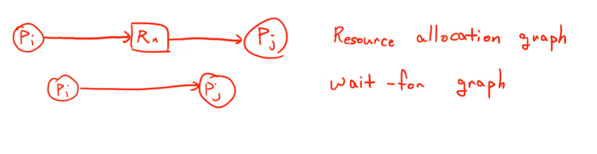

#### mutual exclusion을 방지하려면?

현실적이지않음

mutual exclusion이 필요해서 하는건데...

#### no preemption

이것도 현실적으로 쉽지않음

#### no hold and wait

원래는 다른애가 가지고 있으면 무한정 기다려야하는데

한꺼번에 획득하면 기다릴일이 없음

아예 가져가거나 못가져가거나

atomic한듯

#### no circular wait

circular wait를 만들지않으려면 모든 리소스에 번호를 부여

리소스를 할당받을 때 낮은 번호의 리소스부터 할당받게한다

누군가가 높은 번호를 가진 상태에서 낮은 번호를 요구할 일이 없음. 모든 리소스 할당이 낮은 순서부터되기때문에 아예 할당을 못받거나 순차적으로 할당을 받거나

자연스럽게 circular wait이 해결된다

모든 프로세스들은 순서에 맞춰서 리소스를 할당받는다 근데 사실상 이것도 어려움

1. 몇 개의 리소스가 있는지도 모름

2. 시스템마다 리소스 수가 다를 것

3. os가 일정한 order를 가지고 순서를 부여학 쉽지않음

4. 새로운 리소스가 추가되면 어떻게 할 것인지

   단순하게 i+1?

   근데 얘가 굉장히 중요한 리소스라면?

이론적으로는 괜찮으나 실질적으로 어렵다

## Deadlock Avoidance - Banker's Algorithm 

시스템이 추가적인 정보, 사전 정보 요구 : a prior information

- maximun number of resource : 각각의 프로세스가 동시에? 사용하고자하는 최대 리소스의 개수를 미리 개재
  - ex) P0은 R0 :10개, R1: 5개, R2:2개
  - 미리 정해두는게 쉬운건 아니지만 일단 이걸 전제

- resource-allocation state : 특정순간에 실제 할당받은 것을 체크 - circular wait이 생기지않도록함

## Banker's Algorithm

시스템은 state를 safe state와 unsage state로 나눔

- Safe state : 어떤한 형태에도 데드락이 발생안함
  - Safe sequence <P1, P2,... Pn>이 safe state에 존재한다

  - 아래 은행 예시의 경우 B-A-C, B-C-A, C-A-B, C-B-A가 될 수 있음

  - safe sequence에서는 언제나 앞번호의 프로세스가 수행되고 그 다음 뒷번호 프로세스가 수행된다고 가정한다

  - P1이 빌려가고 반납하면 P2가 빌려감.. 이렇게 순차적으로

  - 느리긴 하지만 safe할 수 있다

- Unsafe state : 데드락이 발생할수도있음

P : 프로세스 n개의 set

R : 리소스 m개의 set

safe state인지를 어떻게 볼까

  

ex) 은행 총 100억 소유중이라고 할 때,

(리소스가 하나만 존재 : 돈)

\# safe state 예시

| 고객 | 최대 필요량 | 현재 대출금 | 필요량 |
| ---- | ----------- | ----------- | ------ |
| A    | 60억        | 20억        | 40억   |
| B    | 50억        | 30억        | 20억   |
| C    | 50억        | 30억        | 20억   |

은행 남은 잔고 : 30억

* B또는 C에게 필요량만큼 빌려줄 수 있음!
* 만약 B에게 20억을 빌려준다면 B가 일을 수행 후 대출한 50억을 다시 은행에게 돌려줌
* 받은 50억으로 모두에게 돈을 빌려주고 회수가능

 

\# unsafe state 예시

| 고객 | 최대 필요량 | 현재 대출금 | 필요량 |
| ---- | ----------- | ----------- | ------ |
| A    | 60억        | 30억        | 30억   |
| B    | 50억        | 40억        | 20억   |
| C    | 50억        | 30억        | 20억   |

은행 남은 잔고 : 0억

* 모두에게 돈을 추가로 빌려줄 수 없음 -> 아무도 더 이상 돈을 빌리지 못하고 일을 수행할 수 없는 상태
* 그러나 만약 운좋게 A가 30억만으로도 주어진 일을 수행할 수 있다면 A가 일을 완수후 30억을 다시 돌려주고 은행은 다른 고객에게 돈을 빌려주는게 가능!
* 이렇게 데드락이 발생할수도 있는 상황을 unsafe라고 함

### 전제조건

- 각각의 프로세스는 사전에 maximum use를 고지해야함 - 최대 얼마나 사용할 것인지 미리 알려줘야함

- 프로세스는 기다릴 수 있어야함

- 프로세스가 한 번 리소스를 가져가면 주어진 시간안에 반환을 해야함

### 

### Notation

- n : 프로세스의 개수
- m : 리소스의 개수
- Available[1:m] 리소스마다 몇 개가 사용 가능한지
- Max[1:n, 1:m] : n x m 행렬, 각 프로세스가 최대로 필요로 하는 리소스 개수
- Allocation[1:n, 1:m] : 현재 각 프로세스들에게 할당된 리소스
- Need[1:n, 1:m] : 각 프로세스들에게 필요한 리소스들 (Max - Allocation)

### 알고리즘 두 가지

- safety algorithm : 현재 safe인지 unsafe인지 판별
- Resource-Request Algorithm : 새로운 리퀘스트가 왔을 때, 이 리퀘스트를 들어주면 safe인지 unsafe인지 판별 (safety algorithm 사용)

### Safety Algorithm

Availabe보다 Need가 더 작은애들은 언제든지 일을 할 수 있음

Finish : 해당 프로세스가 끝났는지를 나타냄

Available == Work라고 할 때

1. initialize Work[1:m] and Finish[1:n]

   Work = Available

   Finish[i]는 전부 false

2. 아래를 만족하는 i를 찾는다.

   * Finish[i] = false : 아직 working중인 process
   * Need i <= Work : Pi에게 추가로 필요한 리소스가 현재 빌려줄 수 있는 리소스보다 작은 상태

   만약 만족하는 i가 없다면 4번으로

3. Work = Work + Allocation(i) : Pi가 일을 마쳤으니 Pi에게 할당된 리소스를 회수

   Finish[i] = true : Pi 작업끝!

   2번으로 돌아감

4. 모든 i에 대해 Finish[i]가 true이면, 시스템은 safe state한 것.

### Resource Request Algorithm

리퀘스트를 받았다고 가정하고 앞으로 벌어질 일들에 대해 safety algorithm을 돌려봄

* 어떤 프로세스가 리소스 요청을 할 때 일단 들어줘보고 safe가 유지되는지 확인

1. Request(i)가 Need(i)보다 작은지 확인 (만약 Request가 크다면 Max를 넘어가는 범위이므로 error)

2. Request(i) <= Available(i)이면 일단 실행

3. 아래 수행 - 실제로 request를 들어주는건 아니고 빌려줘도 될지 값만 계산해봄

   * Available = Available - Request(i) : 빌려줄 수 있는 리소스양에서 Request만큼 줄임
   * Allocation(i) = Allocation(i) + Request(i) :  Pi에게 리소스 할당
   * Need(i) = Need(i) - Request(i) : 빌려준만큼 Pi에게 필요한 리소스에서 줄임

   safe를 만족하면 Pi에 리소스를 할당

   unsafe하면 Pi를 기다리게함

### 한계

근데 사실 잘안쓰임

1. Rj가 얼마나 될지 정확하게 알기 힘듦 - 리소스 자원의 수가 가변적일수도있음
2. Process 수가 가변적임 - 프로세스 수가 고정되어있는게 아님
3. 미리 maximum use를 고지하기 힘듦

그래서 사용되진않음 ㅎ

사실 데드락을 크게 고려안함... 왜?!

데드락이 발생하면 pc사용자가 바로 인지할 수 있음

무한뤂프 돌면서 뻗을때... 걍 작업관리자 켜서 종료함

오잉~ 나 스스로 데드락 종료 ?!

그래서 엄청나게 중요한 문제는 아님

유저가 개입할 수 없는 서버시스템, misstion critical system(자율자동차)...에서는 중요한 문제

### prevention detection 차이

prevention : 비쌈, 비효율적. 데드락 가능성을 보고 아예 방지

detection : 데드락을 허용하되 리커버리 제공

근데 사실 디텍션도 그렇게 값싼건아님

복구가 항상 가능한 것은 아님

mission critical system(자율주행자동차)같이 데드락에 취약한 시스템에서는 사용이 어렵다

(그럼 뭔 쓸모냐?)

## Deadlock Detection

- single instance - 자원 타입마다 자원이 한 개

  - 그래프에 싸이클이 생기는지 안생기는지로 detection
  - wait-for 그래프 사용

    

    자원이 하나씩있으므로 리소스 노드 삭제하고 간편화해서 그림

    싸이클이 발생했는지 확인하기위해선 O(n^2)의 시간이 걸린다. (n = 화살표의 개수)
- multiple instance - 한 종류의 자원이 여러개있음

  - banker's algorithm을 변형해서 detection

바이너리 세마포어, 카운팅 세마포어 같은 느낌

### Multiple instance

Max가 없고 Request[1:n, 1:m]가 생김

* Process들의 Request가 따로따로 존재함
* Need 대신 Request사용
* Request : 리소스 리퀘스트를 보냈지만 아직 할당은 받지 못한 상태

Finish[i]가 True가 되는 조건이 다름

* 아까는 초기값 False에 자원 반납을 전부 완료하면 True로 전환
* 지금은 allocation한게없으면 True (자원을 아무것도 사용하고있지않으면 일단 True)

데드락이 생기는지 안생기는지만 판단

1. Initialize Work[1:m], Finish[1:n]

   Work = Available

   Finish[i] = false (if Allocation != 0), 아니면 true

2. 다음 조건을 만족하는 i를 찾는다

   Finish[i] = false

   Request(i) <= Work

   만족하는 i가 없다면 4번으로

3. Work = Work + Allocation(i)

   Finish[i] = true

   2번으로 다시 

4. 모든 i에 대해 Finish[i] = true면 no deadlock

detection은 request가 들어올 때마다 돌린다

* 알고리즘이 무거워서 오래걸림. 함수가 너무 자주 호출됨 : 오버헤드가 큼

주기적으로 호출한다

* 주기가 길면 데드락 상황도 오래 지속된다

주기적으로 하면서 특정 조건일 때 발동

* CPU 사용률이 40% 이하일 때 - 성능적으로 큰 손해가 없음, 데드락 가능성 존재(다들 기다리는중)

데드락 감지되면 어떻게 하죠?

리커버리 해야죠

* 프로세스 종료
  * 모든걸 종료시킬거임? - 개오바 무리
  * 하나씩 종료시키면서 데드락 해결되길바라자
    * 근데 뭘 먼저 종료시킬건데?
    * 얼마나 중요한가, 얼마나 돌았는가, 끝내기위해 얼마나 많은 리소스를 필요로 하는가 등 많은 조건들을 따짐
    * 시스템마다 우선으로 두는 가치를 잘 반영해서 짜야함
* 자원을 뺏어서 다른애한테 (preemption)
  * 누구껄 뺏죠 - 이것도 복잡한 문제
  * Rollback - 자원 할당 시키기 전으로 되돌림, safe한 state일 때로 돌려야함. 근데... 그 때가 언젠지 어떻게 알죠?;
  * safe한 state일 때를 기록해놔야함 : 이것도 오바
  * Starvation : 한 명이 계속 자원 뺏길수도있음 
