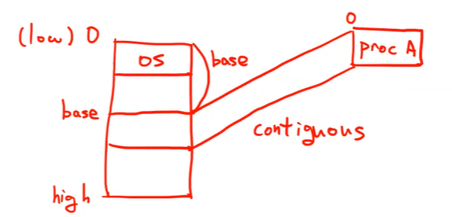
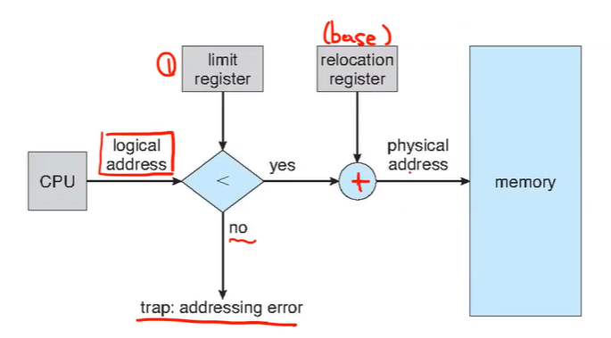

## Memory System

registers - (main) -cache - Memory - Storage(disk)

> Registers
>
> - 프로세스에서 사용하는 data
>
> Memory
>
> - DRAM
> - 프로세스의 정보(state, 코드)
>
> Storage
>
> - SSD, HDD
> - 프로그램 코드, 파일
> - 영구적으로 유지. 전원이 꺼져도 유지. 프로그램 관련 (메모리와 레지스터는 전원이 켜져야함. 프로세스 관련이라고 보면 됨)

- 프로그램이 수행될 때는 disk에서 memory로 가져와야함

- 메인 메모리와 레지스터는 CPU가 직접 접근할 수 있는 유일한 공간
- 메모리에는 주소와, 주소를 읽고 주소에 쓰는 요청만 감
- 레지스터는 one CPU clock안에 접근할 수 있다
- memory는 many cycle 을 소요. stall을 유발함
  - stall - 기다리는거,
  - stall등을 최소화하기위해 Cache등장
- Memory의 Protection 필요

## Hardware Address Protection

메모리안에서 A프로세스에게 할당된 공간을 B 프로세스가 건드리지않게 Protection이 필요함

- base와 limit을 가지고 해결

CPU는 address를 받으면 base

### Address Binding

- 소스코드에서는 address가 symbolic(변수명)하게 나타남 (주소를 직접 명시하지않음) int a;

- 컴파일 단계에서 relocatable address부여
  - 14bytes from beginning of this module
- 링커 단계에서 absolute address부여 (logical address : cpu에서 바라보는 주소)
  - 74014

### Logical vs Physical Address

- Logical address
  - CPU에 의해서 생성. virtual address라고도 함
- Physical address
  - physical = logical + base
  - 실제 메모리의 물리적 주소

### MMU (Memory-Management Unit)

- logical에서 physical로 매핑시켜주는 하드웨어 디바이스
- OS가 MMU의 relocation register에 값(base)을 써줘야함

메모리 구역을 분리하는건 알겠는데 어떤 프로세스를 어떤 구역에 둬야할까?

## Contiguous Memory Allocation

초기 - 연속적 할당

메인 메모리는 이 안에서 두 개의 파티션으로 나뉨

- low : os
- 나머지 공간은 User Process가 통으로 들어감
- high

- physical 주소 변환에 복잡함이 없음

process A는 0부터 알파까지

알파 = limit

- Base = physical address의 smallest value
- Limit = logical address의 range
- os가 limit과 relocation에 값을 써줌(dispatcher가 cpu 스케줄링할 때)

### multiple-partition allocation

메모리에 몇 개의 프로그램이 올라갈 수 있는가

파티션 크기 자체는 가변적 : 프로세스마다 limit이 다를 수 있음

Hole : 메모리안의 비어진 공간

- 각 프로세스마다 base, limit 관리
- 새 프로세스가 들어올 때 새 프로세스의 base와 limit을 정함
- allocated P, free P (hole) 관리

### First-fit

allocate할 수 있는 첫 번째 hole에 할당

빈 홀 검색은 처음부터 할 수도 있고 바로 이전 탐색 이후부터 할 수도 있다

빠름

### Best-fit

allocate할 수 있는 가장 small한 hole

공간효율

### Worst-fit

가장 큰 hole에

가장 큰 공간이기때문에 할당해주고 남은 공간도 클 것이다 - fragmentation을 낮춤

그러나 성능, 효율이 떨어짐

### Fragmentation

- External fragmentation
  - 전체 메모리 스페이스 request한 것을 다 담을 수 있을만큼 있으나 연속적이지 않아서 문제
  - 1크기의 홀이 10개, request는 5크기 요청. 공간은 있으나 연속적이지 않아서 담을 수 없음
  - 50-percent rule : fitst-fit으로 한 분석 결과 0.5의 블록은 fragmentation으로 사용불가능
- Internal fragmentation
  - 18648B의 여유공간이 있는데 18646B request가 옴. 2B가 남음 (사실상 못쓰임)
  - 저 2B를 홀로 관리해줘야함
  - 이걸 막기위해 그냥 18648B를 할당해버림
  - 실질적으로 2B는 사용안하는 공간
