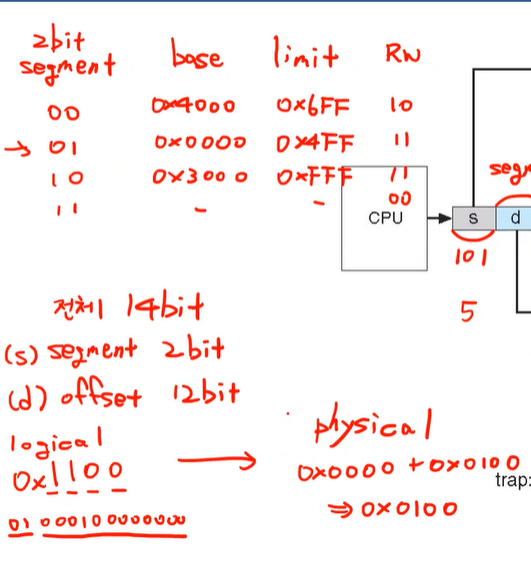

## Contiguous Allocation

### Compaction

hole들을 모음

external fragmentation 해결

문제 : I/O를 발생시킴

큰 메모리 카피를 일으킴 - 오버헤드

지금은 쓰이지않음

### Swapping

fragmentation을 해결한건 아니고 여유공간 자체를 늘려줌

Backing store : 스왑되는 공간. 기존에 있는 프로세스 메모리 공간 하나를 디스크로 백업해놓음

- 백업을 시키고 free.
- free한 공간에 새 프로세스 할당

근데 오버헤드는 compaction과 비슷;

- 데이터를 빼오고 이동시키는 시간이 길다
- 그러나 여유공간이 많은 것 처럼 보여줌 Degree of Multi programming을 늘림
- but, disk에 있는 애들을 위한 ready queue를 추가로 관리해줘야함

### Context Switch Time Including Swapping

컨텍스트 스위칭을 할 때 Swapping을 같이하자!

- 디스크에 옮겨놓는 일은 시간이 오래걸림
- Context switch time이 커질 수 있다
- Standard swapping은 쓰이지 않음(이후 Paging과 함께 쓰이긴 함)
- 모바일 os에서는 swap이 사용되지않음
  - 메모리에 있는 data를 디스크로 옮김
  - 모바일은 디스크가 없음
  - Flash memory based임
  - 플래시 메모리는 write cycles가 제한되어있음 ( 같은 공간에 쓰기 횟수가 제한)
  - 모바일 os에서는 refresh : 백그라운드에 있는 애들의 정보를 계속 유지할 수 없음. 최소한의 정보만 저장해두고 free시킴

## Contiguous Allocation의 문제

모든 데이터를 통째로 관리

코드는 여러 프로세스가 공유될 수 있음

한 번 만들어진 코드는 변하지않음. read-only

그러나 데이터, stack, heap섹션은 일반적으로 공유되지않음- read-write

즉, 특성이 다른 영역들이 존재

> 프로세스의 모든 공간(stack, heap, data, code)를 전부 이어붙여 저장하지말고 따로따로 저장할 순 없을까?
>
> -> Segmentation

## Segmentation

메모리 area를 여러 개의 area로 나누자

- segment마다 개별적으로 base와 limit 값을 가지고있어야함
  - 두 개의 protection bit가 필요(read write가 가능한지 표시하는)
  - ex) 10이면 read만 가능

MMU가 할 일

1. 지금 요청이 온게 어느 seg에 속하는 것인가
2. 해당 seg의 limit을 검사
3. 해당 seg의 base를 더함

어느 seg에 속하는지 어떻게 알 수 있을까?

- logical address의 상위 bit을 세그먼트를 구분하는데 쓰자
- 인스트럭션 자체에서 구분을 해보자
  - ex) stack에 푸쉬하는 인스트럭션이니 stack에 가야겠구나!
  - 인스트럭션마다 명확하게 나뉘는게 아니라 어려움

세그먼트별로 리밋과 베이스를 어떻게 관리할까?

segment table

## Segmentation Architecture

- 로지컬address에서 바라보는 주소를 다음과 같이 만듦

  - <segment-number, offset>
  - 상위 bit : 어떤 seg에 속하는지
  - 하위 bit : seg안에서의 주소

- Segment table

  - 각각의 seg에 할당된 base와 limit을 관리
  - s : seg의 번호
  - d : = offset, seg안에서의 addr

base : physical addr의 starting을 담고있음

limit : 해당 seg의 length

레지스터 두 개가 필요

- Segment-table base register(STBR)
  - physical memory안의 세그먼트 테이블의 실제 위치
  - seg-table의 base
- Segment-table length register(STLR)
  - 해당 seg table의 length를 구하는 테이블
  - seg-table의 limit
