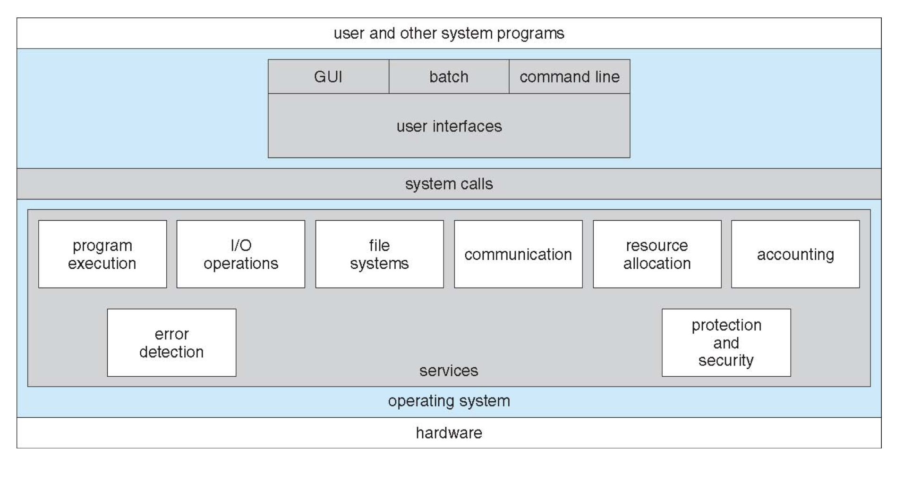

## 1. OS의 구조

 

- **GUI** : 그래픽 UI ex. 마우스 커서

- **command line** : 커맨드입력창

- **시스템콜** : os 내부 기능 활용

- **커널**(그림의 services)

## 2. 컴퓨터 하드웨어

- CPU
- DISK
- disk controller
- memory
- 📌 bus
  등등...
  - System bus
  
    1. Data bus
       서로 데이터를 주고받음
    2. Command/Address bus
       메모리 주소, 명령어(거의 read/write : 프린터에 뭘 쓰기위해 설정값을 바꾸려는 명령어도 write에 포함)
  
  - 버스 component classification
    1. Bus arbiter(버스 관리자)
       여러개의 버스 리퀘스트가 동시에 들어옴. 어떤애를 먼저 보낼지 충돌 관리
    2. Bus master
       신호를 보내는 쪽 : bus transactionn을 만듦.
       ex) CPU, DMA controller, graphics adapter
    3. Bus slave
       신호를 받는 쪽
       ex) Memory, Device controller

## 3. I/O Operations

I/O controller가 cpu commands에 따라 I/O operations 수행
I/O controller register

- Data register(input, output : 실질적으로 보내고 받는 데이터)
- 📌 Control register(control, status) <- 컨트롤 레지스터의 값을 변경해줌으로써 i/o동작이 일어나도록 함

ex) 아웃풋 레지스터 수행할때

1. cpu : read status register of I/O controller(레지스터가 사용 가능한 상태인지 확인)
2. write cmd : data를 I/O controller한테 보냄
3. 쓸 수 없는 상태라면 쓸 수 있는 상황이 될 때까지 1번을 반복

### 📌 I/O operation이 끝났는지 확인할 수 있는 방법 :

1. Polling I/O
2. interrupt-driven I/O

#### Polling I/O
cpu가 주도
주기적으로 I/O status reg를 체크

#### Interrupt-driven I/O
I/O controller가 주관
I/O device controller가 cpu한테 알려줌

### 📌 I/O register에 접근 방법

1. Memory-mapped I/O : 메모리 addr주소에 접근
2. Port-mapped I/O : 메모리 주소는 따로 있고 디바이스 별로 포트를 만들어서 접근. Port-mapped I/O가 대체로 쓰임
