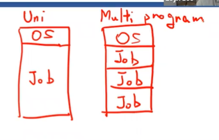

## Process

여기부터 중요하네 ...

os는 프로세스를 중심으로 관리

## Process Concept

> program은 passive
>
> process는 active

컴퓨터내에서 돌아가는 일의 단위

실행중인 프로그램

**특정한 프로세스 상태를 갖는 컨텍스트 안에서 돌아가는 실행의 흐름**

excution stream : 한줄한줄 실행하고있는 바로 그 상태!

process state : 아래 참고

프로그램 : 실행시키기전까지는 프로그램

코드 시퀀스. 기계어의 나열

프로그램을 실행시킨게 프로세스

실행되서 메모리에올라가서 한줄한줄 실행중~><

프로그램은 여러개의 프로세스가 될 수 있다. ex. 크롬 브라우저 여러개 생성

### process state (= process context)

- Memory context
- Hardware context
- System context

0과 max는 메모리 상대주소를 가리킴

#### Memory context

- text : 컴파일 되어서 기계어로 된 code와 data
- 파일안에 이미 존재하고 있는 data : 글로벌 변수

- stack : 지역변수, 함수인자, 함수호출되고 리턴될 주소

- heap : 동적으로 할당된 data (ex. new malloc)

(도서관 관리)

#### Hardware context

CPU register, I/O registers

(도서관 관리)

#### System context

Process table, open file table, page table

(책장 주변 환경 관리)

### 📌 Multiprogramming vs Multiprocessing

- 유니 프로그래밍 : 하나의 프로세스가 메모리에 올라간다

- 멀티 프로그래밍 : 메모리 관점! 메모리에 여러개가 올라가는가

  동시에 여러 개의 프로그램이 실행되어서 메모리안에 여러개의 컨텍스트를 올려놓은 상태

 

- 멀티 프로세싱 : cpu 관점 - cpu가 여러 프로세스를 동시에 번갈아가며 처리하고있는가

 여러 개의 프로세스가 cpu를 번갈아가며 사용하면서 실행중. cpu가 multiplexed됨

cpu를 쓰려는 프로세스들을 관리할 방법이 필요하다!

각각의 프로세스들을 관리하기위해 만든게 process control block

### 📌 Process Control Block

- process state

- program counter : 몇 번째 라인을 수행중인지

- 레지스터들

- 스케줄링 information

  등등...

각각의 프로세스에게 할당되어있다!

os는 이 프로세스 컨트롤 블록을 보고 프로세스를 관리

### 📌 Process table

각각의 프로세스들의 pcb를 모아둔것들

초창기 유닉스는 pcb를 array로 구현

길이가 고정되어있어서 일정 길이 이상으로 늘어나지못함

지금은 linked list형태로 사용중

### 📌 Process State (좀 더 자세하게...?)

앞에 있는건 context라고 하기로 하자...

얘는 진짜 딱 프로세스의 상태

- new : 프로세스 생성
- running : 레디들중에 선택
- waiting : running중 cpu에서 나와야 할 때 (ex. I/O or event wait)
- ready :
  - new하고 성공적으로 만들어지면 옴
  - 러닝중 인터럽트
- terminated : 프로세스 종료

process life cycle

큐를 사용해서 구현

### 📌 State Transition

- Ready queue

  말그대로 레디중인애들

- Device quete (I/O waiting queue)

  I/O이벤트등으로 디스크를 기다리고 있는 프로세스들... 각각의 이유별로 큐를 만들어서 따로 관리

- job queue

 시스템에 있는 모든 프로세스들을 따로 만들어놓은 큐

- 이 linked list를 구현할때 그냥 pcb를 가져와서 구현함

- cpu에서 일하고있는 큐는 위 셋 중 어떤 큐에도 들어가있지않다

- 시간이 다 돼서 쫓겨난 애들은 레디큐로

### 📌 Schedulers

레디큐에서 cpu로 보낼애를 선택하는 법

- 📌 Short-term scheduler (= CPU scheduler)
  - 어떤애를 cpu로 보낼건지!
  - 짧은 시간 간격으로 돌면서 다음애 돌 애를 지속적으로 바꿔줌
  - 밀리세컨드 이하로 반복
  - 여러개의 프로세스가 동시에 움직이는 것 같지만 사실은 밀리세커드 단위로 바뀌고 있는 것
  - 자주 호출돼서 빨라야 함!
- long-term scheduler (= job scheduler)
  - 없는 os도 있음
  - 레디큐에 넣을 프로세스들을 선별
  - cpu scheduler가 본선느낌이라면 얘는 예선느낌
  - 하나의 컴퓨터에서 너무 많은 프로세스를 만들어버리면 pcb도 많아짐... 책장 부족!
  - degree of multiprogramming : 멀티프로그래밍의 정도를 나눔. 프로그램 몇 개가 메모리에 있을지 결정

#### 📌 스케줄러를 위한 프로세스의 두 종류

- I/O-bound process
  - I/O 요청을 처리, 대기하는데 시간이 많이 걸림
- CPU-bound process
  - I/O는 모르겠고~ cpu를 오래써야 끝날 수 있는 프로세스

 job scheduler는 저 두 개를 적절히 섞어준다

### CPU Switch From Process to Process

#### 📌 Context switch

1. 원래 돌고 있던 프로세스의 컨텍스트를 save

2. 새로 올 프로세스의 컨텍스트를 가져옴

- 오버헤드. 스위치하는동안에는 누구도 일을 하지 않음
- 자주 일어나면 안좋음
- 이걸 위해 레지스터를 여러개 구비해놓기도. (책을 치우고 갈 필요가 없음)

## 📌 Process Creation & Termination

> 두 가지 방법 존재
>
> 1. 새로운 프로세스 만들기
> 2. 클론하기
>
> 보통 클론

- 📌 process creation :

  1. disk storage에서 프로그램의 code, data를 읽어 메모리에 넣는다
  2. stack공간을 만든다(empty stack)
  3. pcb 만들고 초기화
  4. 레디큐에 프로세스를 넣는다

- 리눅스는 컴퓨터 부팅될 때 첫 프로세스만 이렇게 만듦

- 나머지 프로세스는 기존의 프로세스를 클론해서 만든다

- 기존에 있던 메모리 공간을 그대로 복사해온다

- 복사하고 exec()을 통해 새로운 프로그램을 메모리에 올려버린다(이걸 안하면 기존 것과 똑같은 프로그램)

- 프로세스를 만드는 시간이 줄어든다! 개이득!
