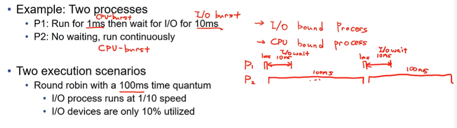

스케줄링 policy : CPU를 누구한테 할당할까
하나의 응용프로그램이 있을때 시피유 버스트와 아이오 버스트로 나뉨.
각각의 프로세스마다 시피유 버스타한 부분이 있을텐데 이를 어떻게 시피유에 할당해주냐

## FCFS

가장 간단한 방법. 줄 선 순서대로. 먼저 온 프로세스부터 처리

하나의 cpu burst한 부분을 단위로 cpu 스케줄링을 함

24, 3, 3 <-cpu burst time

단점: 시피유 버스트 타임이 긴 프로세스가 먼저 선택된다면 하나가 시피유를 독점
솔루션 : 시피유 버스트가 끝날때까지 기다리는게 아니라 일정 시간이 지나면 강제적으로 컨텍스트 스위치를 시켜버리자 time slice

예제)

P1 P2 P3순으로 실행(먼저 온 순서)

- waiting time : 각 프로세스가 도착한 이후에 얼마나 기다렸는가

p2 p3 p1 순으로 왔을 때 훨씬 빨라짐

## Shortest Job First (SJF)

Key operations : length of CPU burst

각각의 cpu 버스트의 길이를 가지고 짧은 애한테 우선순위 할당

optimal함 : 쉽게 증명 가능

waiting time 기준으로는 가장 좋은 policy

문제) 어떻게 cpu burst 타임을 알 수 있는지
정확한 cpu burst time을 OS가 알 수 없음. 구현불가능!

two variations이 존재

- non preemptive (양보가 안되는. 우선순위)

  어떤 SJF정책에 의해서 한 번 씨피유를 점유하면 그 잡이 끝날때까지는 스케줄링이 되지 않는다. 자리 안내줌

- preemptive(양보가능한)

  만약 SJF정책에 의해 짧은애가 선택이 되면
  새로운 프로세스가 레디큐에 들어옴
  다시 스케줄링 가능. 새로 들어온 애 먼저 들어가게 해줌 

  ex)
  끝난 시간 /바로 수행됐다면 끝났을 시간/ waiting time
  p1 16 (0+7) 9
  p2 7 (2+4) 1
  p3 5 (4+1) 0
  p4 11 (5+4) 2

근데 cpu burst time을 알 수 없음

노력1. 예측해보자!
exponential averaging
수학적인 컨셉 제공 but 실제로 os에 적용하긴 무리 : 알파값 정하기가 힘듦. 실패케이스
n+1시점의 cpu burst time을 이전의 히스토리를 가지고 예측해보자

tn : 바로 직전의 실제 cpu burst time
타우n+1 : 이번에 예측할 cpu burst time
타우n : 바로 직전에 예측했던 cpu burst time

알파를 얼마로 정해야?
알파 = 0 기존에 예측한거 유지
알파 = 1 직전의 실제값만 씀
알파값은 시스템과 응용프로그램에 따라 또 달라짐
이론적인 컨셉만 제공하고 실제 사용은 안함

더 나은 policy를 찾아야할 필요성

---

## Round Robin(RR)

Key operations : 각각의 프로세스는 각자의 time quantum(q) 동안만 cpu를 차지할 수 있음. q가 끝나면 cpu를 돌려주고 레디큐의 맨 끝으로 돌아감.

q는 10 - 100 밀리세컨드 정도

q가 크면 : FIFO. FCFS와 같아짐.
q가 작으면 : 컨텍스트 스위치 오버헤드가 커짐. SJP와 근접해짐.

많은 os가 라운드로빈이 기반인 스케줄링 사용

컨텍스트 스위치타임은 보통 <10
q를 10~100으로 잡아서 컨텍스트 스위치타임의 오버헤드가 안보이게

만약 n개의 프로세스가 있다면 어떤 프로세스가 자기 순서를 받을때까지 최대 (n-1)q 만큼만 기다리면 됨

bad case) 10개의 프로세스가 100 time을 수행해야함

1000-10 #waiting time
1000-9
1000-8
.
.
.

다들 오랜 시간 기다려야함.
균등하게 비효율적.

즉,  스케줄링 할 대상들이 비슷한 cpu burst time을 가질때 bad

ex) 

* q가 100 
* p1 cpu burst:1 , I/O burst :10
* p2는 그냥 계속 cpu burst

p1 1ms + 10ms waiting |1ms + 10ms|
p2 100ms . . . . . . . . 100ms . . . . . .
1ms 후 100ms 수행

U(CPU) = 100% (cpu가 얼마나 활용되고있는가)

U(I/O) = 10ms 돌고 91ms 기다림
10/101 = 10%

단점) I/O 사용이 잘 안됨

같은 ex, q만 다르다고 가정) q = 1
U(CPU) = 100%
U(I/O) = 거의 90% p1이 cpu burst할때 제외하고는 다 I/O (10/11)

단점) 컨텍스트 스위칭이 자주 일어남. 오버헤드큼

타임 퀀텀이 적절해야 라운드로빈 효율적
근데 적절한 타임이 cpu burst와 i/o burst에게 다름
cpu는 클수록. io는 작을수록

다음해결방안 : (SJ)io bound process한테는 타임 퀀텀을 작게 (LJ)씨피유는 타임퀀텀을 크게

프로세스마다 다르게 적용함 adaptive policy

## Priority Scheduling

각 프로세스마다 우선순위 부여 - 숫자형태로

더 높은 우선순위 먼저 실행
SJF도 프라이어리티 스케줄링의 일종이라고 볼 수 있음. 얘는 실행시간이 짧은애가 우선

얘도
프림티브
논프림티브 둘 다 만들 수 있음

문제) Starvation
어떤 프로세스가 우선순위가 낮음. 우선순위가 더 높은 프로세스가 계속들어온다면 우선 순위가 낮은 프로세스는 실행될 수 없음.

솔루션) Aging
프라이어티에 나이 개념 도입
대기 시간이 길어지면 우선순위롤 조금씩 올려줌

## Multilevel Queue

큐를 분리해서 사용

foreground - 인터랙티브 : cpu보다 io가 더 느림
background - batch : cpu가 긴.
각 프로세스는 한 번 큐가 정해지면 그 큐만 사용? 반배정하듯이
각각의 큐는 서로 다른 policy를 가질 수 있음

- foreground - RR

- background - FCFS

> 반드시 저런건 아님. 설계하기나름

어떤 큐에 있는 애한테 우선순위를 줄 것인지도 결정 필요
이를 위한 policy도 추가적으로 필요

- 고정된 프라이어티 스케줄링

- 타임 슬라이스 (포그라운드한테 일정시간, 백그라운드한테 일정시간)

  아직은 adaptive아님 아냐 아주 약간 adaptive...?

실질적으로 사용하는게 Multilevel Feedback Queue

