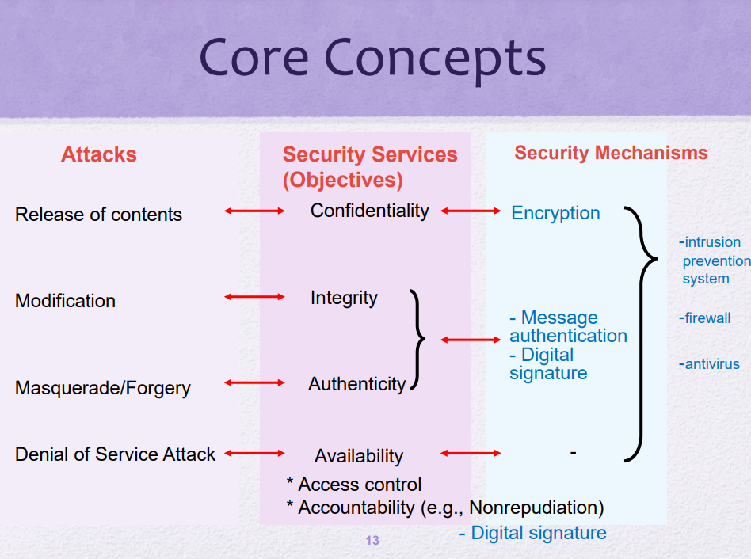
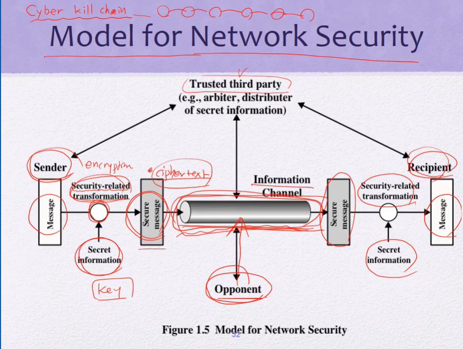

## OSI 보안 구조

1. Security attack
2. Security mechaism
3. Security service

## Threat & Attack

### 📌 Security attack

---

#### 💥 **passive attack**

> 공격이 일어난 뒤 시스템에 변형이 일어나지않음
>
> 두 가지 타입이 존재
>
> 1. release of message contents
> 2. traffic analysis

ex) 메세지 도청, 메세지 복사

- `release of message contents`

  암호화로 방어

- `traffic analysis` :

  암호화된 패킷 자체가 유통되고있다는게 약점이 됨, 어느 시간대에 패킷이 많이 유통되는지도 힌트가 될 수 있음

  Tor로 방어

#### 💥 **active attack**

> 시스템 자원이나 동작을 변형시킴

ex) 메세지 가로챔, 메세지 전송자 흉내내서 다른 메세지 전송

- `Masquerade` : 다른 사람인척 (수신자인척 메세지 보냄)

- `Replay` : 100원 보내는 동작이 있다면 이걸 10000번 수행

- `Modification of messages` : 메시지 내용 수정

- `Denial of service` : 메시지 수신 막기

#### 그렇다면 active attack이 더 치명적일까?

> 답은 경우에 따라 다르다!
>
> 패시브 어택의 경우 공격받았는지 조차 모름
>
> 피해를 받았음을 알면 대응이 가능할수도있음

### 📌 Security service

---

> 1. Data Confidentiality
> 2. Data Integrity
> 3. Availability
> 4. Authentication
> 5. Nonrepudation (for accountability)
> 6. Access Control

#### Data Cofidentiality

> 기밀성 보호에 초점

패시브 어택에 대한 방어 (아무도 못 봐)

트래픽 보호(어디서부터 어디로 가는지, 빈도, 패킷길이등)

#### Data Integrity

> 메시지가 변경되는 것에 초점

단일 메세지, 메세지 스트림에 적용 가능

커넥션이 없는 경우 : 단일 메세지 - 메세지 변조에 초점, 어떤 부분이 복제, 삭제, 추가 되었는가

커넥션이 있는 경우 : 메세지 스트림 - reordering(메세지 순서가 바뀜)

**원래의 상태가 바뀌지않는것에 중심을 둔다**

#### Availability Service

> 서비스 제공에 초점

DOS(denial-of-service attack) 공격에 초점

#### Authentication

> 사용자 인증에 초점

`Peer entity authentication` : 양방향 소통중 상대방이 누구인지 인증. 사용자를 인증

`Data origin authentication` : 데이터가 전송될 때 그 데이터가 내가 기대하는 사람으로부터 받은게 맞는지 확인 (Masquerade등 막음:진위여부판단)

#### Nonrepudiation (for accountability)

> 책임 소재를 가리는 것에 초점

사용자가 부인하지않게. 누군가 메세지를 보냈다면 그 사람이 보냈다는걸 확인할 수 있게

#### Access Control

(CIAAA 의 조건에 들어가진않지만 다섯개와 연결된 개념)

커뮤니케이션 링크를 통해 호스트 시스템&app에 접근하는 것을 제어

`identified` : 이 사람이 누구인지 먼저 신원 확인

`authenticaticated` : 이 사람이 누구라고 주장할 때 맞는지 검증

 **Attacks** : 보안 공격의 종류

 **Security Services** : 보안이 제공하는 서비스

 **Security Mechanisms** : 서비스 목적을 달성시키기위한 재료. 도구

`Message authentication` 또는 `Digital signature`를 사용해 **Integrity**와 **Authenticity** 를 지킬 수 있다.

`Digital signature`는 `Message authentication` 와 달리 **Accountablility (Nonrepudiation)**도 달성할 수 있다

## Fundamental Security Design Principle

---

보안 디자인 설계 룰

- Economy of mechanism : 작고 간단하게. 비용적&관리적측면에서 경제적으로!

- Fail-safe defaults : 보안의 기본 정책은 exclusion이 아닌permission에 기본해야한다. ex) 이건 안돼(x) 이것만 허용(o)

- Complete mediation : access 할 때 마다 모든 access 확인, 각각의 자원마다 체크한다.

- Open design : 개방형 설계, 보안 시스템을 열고 모두가 볼 수 있게한다. 집단 지성

- Separation of priviledge : 권한 세분화, 하나 뚫렸을 때 전체가 망가지지않게

- Least privilege : 권한 최소화

- Least common mechanism : 공유 메커니즘 최소화

- Psychological acceptablility : 심리적으로 받아들일수있게 , 심리적 압박감&불편함 최소화 - 사용자 편의성 관련, 사용자에게 투명해야함. 사용자는 시큐리티 매커리즘이 있는지 모르게 해주는게 좋음

- Isolation : 분리, public과 critical 분리. 중요한 시스템은 public이 접근할 수 없게 분리해야한다

- Encapsulation : 캡슐화. 안의 내부적인 구성에 대해서는 알려주지않아도된다.

- Modularity : 모듈별로 설계, 한 쪽의 에러가 다른 쪽에 영향을 끼치지않게

- Layering : 겹치는 보호

- Least astonishment : 사용자를 놀라게하면안됨. 사용자가 예상할 수 있는 범위내에서 동작해야함

## Attack Surfaces

---

시스템이 있을 때 거기에 존재하는 취약점들을 말함

공격자가 뚫고 들어갈 수 있는 표면

### Attack Surface Categories

---

#### Network attack surface

네트워크를 통해서 공격

#### Software attack surface

프로그래밍이 잘못되었다는 등의 이유로 소프트웨어를 통해 공격

#### Human attack surface

사람을 공격!

중요 시스템을 다루는 사람을 공격!

## Attack Tree

---

어떤 대상을 공격하는 체계

branching과 계층이 있다

\+ Cyber kill chain : 어택 트리와 마찬가지로 공격의 절차를 보여준다. 어택 트리가 공격의 목표에 다다르기위해 어떤 기술들을 쓸 수 있는지 트리형식으로 보여줬다면 사이버 킬 체인은 실제로 공격에 도달하기 위해 공격자가 뭐하고 뭐하고 뭐해야하는지 쭉 나열되어있음

### Model for Network Security

---

### Standards

표준을 정하는 기관들

NIST, ISOC, ITU-T, ISO

그 외 TTA, KS, IEEE 등 더 있음
