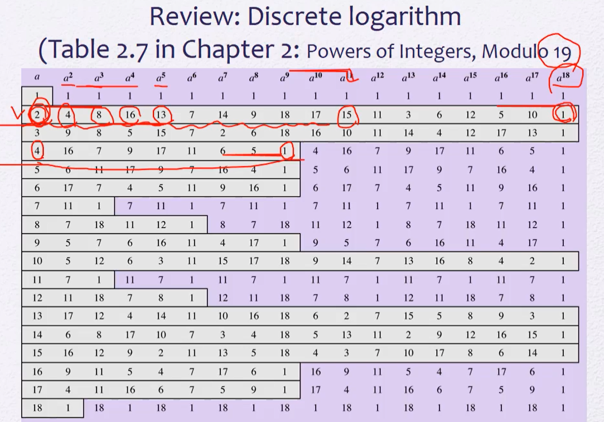
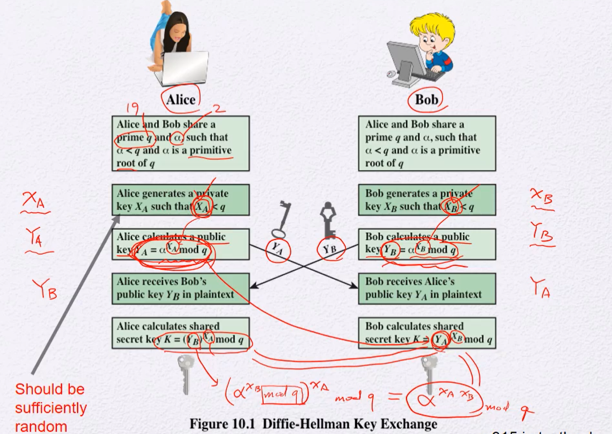

## 공개키암호 응용 방식

* Encrption & Decryption

  * 메시지암호화

* Digital Signature

  * 전자서명

* Key exchange

  * 암호화에 사용되는 세션키 전달 용도

  * 하이브리드 방식 - key encapsulation

  * src가 메시지 암호화하는것처럼 세션키를 암호화해서 보내면 dest가 세션키 확인 가능

    

## Discrete logarithm

디스크리트 로그 문제

> a가 2일때 몇 번 제곱하면 15가 나올까?
>
> 답 : 11

## Diffie-Hellman Key Exchange

> 디스크리트 로그 문제가 어렵다는 것을 응용

> p가 19, 알파가 2

* Alice와 Bob의 p와 알파를 공유한다 (퍼블릭함)

* Alice는 랜덤키 XA(pr)를 생성

* Bob도 랜덤키 XB(pr) 생성

* 각자 YA와 YB 생성(pb)

* YA와 YB를 서로 공유

* 받은 상대의 퍼블릭키를 자신의 프라이빗키로 제곱한 후 mod q를 하면 둘은 동일한 값의 키 K를 얻을 수 있다

  > 어떻게 두 K가 같을 수 있는가?
  >
  > * YB 는 `알파의 XB제곱`
  > * Alice는 YB에 XA 제곱을 해야하니 결국  `알파의 XB제곱`에 XA제곱을 하는 셈
  > * Bob또한 YA에 XB  제곱을 하니 결국 `알파의 XA 제곱` XB제곱을 하는 셈
  > * 즉 둘의 K는 알파^(XA x XB) mod q로 값이 같다

   

* 여기서 왜 디스크리트 로그 문제가 중요한걸까?

  > 모두에게 알파, q, YA, YB 값이 공개됨
  >
  > 프라이빗키인 XA는 YA를 구할 때 알파의 지수로 사용되므로 디스크리트 로그 문제를 쉽게 풀 수 있다면 프라이빗키인 XA도 알아낼 수 있음

* 결론은, 디피헬먼 알고리즘에서 안전성을 보장하려면  XA와 XB를 알아낼 수 없어야함
* 만약 Alice가 XA를 잘못 생성하면 공격가능
  * XA는 랜덤으로 생성됨 - 난수발생기의 성능이 중요
  * 만약 Alice가 시간값같은걸로 랜덤 시드를 발생시킨다면 위험. 공격자가 시간대를 추측가능
  * seed가 뭐냐에 따라서 안전성이 걸림
  * 위에서 YA와 q, 알파값으로 XA를 추측해내는 방법이 아니라 가능성 높은 XA들을 추측해서(ex. 시간대) 모든 XA후보들로 계산을 해서 진짜 XA를 맞춰버릴수도있음

## RSA vs DH : Forward Secrecy

RSA : Key Encapsulation 해서 한 쪽이 세션키 전달

DH : 양쪽에서 공유

둘의 차이는 Forward Secrecy

### RSA

**두 개의 세션이 있다고 가정**

>  앨리스가 세션키를 밥의 퍼블릭키를 사용해서 암호화하면,
>
> 밥이 자신의 프라이빗키로 암호문을 복호화해서 세션키 획득
>
> 둘은 세션키를 가지고 AES 알고리즘을 써서 메시지 주고받음

* 만약 세션 2때 해킹으로 밥의 프라이빗키가 노출된다면?
* 공격자또한 밥의 프라이빗키로 세션키 획득이 가능해짐! (세션 1의 키와 세션 2의 키 모두 획득 가능)
* 메시지의 AES 알고리즘을 세션키로 풀 수 있어서 공격자는 세션1,2의 메시지 내용을 전부 볼 수 있음
* 즉, 한 번 프라이빗키가 뚫리면 모든 세션의 메시지가 노출됨

### DH

**두 개의 세션이 있다고 가정**

> 각자 프라이빗키인 XA, XB를 만들고 그걸로 퍼블릭키인 YA, YB를 생성해서 공유
>
> 공유한 퍼블릭키로 세션키 생성
>
> **세션키를 생성했다면 XA와 XB는 필요가 없으니 삭제해도 됨**

* 만약 세션 2때 해킹으로 밥의 프라이빗키가 노출된다면?
* 공격자는 XB를 사용해서 세션 2의 세션키를 획득 가능
* 그러나 세션 1때 사용한 XB는 이미 삭제되었기 때문에 세션 1때 주고받은 메시지는 훔쳐볼 수 없음
* 즉, 이전 세션의 메시지는 안전함

### Forward Secrecy

앞 쪽은 안전하다는 말

* RSA와 DH의 차이는 Forward Secrecy다

> RSA는 프라이빗키가 뚫리면 모든 세션의 메시지가 노출된다
>
> DH는 프라이빗키가 뚫리면 해당 세션의 메시지만 노출되지만 이전 세션의 메시지는 안전하다

#### RSA도 Forward Secrecy 할 수는 없을까?

* DH에서 사용한 XA, XB를 삭제해버려 이전 세션의 키를 복구할 수 없게 만든것처럼, RSA의 프라이빗키인 d도 사용하면 삭제하고 매 세션마다 다시 새로 만들자!

  > 근데 키페어 만드는 과정이 개 복잡함. 추천하지않는 방법. 비효율적

* 그냥... DH쓰자...^^

  * TLS 1.3에서는 아예 RSA의 key exchange지원안함 (1.2까지만 지원)

## Man in the Middle (MitM) Attack

* 중간에서 src or dest 인척 속임

* 공격자인 다스는 앨리스에겐 밥인척 YD1을 보냄

* 밥에겐 앨리스인척 YD2를 보냄

* 사실상 앨리스 - 다스, 밥 - 다스 사이 정상적인 DH가 작동되긴했지만 상대가 다스라는게 문제

* 다스가 중간에서 메시지를 정상적인척 전달해주기때문에 앨리스와 밥은 중간에 다스가 있는지 모름

  > dest는 받은 퍼블릭키 Y가 src가 보낸 Y가 맞는지 확인할 방법이 없기 때문에 발생하는 문제

  * 공인 인증서로 해결 가능

## ElGamal Encryption

디스크리트 로그 문제에 기반한 또 다른 암호임

* 퍼블릭한 파라미터 q와 알파 생성

#### Key Generation by Alice

* DH처럼 XA 랜덤으로 생성
* XA로 YA생성
  * DH와의 차이 : DH는 세션키 생성을 위해 X와 Y를 임시로 만들지만 Elgamel은  이렇게 생성한 키페어를 지속적으로 사용함

#### Encryption by Bob (with Alice의 PB)

* 밥은 랜덤한 정수 k를 생성

* 밥은 앨리스의 퍼블릭키 YA와 k를 가지고 K를 생성
* 알파와 k를 가지고 C1생성
* K와 평문M을 가지고 C2생성
* 두 개의 암호문 C1, C2를 앨리스에게 전달!

#### Decryption by Alice (with Alice의 PR)

C1 - 밥의 임시 공개키라고 볼 수 있음

* 앨리스는 자신의 프라이빗키와 C1을 가지고 K를 복원
* 앨리스는 복원한 K와 C2를 가지고 본래의 메시지로 복호화

> DH와 OTP을 합친거라고 볼 수 있음
>
> One Time Pad (랜덤키)
>
> 메시지와 같은 길이의 랜덤키 K를 생성 - OTP의 키처럼 사용

## Elliptic Curve Arithmetic

타원곡선암호

3072 bit의 RSA와 128bit AES의 안전성이 비슷함

> 큰 비트수의 암호를 쓰면 계산도 많이 해야하고 메모리도 많이 사용하고...

그 대안이 ECC (Elliptic Curve Arithmetic)

* 공개키 암호의 표준 IEEE P1363a에 타원곡선 암호가 포함됨
* 자동차 환경 무선통신(WAVE) 표준 IEEE 1609에서 rsa는 배제되어있고 타원곡선만 언급됨
* 대부분의 공개키암호 표준에서는 디피헬만, rsa, 타원곡선암호 다 포함되어있음. 최근에 나오는 특정 표준에서는 타원 곡선 암호만 포함하게 하는 경우도 있음
* 같은 안전성을 주기위해서 훨씬 짧은 키를 써도 된다 (같은 키 길이를 쓰면 ECC가 훨씬 안전함)
* 자동차의 경우 패킷 길이가 길면 그 사이 차가 슝 지나가 통신 범위에서 멀어져 전송을 못할수도있다. 즉, 패키 길이가 짧은게 중요
* 패킷 길이가 작아야하는데 3072bit인 RSA는 적합하지않음 (타원곡선 암호는 256bit로 같은 안전성을 보여줌)

## Comparable Security Strengths

타원곡선암호와 기존 공개키 암호의 비교

NIST에서 표준화한 키 관리 권고사항에 대한 표준 (가장 최근의 Revision 5)

보안강도 : 공격자가 성공적으로 키를 복구하기위해 어느정도의 작업을 해야하는가? - 클수록 좋음

> 80이라고하면 공격자의 작업량이 2^80이라는 뜻
>
> 128과 256을 비교하면, bit수는 두 배가 됐지만 공격자의 작업량은 2^128배만큼 늘어남

rsa나 디스크리트 로그 계열 암호들은 모듈러스에 비해 훨씬 적은 안전성을 제공하게 된다

타원곡선은 공격자에게 요구되는 비트수의 두 배정도되는 숫자를 키로 쓰면 안전하다

같은 비트 (Security Strength)안전성을 봤을 때 RSA에 비해 타원곡선에게 요구되는 비트의 수가 훨씬 적다. 증가하는 속도도 더 낮음.

## Abelian Group

아래 조건들을 만족하는 원소들의 집합

## Cyclic Group

어떤 제너레이터가 그룹 안의 모든 원소를 생성해낼 수 있는 그룹.

## 타원 곡선

> y에 대해서는 2차식이고 x에 대해서는 3차식으로 되어있는 곡선

* 두 가지 형태 존재

  * 타원이 있고 나머지는 곡선으로 떨어져있는 형태

  * 곡선 하나로 다 이어져있는 형태

### ECDLP(Elliptic curve discrete logarithm problem)

> 타원곡선 암호는 ECDLP에 기반하고있다

그래프 내 어떤 점 P와 ,Q를 이어서 직선을 그으면 또 다른 점, -(P+Q)와 만난다 (3차 그래프이기때문)

x 중심축을 기준으로 -(P+Q)와 대칭되는 점이 (P+Q)이다

> 서로 다른 점 P+Q외에 같은 점 P와 P를 더한 2P도 얻을 수 있다.
>
> * 두 점 P와 Q를 이어서 그은 직선이 아닌 P를 접하는 직선을 그음
> * 위 방법으로 2P, 3P, 4P ... 계속 구하기 가능 (계속 더 하다 보면 언젠가 자기자신 P로 돌아옴)
> * 즉, P하나로 모든 원소를 생성하는 Cyclic Group을 나타낼수도있음

 

* 디스크리트 로그 문제와 비슷하게 활용할 수 있음
  * `kP = Q` 일 때, 
  * k와 P가 주어지면, square & multiply처럼 덧셈과 2배연산을 반복해서 Q를 계산해낼수있다
  * 그러나 반대로 P와 Q가 주어졌을 때 k를 알아내기는 힘들다

* 타원곡선의 Addition이 finite field의 modular mulitiplication처럼 작동할 예정
* Multiple addition이 modular exponentiaion처럼 작동함
* 디스크리트 로그문제보다 더 어려움

### ECDH (Elliptic Curve Diffie-Hellman) Key Exchange

기존의 지수연산을 타원곡선 점들간의 몇 배 연산으로 대체할 수 있음

즉, 디스크리트 로그 상에서 정의되는 여러가지 프로토콜들을 그대로 사용할 수 있다

> 디피헬먼도 타원곡선 버전으로 만들 수 있음

> E : 타원 곡선식
>
> G : 제너레이터. 어디서부터 시작할 것인지
>
> n : G로 만들 수 있는 가장 큰 값

#### User A Key Generation

> n보다 작은 nA(PR)를 랜덤하게 뽑는다
>
> nA x G 를 해서 PA(PU)를 구한다

#### User B Key Generation

> 위와 마찬가지로, 
>
> n보다 작은 nB(PR)를 랜덤하게 뽑는다
>
> nB x G 를 해서 PB(PU)를 구한다

* 둘은 PA와 PB를 서로에게 공유한다

* 둘은 받은 상대의 퍼블릭키(P)와 자신의 프라이빗키(n)를 곱해 K를 만든다

 

> 공격자는 E, G, PA, PB를 알아도
>
> nA, nB를 추측해내기 어렵다.
>
> 여기서 사용하는 nA, nB가 이전에 했던 XA, XB보다 작은 bit의 수이다. 훨씬 효율적!

### Security of Elliptic Curve Cryptography

ECDLP를 깨는 가장 효율적인 알고리즘은 `Pollard rho method`, DLP에도 똑같이 적용됨

DLP는 `Pollard rho method`처럼 일반적인 방법보다 더 빨리 문제를 풀 수 있는 알고리즘이 존재 (팩토링이랑 비슷?)

보통 키길이가 비슷하면, rsa나 dh나 타원곡선암호든 계산량이 비슷함. 

키의 길이가 작으면 계산량이 작다는 뜻

그럼, 비슷한 시큐리티를 가정했을 때 타원곡선쪽이 다른 방법보다 더 적은 계산량을 제공하고 효율성을 자랑한다.