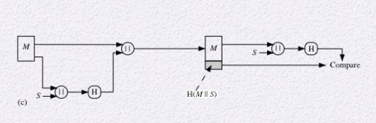

## Hash Function

> 자료구조의 해시테이블이랑 비슷한 개념

* 인풋으로 길이가 변할 수 있는 블록 M을 받는다
* 아웃풋으로 정해진 길이의 해시값을 출력한다
* h = H(M)

* 주로 데이터 무결성(Integrity)를 보장하는데  사용됨
* 일종의 압축함수라고 생각할 수 있다

> Crptographic hash 함수의 조건
>
> * h를 주면 M을 찾기 어려워야함
>   * the one-way property : 단방향적, M에서 h를 찾긴 쉽지만 그 반대는 어렵다
> * the collision-free property : 같은 hash value를 아웃풋으로 가지는 인풋 데이터 쌍을 찾기 어렵다

### 해시 함수의 다섯가지 용도

* MAC : keyed hash
* digital signature
* password protection
* system integrity 보호
* PRF / PRNG 수도 랜덤 함수, 수도 랜덤 넘버 제너레이터

### Data Integrity 용도

* src는 데이터 뒷부분에 해시값을 붙여서 보냄
* dest는 받은 데이터의 앞부분에 해시함수를 적용하고 그 값이 데이터 뒷부분의 해시값과 일치하는지 확인
* 같다면 전송과정에서 오류가 없는것

만약 다스가 중간에서 공격한다면? (Man in the middle attack)

원래 데이터의 해시값인지 변조된 해시값인지 구별이 불가능

왜 이 방법이 가능한가?

* 다스가 변조된 데이터에 대해서 자기 나름대로 해시값을 쉽게 계산할 수 있기 때문
* 해쉬값을 쉽게 계산 못하게하자!

### MAC 

* keyed hash function이라고도 한다
* key를 넣고 hash를 돌리겠다! (앞의 허술한 hash와는 다르다!)
* key는 src와 dest가 미리 공유한 비밀키

> 인풋으로 시크릿 키와 데이터 블록을 받는다 - MAC으로 작용
>
> * 무결성을 점검해보려면 
> * src는 원래 메시지 데이터에 MAC을 붙여서 보냄
> * dest는 자기가 알고있는 keyed hash를 돌려서 받은 MAC과 비교
>
> 공격자는 key가 없어서 MAC값을 변조할 수 없다

|| : 붙인다는 뜻

* Message에다가 Secret key를 비트 스트링으로 뒤에 붙임
* 이걸 해시로 돌림
* Message에 해시값을 붙여서 보냄
* dest는 받은 Message부분에 해시함수를 돌려서 받은 MAC과 자신이 만든 MAC이 같은지 비교
* integrity와 authentication 둘 다 수행

### Digital Signature

MAC에서의 역할과 비슷

nonrepudation

메시지의 해시값에 서명할 것

> RSA에서의 디지털 서명
>
> src의 프라이빗키인 d로 M을 암호화한 S를 M에 붙여서 dest에게 보냄
>
> dest는 S를 src의 퍼블릭 키로 복호화하고 M과 일치하는지 확인
>
> * 그러나 RSA는 암호화에 mod n을 적용하기 때문에 메시지인 M이 n보다 작아야함
> * 그러나 엄청 긴 메시지를 보내려면...?
> * M을 블록처럼 나누고 서명해서 여러개를 보낸다?
> * 그럴 필요 없음!
> * 누군가가 조작하지않았다는 것만 보장하면 되기때문에 굳이 길이에 집착할 필요 없음 해시를 대신 적용하자!

* M을 해시함수에 돌려 H를 얻는다
* H를 src의 프라이빗키로 암호화한 E(sign)를 얻는다
* M에 E를 붙여 전송한다
* dest는 받은 M에 해시함수를 돌린 값과 받은 E를 퍼블릭키로 복호화한 값이 같은지 확인

Other Hash Function Uses

### one-way password

유저의 아이디와 패스워드를 저장할 때

* id : password

이런식으로 저장하지않고

* id : H(password)

를 저장한다

#### 오프라인 딕셔너리 어택

공격자는 자주 사용되는 패스워드에 대응하는 해시 값을 딕셔너리 형태로 미리 만들어둠  

해킹을 해서 user의 H(password)를 알아내고 H(password)와 일치하는 값이 미리 만들어둔 딕셔너리에 있는지 탐색

 

이걸 막기위해

해시를 쓸 때 그냥 쓰는게 아니라 salt라는 값을 쓴다

sault 값이 12345라면,

H(password || 12345 )를 한다.

공격자는 사전을 만드려면 패스워드에 여러 salt값까지 추가로 붙여야하기때문에 salt 크기만큼 사전의 크기도 늘어난다

공격자의 리소스 사용을 늘림

### intrusion and virus detection

F = file

파일을 해시함수로 돌려서 저장

이후 똑같은 파일을 해시 함수로 돌렸는데 해시값이 바뀌면 파일이 변조된것

* 공격방법은 아까와 동일하게 공격자가 해시값을 생성해서 변조된 해시값을 붙이는 것
* 막는 방법은 해시값을 안전한 곳에 보관하거나 key를 추가로 사용

### PRF, PRNG

해시함수의 요구 조건

Preimage

* x를 해시함수에 돌렸는데 h가 나옴 (h = H(x)) 이때 x를 h의 preimage라고 부름
* 해시함수는 일반적이로 다대일 매핑
* h 결과값에 대응하는 원래 인풋들이 많음

Collision

* 공격자가 변조된 데이터를 보냈는데
* 변조된 데이터의 해시값과 원본 데이터의 해시값이 일치하면 무결성을 보증할 수 없기때문에 안됨

## 해시 함수를 어떻게 만들어야할까?

#### 이렇게 만들면 안됨!

노안전 사례

* 입력을 n bit단위의 여러 블록으로 자름
* 한 블록을 한 번에 하나씩 해시 함수로 돌림

* 비트 단위로 xor - 패리티비트 생성

* 단순히 xor이 아니라 다음 블록으로 넘어갈때마다 한 비트를 circular shift해서 비트 xor

Preimage랑 Collision 특징 충족못함

* oneway : 결과물을 가지고 인풋을 임의로 만들어낼 수 있다
* collision : 같은 xor결과값을 만들어낼 수 있다

## Attacks on Hash Functions

### Brute-Force Attack

막 던져봄

아웃풋 길이가 길수록 공격하기 어려움 -> 그만큼 시도수가 늘어나니까

### Cryptanalysis

알고리즘의 취약점을 찾는다

ex. 아까 위에서는 xor을 만든다는 특징을 이용해서 공격. 0,0 -> 1,1로 바꿔서 다른 input 같은 결과도출

### Collision Resistant Attacks

birthday paradox

m bit짜리 아웃풋의 인풋을 맞춰보려면 2^m + 1만큼 시도해야함

그러나 그 반인 2^(m/2) 번의 시도로도 1/2이상의 확률로 충돌을 찾을 수 있다

## Secure Hash Algorithm(SHA)

해시 함수를 잘 설계해야한다!

NIST에서 해시 함수 안전 표준 알고리즘을 제안

SHA-0 : 1993 : 표준화는 안됨

SHA-1 : 1995, 해시 함수 MD(message digest = hash func)4에 기반, 160bit의 해시 값, 근데 깨짐

SHA-2 : 256, 384, 512 bit

SHA-3 224, 256, 384, 512 bit

SHA 는 역방향 계산안됨~ 블럭암호와 해쉬암호의 차이

뒤에 10분정도 다시 듣기

