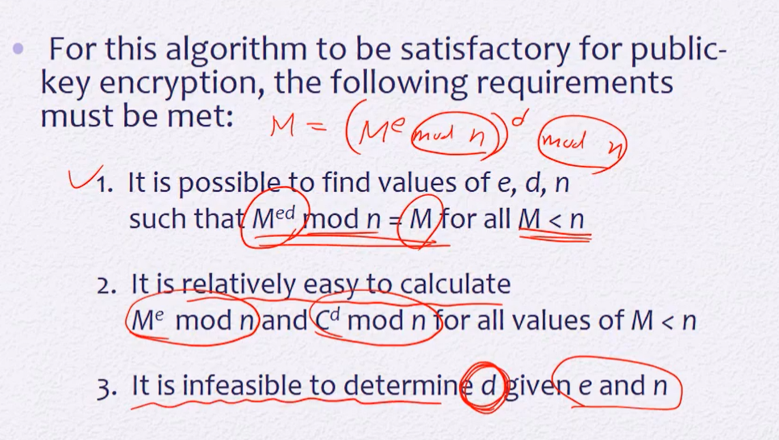

## Symmetric Encryption의 문제

* 어떻게 secure채널을 통해서 안전한 키를 전달하지?

* 전자서명이 있으면 쉽게 해결되나 대칭키만 가지고는 해결할 수 없는 nonrepudiation - 자신이 보낸걸 부인할 수 없는

* CBC-MAC이 존재하긴하나 Integrity와 Authentication만 보증한다 - 나랑 이전에 키를 공유했던 그 사람이 맞구나!

  > 만약 A가 B에게 100만원을 준다는 문서를 주었으나 A가 주지않았을 때 : 
  >
  > B가 CBC-MAC을 통해 받은 Ciphertext를 key로 복호화해서 A로부터받았음을 확인
  >
  > B가 법정에서 증거를 제출하려면 받은 Plaintext와 key와 MAC(Message Authentication)을 제공
  >
  > key는 secure하게 보관되어야하므로 A와 B만 가지고있다
  >
  > 그러나 이 Plaintext가 정말 A가 보낸건지 B가 key를 사용해서 임의로 만든건지 구분할 수 없다
  >
  > 즉, key가 최소 두 명이상한테 공유되었기때문에 누가 쓴건지 구별이 불가능하다.
  >
  > key는 single claimed sender를 가져야한다. 보낸이한테만 유일한 키

## Public-Key Cryptosystems

`Plaintext` -> `Public key` -> `Encryption algorithm`

`Ciphertext` -> `Private key` -> `Decryption algorithm`

* 키 분배 문제 해결
* 전자서명 구현

### Encryption with public key : 메세지를 숨기고 싶을 때

* 누구의 퍼블릭 키, 누구의 프라이빗 키인지가 중요하다
* Bob이 Alice에게 암호문을 보낼 때, Alice의 퍼블릭키를 사용해서 암호화
* Alice는 받은 암호문을 Alice의 프라이빗키를 사용해 복호화한다 

> 키 분배 문제 해결 
>
> * 키 분배 문제 : 어떻게 key를 안전하게 교환할 것인가
> * Public-Key는 A가 Key pair를 생성하면 공개키를 모두에게 공개
> * 굳이 안전하게 전달할 필요가 없음

### Encryption with private key : 전자서명

* Private key를 가지고 Encryption : 전자서명에 해당
* Encryption algorithm == Signature Generation
* Decryption algorithm == Signature Verification

* Bob이 Alice에게 암호문을 보낼 때, Bob의 Private key를 사용해서 암호화
* Alice는 받은 암호문을 Bob의 Public key를 사용해서 복호화
* 서명을 해서 보냄. 받아서 복호화한 Plaintext와 서명이 잘 맞아 떨어진다면 중간에 오류나 변조없이 도착한 것임 : Integrity 보장
* Bob의 Privae key를 통해서 온 것이므로 nonrepudiation 해결

### Conventional and Public-Key Encryption

* conventional : 전통적인 (= Symmetric)

|                   Conventional Encryption                    |                    Publick-Key Encryption                    |
| :----------------------------------------------------------: | :----------------------------------------------------------: |
| 같은 알고리즘이 **같은 키**와 사용된다 (AES같은 경우엔 완전히 같진않고 역연산) | 두 개의 키가 존재한다 하나는 Encryption에 다른 하나는 Decryption에 사용 |
|      보내는 사람과 받는 사람이 알고리즘과 키를 공유한다      | 알고리즘은 서로 공유하나 보내는 사람과 받는 사람이 같은 키가 아닌 키 pair를 사용한다 |
|         대칭 암호에서는 키가 안전하게 유지되어야한다         |            공개키는 안전하게 전달 될 필요가 없다             |
| 키가 안전하게 유지되고 있다면 메세지를 키 없이 복호화하는게 어렵다 | 키 중에 하나가 (Private Key)가 안전하게 유지되고 있다면 메세지를 복호화하는게 어렵다 |
| 알고리즘을 알고 Cipher text를 몇개를 알아도(암호문쌍) 어떤 키가 사용됐는지 알아내는게 어렵다 | 알고리즘을 알고 공개키하나도 알고 Ciphertext(암호문쌍)을 알아도 private key를 알아내긴 어렵다 |

### Public-Key Cryptosystem 

* Authentication and Confidentiality
* Source A, Destination B 일 때
* 1. A가 자신의 Private key를 가지고 서명
  2. A가 B의 Public key를 가지고 암호화
* 1. B가 자신의 Private key를 가지고 복호화
  2. B가 A의 Public key를 가지고 A가 맞는지 확인

#### Public-key cryptosystems can be classified into three catagories:

* Encryption/Decryption
* Digital Signature
* Key exchange
  * 공개키 쓴다고 symmetric 암호 안쓰는 건 아님
  * 공개키암호는 속도가 느림
  * 대용량 암호를 공유할 때 불편. 공개키암호와 대칭암호를 함께 사용

#### Public-Key Requirements

공개키 암호의 요구사항

* 수신자가 키 페어를 만들기 쉬워야함
* 퍼블릭 키와 메세지를 사용해서 ciphertext를 만드는 일이 쉬워야함
* 프라이빗 키와 cipher text를 사용해서 plaintext로 만드는 일도 쉬워야함
* 퍼블릭 키를 알고있어도 프라이빗 키를 추측하는건 어려워야함
* 퍼블릭 키와 ciphertext를 알아도 private key없이 plain text를 추측하는건 어려워야함

## RSA(Rivest-Shamir-Adleman) Algorithm

> 글을 숫자 형태로 표현하는게 전제
>
> 어떤 정수 n을 모듈러로 사용해서
>
> 0 to n-1까지의 정수들을 plaintext의 메시지라고 간주한다.

 

* PU = {e, n}
* PR = {d, n}
* 암호화는 e를 사용해서, 복호화는 d를 사용해서 함
* 두 개다 mod n을 사용해야함. n은 권장사항이 2048 bit이상이며 보통 3072, 4096사용

> 지수연산 사용
>
> * plaintext는 M이라는 숫자로보고
> * ciphertext는 C라는 숫자로 본다

### Algorithm Requirements

1. M은 평문의 글을 나타내며, n보다 작은 모든 M에 대해 위 수식을 만족해야한다
2. 복호화, 암호화 계산이 어렵지않아야한다
3. e와 n이 주어졌을때 d를 추측하기 어려워야한다

 

### 예시

 ex ) Bob -> Alice에게 암호문을 보낼 때

#### Key Generation by Alice

* 소수인 p와 q를 임의로 뽑는다 (p와 q는 다른 수)
*  n을 구한다 : n = p x q

* 오일러 n을 구한다. 
  * n은 p x q이므로 오일러 n은 (p-1)(q-1)이다.

*  임의로 e를 뽑는다. (e는 오일러(n)과 서로소여야함, e는 오일러 n보다 작고 1보다 큼)
  * 이후 구할 d때문. (d는 모듈러 오일러n일때 e의 곱셈의 역원임) 
  * 즉, e x d = 1 mod 오일러(n)
* Extended Euclid를 사용해서 d까지 구하면 퍼블릭키와 프라이빗키 생성 완료!!
  * PU = {e, n}, PR = {d, n}

#### Encryption by Bob with Alice's Public Key

> Plain text = m, m은 n보다 작은 숫자의 범위

* C = M^e mod n

#### Decryption by Alice with Alice's Private Key

* C^d mod n == (M^e mod n)^d mod n
  * M^ed mod n
  * e x d = 1 mod 오일러n이었음
  * 즉, (ed = k x 오일러(n) + 1) : d는 e의 곱셈의 역원

* (  (M^오일러(n))^k  x  M )mod n

> 오일러 이론에 의해 (M^오일러(n))^k 는 1이 된다

* M mod n = M 
  * M이 n보다 작으므로 

#### Example of RSA Algorithm

> p = 11, q = 17
>
> n = p x q = 187
>
> ∮(n) = (p-1)(q-1) = 160
>
> e = 7 (160과 서로소인 수)
>
> d = 23 ( e*d를 mod 160했을 때 1이 나옴. d는 e의 곱셈의 역원)
>
> * plaintext는 n(187)보다 작은 숫자

### Dealing with Long Message

* 128bit단위로 잘라서 블록 단위로 암호화했었음

* RSA에선?

> 1. 마찬가지로 M을 쪼개서 블록단위로 암호화
>
> 2. 하이브리드 encrypiton
>    * **Data encryption** : src가 랜덤한 키를 만들어서 M을 나눈 블록에 대해 K를 사용해서 암호화 시킴 (블록 암호화)
>    * **Key encapsulation** : K는 메시지라고 간주해서 메시지를 암호화해서 보내는 것 처럼 같이 보냄 (K^e mod n)
>    * dest는 받은 메시지와 키를 가지고 메시지를 키로 암호화해서 평문으로 복호화 가능

### RSA Signature

> Decryption : Signature generation
>
> Encryption : Signature Verification

* Alice 가 Bob에게 보낼 때 Alice가 자신의 private key로 Signature generation을 한다. (M, S)를 전달
  * M은 메시지
  * S는 서명한 M ==  (M^d mod n)
* Bob 은 받은 S를 Alice의 public key(e)를 사용해서 Signature Verification을 한다
  * S ^ e mod n == (M^d mod n)^e mod n == M^de mod n == M

### Left to Right binary

**Square and Multiply라고도 불림**

지수승 계산

a^b mod n

> 암호화할때는 b가 e가 되고, 복호화할 때는 b가 d가 된다

예제 a=7, b=560, n=561

> c = 2c와 c = c+1은 편의상의 코드 (없어도 됨)
>
> f = fxf와 f = fxa를 수행한다
>
> f는 a의 c제곱 mod n을 의미

* for k부터 0까지 루프를 돈다
  * k는 b의 비트수 (bk ~ b0)
  * 예제의 경우 bit수가 10개이므로 k는 9~0
* c는 현재 a의 몇 제곱인지를 알려줌(10진수). 
  * b의 bit를 10001까지 수행했을 경우 10001은 10진수로 17 = c 
  * 결과값에는 영향을 주지 않음. (지워도 상관없음. 이해를 돕기위한 값)
* f의 initial은 1
* f는 (a의 bi제곱 mod n)을 의미
* **f는 일단 제곱을 무조건 시킴**  + (c = cx2)
* 해당 bit인 bi가 1일 경우
  * c = c+1
  * f 에 a를 곱함

> 운이 좋을 경우 (1000000)
>
> : 제곱만 수행 (곱셉 연산 한 번)
>
> 운이 나쁠 경우 (1111111)
>
> : 제곱과 곱하기를 수행 (곱셈 연산 두 번)
>
> 지수 e가 2048일 경우
>
> 즉, 총 log2 n ~ 2log2n 의 연산을 수행
>
> * 운이 나쁘면 연산 두 개를 하므로 두 배
>
> * 즉, (2048 ~ 4096)
>
> * 평균적으로 3/2 log2n (3072)
>
> 만약 이렇게 로그에 기반해서 연산안하고 바로 a x a x a x ...a 했다면 2^2048번의 연산을 수행해야한다고함

### Efficient Operation Using the Public Key

근데 저렇게 해도 숫자가 너무 커서 오래걸림

그래서 e를 2^16 +1로 고정(어차피 public key라 고정해도 상관없음)

* 17bit - 맨 앞과 맨 뒤만 1이고 나머지는 0
* 제곱 15번, 곱셈 2번 (위의 2048보다 훨씬 줄어듦)

2^16 +1하면  제곱 16번 + bit 1인게 두개라서 2번 곱셈

가끔 3이나 17같은 엄청 작은 숫자를 쓰기도 하나 공격에 취약할수도있음

**d는 프라이빗이라 고정해놓으면 안됨**

### Attack against RSA

* Brute force
  * d에 모든 값 대입 
  * 2048가지의 경우 존재 너무 오래걸림
* Mathematical attacks
  * 소인수 p와 q의 쌍을 구하려함
* Chosen ciphertext attack
  * RSA의 구조적인 특성을 이용한 공격
  * homomorphic 특성 이용
* Implementation attacks
  * 하드웨어적 구현상의 문제
  * 수행하는데 걸리는 시간, power, cache

### Factoring Problem

* n으로 p, q두 쌍을 구할 수 있으면 RSA는 깨짐 - n을 p, q로 factoring

> 1999년에 실제 RSA에서 쓰는 512bit까지 팩토링 할 수 있게됨

## Chosen Ciphertext Attack (CCA)

* 공격자가 Plain text와 Cipher text의 쌍을 알 때 private key없이 어떤 Cipher text의 Plain text를 추측할 수 있는 것

* 공격자가 어떤 C에 대한 P를 물어봐서 P를 얻어냄

* 이를 바탕으로 또 다른 C를 물어보지않고도 P를 추측하면 공격자가 성공했다고 판단

* 우리가 앞에서 봤던 rsa(textbook rsa)는 이런 공격법에 취약. 

* ex

  > C의 P를 구하고자 할 때
  >
  > C' = C x 2^e mod n
  >
  > C'의 P를 요청함
  >
  > P' = C'^d mod n =  (C x 2^e)^d mod n = C^d x 2 mod n
  >
  > 즉 C의 P는 P'에 2의 역원을 곱하면 된다

이런 공격을 방지하기 위해 RSA에 특별한 구조를 넣게 되어있음 RSA Security- OAEP

안전성때문에 RSA-OAEP 사용

### OAEP(Optimal Asymmetric encryption padding)

> 원래는 M에 e제곱을 해서 암호화를 했지만 OAEP에서는 M을 인코딩한 EM을 e제곱한다

인코딩방법

* M에 0을 쭉 채워넣은 패딩을 추가
* 파라미터를 해쉬함 (파라미터는 공개됨)
* 해시 + 패딩 + M을 더해서 데이터블록생성
* 암호할때마다 매번 생성하는 랜덤 시드를 MGF돌림(MGF도 해시함수의 일종)
* MGF한 seed와 DB를 xor연산
* DB에 위의 MGF가 아닌 또 다른 MGF를 돌린후 seed와 xor해서 maskedseed를 얻는다
* maskedseed + maskedDB 형태인 EM획득

복호화 방법

> 암호문을 복호화하면 EM이 나옴
>
> EM의 형식이 맞는지 체크하는 과정이 있음

* EM을 파싱해서 앞부분과 뒷부분으로 나눔(maskedseed + maskedDB)
* maskedDB에 해시함수 적용
  * 해시함수는 모두에게 공개됨
* maskedseed와 해시함수를 적용한 maskedDB를 xor해서 seed값을 얻는다
* xor과 MGF로 DB도 얻는다
* 파라미터를 해시함수로 돌려서 DB의 앞부분이 나오는지 확인
  * MAC(Message Authentication)과 유사
  * 정상적인 구조인가 확인
  * 공격자가 만든 임의로 조작된 Ciphertext였다면 인증이 안됨
  * 임의로 조작됐다면 파라미터를 해시함수 적용했을때 원하는 값이 안나옴
  * 이럴 땐 Decryption 결과 안돌려줌

> 그 외 장점
>
> 랜덤 시드값을 사용하므로 같은 M이라도 다른 결과가 나옴
>
> 이전 M의 쌍을가지고 추측이 어려움

## Side Channel Attack

implementation attack의 하나

알고리즘을 실행시키고있는 기계 자체를 공격

알고리즘을 실행하면 기계에서 부수적인 정보가 나옴

* Timing attack : 누군가 private key를 가지고 연산을 하고있을 때 private key에 따라 연산 시간이 달라질수도있다
  * C^d mod n 할 때  앞에서 비트 값이 0이면 제곱만, 1이면 제곱+곱셈연산 수행
  * 연산 시간에 따라 1인지  0인지 추측 가능

* Power analysis : 전력 소모의 패턴을 분석. 제곱연산할때의 전력소모와 곱셈 연산을 할 때 전력소모를 구해서 분석. (전자기파 분석, 클라우드 분석)
  * 1이면 S M , 0이면 S

* Cache
  * 논리적인 자원은 분리되어있지만 물리적인 자원은 분리되어있지않음
  * 캐시가 어떤 형태로 플래쉬되는지 패턴을 통해 추측가능

  

어떻게 막나?

### Constant-time algorithm

* 알고리즘을 비트가 0이냐 1이냐에 따라서 바뀌지않게 만든다
* M을 항상 하게 바꿈
* f x f 연산 결과값을 f에넣지않고 x[0]또는 x[1]에 넣는다
* 1이냐 0이냐에 따라 X[0] or X[1] 반환
* 비트가 0이든 1이든 항상 곱셈을 수행한다.
* 시간이 더 오래 걸리긴 함(필요없는 M도 하게 되어서)
* 시간분석 대응가능. 일정한 시간 소요

### Fault-Based Attack

좀 더 공격적

아까는 공격자가 그냥 관찰만

연산이 수행되는 와중에 강력한 전압을 걸어주는등의 공격을 해서 오류가 생기게

(ex) 내 버스카드에 물리적으로 충격을 걸어서(전압공격등) 잔액정보를 마음대로 조작~~)

### Misconceptions Concerning Public-Key Encryption

* 공개키 알고리즘은 암호 공격에 대해서 시메트릭 암호보다 안전하다

> 맞을수도있고 틀릴수도있음
>
> AES 128비트 버전과 RSA 2048 어떤게 더 안전할까?
>
> RSA가 시도할 경우의 수가 더 많음
>
> 그러나 이렇게 무작위로 하지않음
>
> 팩토링을 사용하면 효율적으로 가능. AES보다 더 빠르게
>
> 공격할 방식 자체가 다르기 때문에 맞을수도있고 틀릴수도있음

* 공개키 알고리즘이 대칭 알고리즘을 완벽하게 대체할 수 있는 알고리즘이다

  x : 성능 측면에서 대칭 알고리즘이 훨씬 유리

  키 공유 문제에선 공개키 알고리즘이 유리

  보통 둘 다 사용하는 하이브리드 알고리즘 사용

* 대칭 암호의 키공유문제를 해결하기 위해 나온게 공개키 알고리즘 : 공개키 암호를 쓰면 키 분배를 하는데 전혀 문제가 없을까?

  x : 상대적으로 대칭 암호에 비해 키 공유가 나은 것이지 근본적으로 해결되는 것은 아니다

  시메트릭 : 키를 안전하게 전달하는 것이 목표

  퍼블릭키 : 키를 숨기면서 전달할 필요가 없음. 

  대칭 암호에서의 키 분배는 confidentialiry

  퍼블릭키는 authentication과 Integrity 보장해야함

  공격자가 다른 사람의 공개키인척 공유하면 안됨

  이런 문제때문에 공개키 인증서가 나옴

  정부에서 공인된 절차로 만든게 공인인증서

  

RSA에서 Factoring과 Discrete Logarithm(이산대수)이 중요하다...
