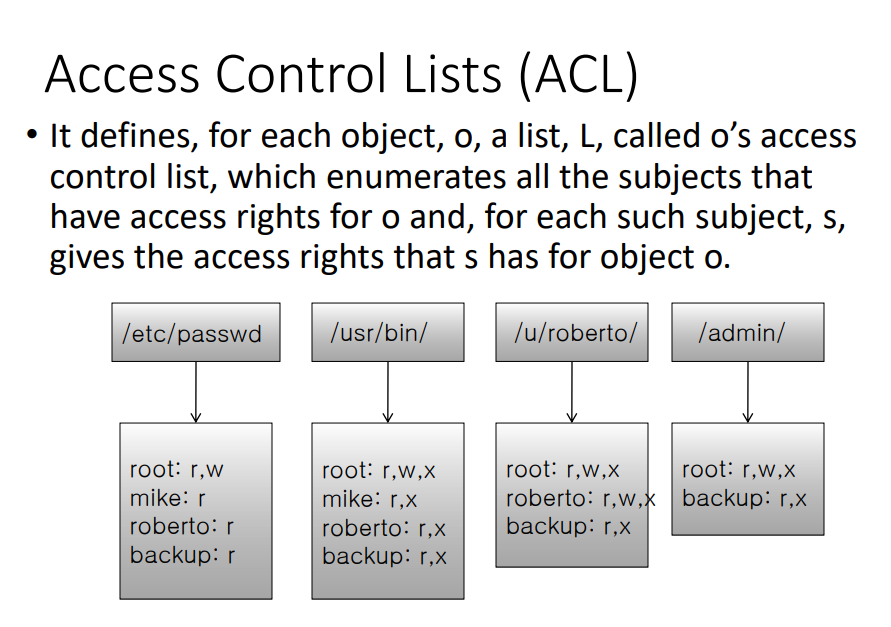
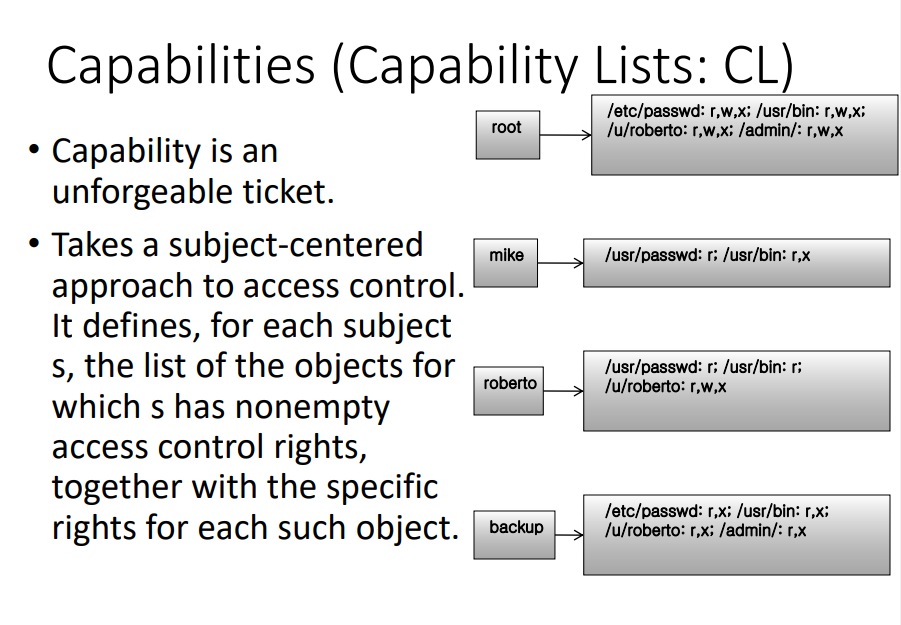

## Access Control

---

> 접근제어

- 시큐리티 서비스 중 한 가지

- 어떤 공격에 대응하는 가장 효율적인 방법 중 하나

- 공격이 일어나기 전에 막는다

- 어떤 access 권한들이 있고 어떻게 허용할 것인지 엄격하게 정의

- 인가되지않은 공개, 부적절한 변경으로부터 데이터와 리소스를 보호하는 절차

## Access Control의 Security policy

---

### 📌 Discretionary access control (`DAC` : 임의적 접근제어)

​ 필수적인 요구조건이 있는 것이 아니라 사용자가 임의적으로 정함

​ 정보의 소유자가 해당 정보에 대한 read, write, execute 권한을 모두 정함

​ 사용자의 id나 groupid에 기반해서 제약 조건을 건다

ex) ACL(Access control list)

`장점 ` : 주체별로 어떤 동작이 가능한지 세세하게 설정할 수 있다

`단점` : 사용자를 어떻게 믿을 것 인지, 원치않게 권한이 상승할 수 있다

### 📌 Mandatory access control (`MAC` : 강제적 접근 제어)

​ 관리자가 접근 제어

​ 규칙 기반 : **rule-based access control**

​ ex)

- Security label(중요도에 따라 계층이 나뉨)

- Bell-LaPadula model
  - read-up (x) : 2급이 1급 정보를 볼 수 없음
  - write-down (x) : 1급 내용을 2급에 덮어쓸 수 없음
- sandboxing : 벽을 두고 서로 넘어가지 못하게 함

## Access Control Models(Implementations)

---

정책을 구현하는 실질적인 방법

### 📌 Access Control Matrices(ACM)

---

- permissions을 정리하는 2차원 테이블

- 객체와 주체가 있고 각 주체들이 객체들에 대해 어떤 동작을 할 수 있는지 명세

- 직접적으로 구현하는 것은 비효율적. 공간이 어마어마!

- 대부분 줄여서 사용

- ex) 대부분의 entry들은 비어있을것. 이를 압축해서 표현

### 📌 Access Control Lists (ACL)

---

- **객체 위주로 압축**, DAC의 일종

- 간소화한 ACL : Unix File access control

- 유닉스는 owner, group owner, other users 이렇게 세 가지로 뭉뚱그려서 표현

- id별로 다 표시하진않음. ACM보다 정밀도가 떨어짐. 세부적 컨트롤이 어려움

- ex) 특정 부분에 대한 access나 어떤 특정한 사용자를 제외한 모든 사용자는 접근이 불가같은 세부적인 컨트롤은 어렵다

### 📌 Capabilities (CL)

---

- **주체 위주로 압축**

​ 잘 사용되진않음

ex)

> 놀이공원 티켓 : 어떤 놀이기구는 되고 어떤 앤 안됨
>
> android app permission : 이 앱은 어떤 리소스 접근은 되고 어떤건 안됨

### 📌 Role-based Access Control (RBAC)

---

- 역할 기반

- 주체가 어떤 역할, 직책을 가지고 있느냐가 중요

- task 기반으로 자세하게 명령 가능. 세부적 컨트롤이 가능

- 사용자 id 기반으로 권한을 부여한다면 본의 아니게 필요 이상 권한을 부여하게되기도하는데 역할 기반으로 권한을 줌으로써 세밀하게 task 설정 가능

- 특정 작업에 대해서 권한 설정 가능

ex) create a credit account

## User Authentication

---

사용자 인증

access control을 하기 위해선 누구인지 검증해야함

identification : 여러 주체들이 섞여있는 가운데서 누구인지 식별 가능

Authentication : 어떤 객체가 누구라고 주장했을 때 맞는지 확인

- **유저가 알고있는 지식 기반**

[비밀번호, PIN 등]

direct input vs challenge-response

direct input : 바로 입력하기

challenge-response : 질문에 답변해야 인증

문제 : 패스워드 공간 문제(무작위 때려맞추기 공격 위험), 통계적인 분포, 어깨너머로 엿봄등

- **유저가 지닌 물건 기반**

[ID카드, security token, SIM, REID, OTP 등]

문제 : 도난이나 분실 위험

- **유저 자체나 행위 (생체 인증)**

[지문, 얼굴, 서명 등]

문제 : 프라이버시 문제, 바꾸기 어려움

- **Two-factor authentication**

위의 두 가지를 섞어 사용
