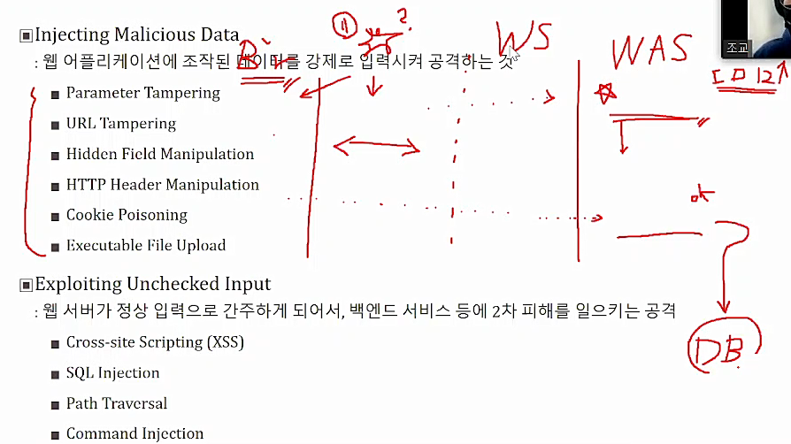

## MITRE

> 미국의 비영리 단체로 보안에 대한 자료들이 올라와있음  
> CVE, CWE, CAPEC

### CVE

많이 나오는 공격들. 알려져있는 취약점

### CWE

CVE에 기반해서 만든 분류 체계

### CAPEC

공격들을 추상화해서 신경써서 분석해야할 것들을 분류

## OWASP (Open Web Application Securty Project)

웹 응용 보안을 다루는 오픈 커뮤니티

📌 Broken Access Control :

말그대로 access control에 문제가 생김

📌 Crypographio Failures :

암호화 하는 것에 문제

📌 Injection :

Cross-site Scripting이나 sql injection등 정상적이지않은 명령을 주입

📌 Insecure Design : 보통 구현이 잘못되는데 얘는 디자인 자체가 잘못된

📌 Security Misconfiguration :

보안 설정 잘못함

📌 Vulnerable and Outdated Components :

취약점에 대한 패치가 나왔으나 적용을 안해서 여전히 취약점이 남아있음

📌 Identification, and Authentication Failures :

사용자 식별, 인증 실패

📌 Software and Data Integriry Failures

인터그리티가 확인이 안됨. 전자서명이 안된 프로그램을 설치하거나

📌 Security Logging and Monitoring Failures

사고가 발생되면 수습을 해야함. 사고 발생자에게 경고를 주거나 사고에 대한 분석, 포렌식을 하는데 문제

📌 Server-Side Request Forgery

서버 취약점을 공격

## Web 기본 지식

- 사용자, 브라우저, 웹 서버, 백엔드

보안 관점에서 브라우저는 프로그램이고 사용자는 프로그램이 아님

브라우저 : 사용자 입력을 받아 소통

사용자가 실제로 볼 수 있게 처리 : rendering

### 브라우저와 웹 서버 간의 통식

보통 http사용

보안성을 추가한 https

- HTTP : 브라우저와 웹 서버 사이의 통신을 정의하는데 사용 TCP 프로토콜 상에서 돌아감

- HTTPS : 보안 계층에 SSL/TLS도 추가. 웹 서버가 브라우저에게 인증서를 제공함으로써 보안성 있는 통신을 할 수 있도록 함

> https를 사용하면 웹 통신이 안전할까?

> 어느부분은 맞고 어느 부분은 틀리다

> 브라우저와 웹 서버간의 통신은 안전할지라도 사용자라는 취약점이 존재해서 무조건 안전한 것은 아님

### 웹서버

- 웹서버 : 브라우저 요청 사항을 처리하는 일에 중점을 둔다.

* 웹 서버는 어떤 동작을 수행할지 결정하기 위해 HTTP헤더 뿐만 아니라 URL을 사용한다

- get, post를 처리해줄 수 있는 최소한의 서버 ex. 아파치

* 웹 서버는 서버 측 스크립트와 함께 동작한다

* 서버 측 스크립트 (= Web Application Server, WAS) ex. python, java

* 서버 측 스크립트는 코드를 실행시켜서 응답을 바로 생성하거나 데이터베이스와 같은 다른 백엔드 서버와 연결한 다음 해당 정보를 이용해서 적절한 응답을 생성한 후 보낸다 파일 db등과 연결하려며 WAS가 필요

_보통 웹서버는 잘 나와있는 솔루션을 뜨고 웹 어플리케이션 서버는 개발자가 개발_

> 백엔드 서비스 : 서버 측 스크립트와 연결된 부가적인 서비스를 백엔드라고함

> 웹 서버의 백그라운드에서 실행되는 서비스

> 정보를 저장하는데 쓰이는 데이터베이스등이 있다

## Web Hacking Overview

### 📌 Injecting Malicious Data

- vaildatior를 만족하지 않는​ 부적절한데이터를 강제로 주입  
  Browser WS WAS

​ 1. 웹서버에 들어오기 전에 이미 err발견하지만 강제로 침입
브라우저 내에서 발생하거나, 브라우저에서 체크했으나 웹 통신중 이상함 발견

- HTTP Header Manipulation : 헤더의 `REFERER`를 조작해서 프로모션 받기 가능
- Cookie Poisoning :
  쿠키: 세션 아이디 등 임시 정보가 담겨있음  
   남의 쿠키를 저장해서 사용하면 타인 아이디로 로그인 가능

### 📌 Exploiting Uhchecked Input

- 웹 서버가 정상 입력으로 간주하게 되어서, 백엔드 서비스 등에 2차 피해를 일으키는 공격

* 게시판과 같이 동적으로 생성되는 Page에 조작된 코드를 넣어서 다른 사용자에게 공격자가 원하는 코드를 실행하게 함

​ 2. 여기까지오고 나중에 DB 가서 보니까 err
WAS에서 ok해서 DB에 보냈지만 DB에서 에러 발생
