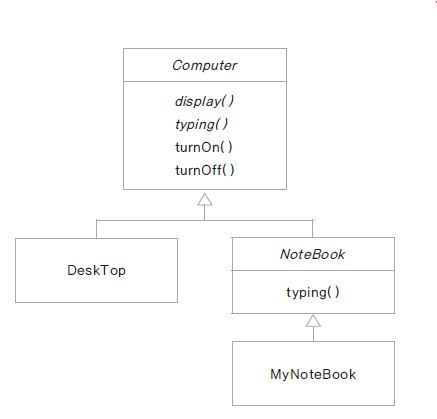

## 추상 클래스

- 구현 코드 없이 메서드의 선언만 있는 추상 메서드(abstract method)를 포함한 클래스이다.
- 상속만을 하기위해 만들어졌다고 봐도 무방하다.

- 메서드 선언(declaration) : 반환타입, 메서드 이름, 매개변수로 구성

- 메서드 정의(definition) : 메서드 구현(implementation)과 동일한 의미 구현부(body) 를 가짐 ({ })

> 예) int add(int x, int y); // 선언
> int add(int x, int y){ } // 구현부가 있음, 추상 메서드 아님

<br/>

- abstract 예약어를 사용
- 추상 클래스는 new 할 수 없음 ( 인스턴스화 할 수 없음 )

### 📌 예시



위와 같은 구조를 갖는 클래스들이 있다고 하자. (기울어진 글씨체는 추상클래스or추상메서드임을 의미한다.)<br/>

```java
public abstract class Computer {
	public abstract void display();
	public abstract void typing();
	public void turnOn() {
		System.out.print("turn on\n");
	}
	public void turnOff() {
		System.out.print("turn on\n");
	}
}

```

> - 추상클래스인 Computer는 메서드 선언부만 존재한 추상 메서드를 가질 수 있다.
> - 추상 메서드외에 일반 메서드도 가질 수 있다.

<br/>

```java
public class DeskTop extends Computer {

	@Override
	public void display() {
		// TODO Auto-generated method stub
		System.out.print("desktop display\n");
	}

	@Override
	public void typing() {
		// TODO Auto-generated method stub
		System.out.print("desktop typing\n");
	}

}
```

> - 추상 클래스를 상속받는 DeskTop클래스이다.
> - DestTop은 추상 클래스인 Computer안에 있는 추상 메서드들을 모두 정의해줘야 일반 클래스로 동작할 수 있다.
> - 물론 모든 추상 메서드들을 정의했어도 추상클래스가 될 수 있다.

<br/>

```java
public abstract class NoteBook extends Computer {

	@Override
	public void typing() {
		// TODO Auto-generated method stub
		System.out.print("notebook typing");
	}

}
```

> - 추상 클래스를 상속받는 NoteBook클래스이다.
> - NoteBook은 추상 메서든 display()와 typing()중 typing()만 정의했지만 NoteBook역시 추상 클래스이기 때문에 모든 추상 메서드를 구체화하지 않아도 된다.

<br/>

```java
public class MyNoteBook extends NoteBook{

	@Override
	public void display() {
		// TODO Auto-generated method stub
		System.out.print("my notebook display\n");
	}

	@Override
	public void turnOn() {
		// TODO Auto-generated method stub
		System.out.print("my notebook turn on");
	}

	@Override
	public void turnOff() {
		// TODO Auto-generated method stub
		super.turnOff();
	}

}
```

> 추상클래스 NoteBook을 상속받은 MyNoteBook클래스이다. NoteBook에서 구체화하지않은 display()를 구체화하고있다.

<br/>

<br/>

```java
//ex

Computer desktop = new DeskTop(); // DeskTop은 Computer를 상속했으므로 업캐스팅이 가능하다.
Computer computer = new Computer(); // error : 추상클래스이므로 인스턴스 생성이 불가능하다
```

## 템플릿 메서드 패턴

- 추상 메서드나 구현 된 메서드를 활용하여 코드의 흐름(시나리오)를 정의하는 메서드이다.

- 코드의 흐름이 바뀌면 안되기 때문에 final로 선언하여 하위 클래스에서 재정의 할 수 없게 한다.

  > **final 예약어**<br/>
  >
  > - 변수에 사용될 경우 : 상수
  > - 메서드에 사용될 경우 : 재정의(오버라이딩) 불가능
  > - 클래스에 사용될 경우 : 상속 불가능

<br/>

### 📌 예시

```java
public abstract class Car {

	public abstract void drive();
	public abstract void stop();

	public void startCar() {
		System.out.println("시동을 켭니다.");
	}

	public void turnOff() {
		System.out.println("시동을 끕니다.");
	}

	final public void run() {
		startCar();
		drive();
		stop();
		turnOff();
	}
}
```

- 위 코드에서 final로 선언된 run 메서드를 보면 클래스 내부 메서드들을 순서에 맞게 실행시키는 것을 볼 수 있다.
- 이처럼 특정 코드의 흐름을 정의해둔 것을 템플릿 메서드라고 한다.
- 사용자는 run메서드를 사용해 Car을 상속받은 모든 클래스에서 절차에 맞게 run내부의 함수들을 실행시킬 수 있다.

### 📌 훅 메서드(Hook Method)

훅 메서드는 추상 클래스에 들어있으며, 아무 일도 하지 않거나 기본 행동을 정의하는 메소드로, 서브 클래스에서 오버라이드 할 수 있다. 예시를 봐보자!

```java
public abstract class Car {

	public abstract void drive();
	public abstract void stop();

	public void startCar() {
		System.out.println("시동을 켭니다.");
	}

	public void turnOff() {
		System.out.println("시동을 끕니다.");
	}

    public void washCar(){}

	final public void run() {
		startCar();
		drive();
		stop();
		turnOff();
        washCar();
	}
}
```

- washCar이라는 메서드가 추가되었다.
- washCar은 정의부{} 가 있지만 안에 어떤 코드도 써있지않은 빈 함수이다.
- washCar 내부를 정의하지않은 클래스에서 run을 실행시키면 washCar는 마치 없는 것 처럼 동작하지않는다.

<br/>

```java
public class ManualCar extends Car{

	@Override
	public void drive() {
		System.out.println("사람이 운전합니다.");
		System.out.println("사람이 핸들을 조작합니다.");
	}

	@Override
	public void stop() {
		System.out.println("브레이크를 밟아서 정지합니다.");
	}

}

-- 실행부분
// ManualCar mc = new ManualCar();
// mc.run();

시동을 켭니다.
사람이 운전합니다.
브레이크를 밟아서 정지합니다.
시동을 끕니다.
```

- 자, 여기 Car를 상속받은 ManualCar클래스가 있다.

- ManualCar 객체를 만든 뒤 run메서드를 실행하면 위와 같이 실행된다.
- washCar는 정의하지 않았으므로 무시된다.

<br/>

```java
public class AICar extends Car{

	@Override
	public void drive() {
		System.out.println("자율 주행합니다.");
		System.out.println("자동차가 스스로 방향을 바꿉니다.");
	}

	@Override
	public void stop() {
		System.out.println("스스로 멈춥니다.");
	}

    @Override
    public void washCar(){
        System.out.println("차를 자동으로 세차합니다.");
    }
}

-- 실행부분
// ManualCar mc = new ManualCar();
// mc.run();

시동을 켭니다.
자율 주행합니다.
자동차가 스스로 방향을 바꿉니다.
스스로 멈춥니다.
시동을 끕니다.
차를 자동으로 세차합니다.
```

- ManualCar 객체를 만든 뒤 run메서드를 실행하면 위와 같이 실행된다.
- washCar를 정의했으므로 실행된다.
