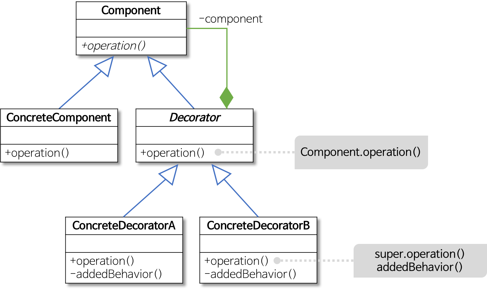
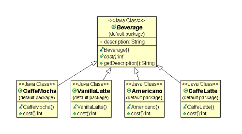
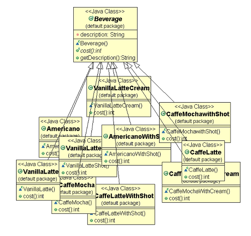
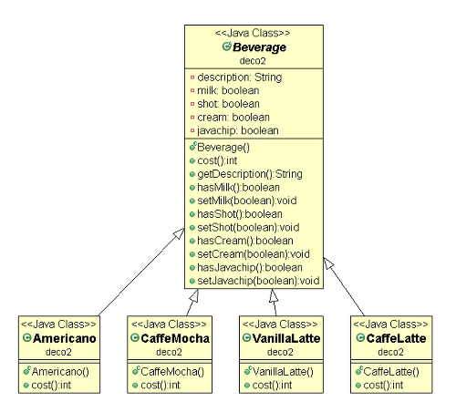
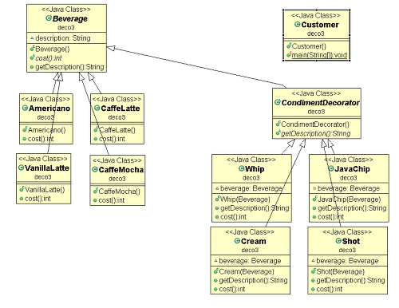

## 데코레이터 패턴 (Decorator Pattern)

> 객체의 결합을 통해 기능을 동적으로 유연하게 확장할 수 있게 해주는 패턴이다.

- 기본 기능에 추가할 수 있는 기능의 종류가 많은 경우에 각 추가 기능을 `Decorator`클래스로 정의한 후 필요한 `Decorator`객체를 조합함으로써 기능을 원하는 대로 추가할 수 있다.

- 상속보다 유연하고 기능 확장에 용이하다.
- 데코레이터는 다른 데코레이터나 컴포넌트를 포함해야한다.
- 컴포넌트 : 실제로 io를 할 수 있는 클래스

<br/>



- Component
  - 실질적인 인스턴스
  - 기본 기능을 뜻하는 ConcreteComponent와 추가 기능을 뜻하는 Decorator의 공통 기능을 정의
  - 즉, 클라이언트는 Component를 통해 실제 객체를 사용한다.
- ConcreteComponent
  - 기본 기능을 구현하는 클래스
  - 책임의 주체를 맡는다.
- Decorator
  - 많은 수가 존재하는 구체적인 Decorator의 공통 기능을 제공
- ConcreteDecoratorA, ConcreteDecoratorB
  - Decorator의 하위 클래스로 기본 기능에 추가되는 개별적인 기능을 뜻함
    ConcreteDecorator 클래스는 ConcreteComponent 객체에 대한 참조가 필요한데, 이는 Decorator 클래스에서 Component 클래스로의 ‘합성(composition) 관계’를 통해 표현됨

### 📌 데코레이터가 필요한 상황

1. 클래스의 요소들을 계속해서 수정을 할 필요가 있을 때
2. 여러 요소들을 조합해서 사용하는 클래스 구조인 경우

<br/>

카페에서 주문을 받는다고 생각해보자. 누군가가 아메리카노, 카페모카, 카페라떼, 바닐라 라떼를 주문했다.



만약 메뉴가 이 네 개 뿐이라면, 이렇게 구조를 짜도 괜찮을 것이다.<br/>

그러나 내가 일하는 카페가 스X벅X이라고 생각해보자. 스X에서는 사용자의 취향에 따라 여러 가지 토핑을 추가할 수 있다.<br/>

누군가는 따뜻한 카페라떼를 시키고, 누군가는 휘핑이 올라간 차가운 카페라떼를 시킬 수도 있다. 카페라떼라는 메뉴 하나에 여러 가지 토핑이 들어가 다양한 메뉴가 생기게 된다.<br/>



토핑의 수가 많을수록, 주문할 수 있는 커피의 가지 수는 늘어나고 클래스 구조는 위처럼 복잡해질 것이다...<br/>

그렇다면 이 구조는 어떨까?<br/>



토핑의 종류를 가장 상위의 클래스에 멤버 변수&메서드 형태로 추가했다. 최상위 클래스의 양이 늘어나긴 했지만, 복잡한 구조를 간략하게 바꿀 수 있었다. 하지만 이게 최선의 방법일까...?

#### NO!

만약 이 카페에서 새로운 토핑이 생긴다면 역시 최상위 클래스에 코드를 추가해야한다. 반대로 더 이상 휘핑크림 토핑을 제공하지 않는다면...? 최상위 클래스에서 휘핑크림과 관련된 코드를 수정해야 한다. <br/>

단순히 휘핑크림 멤버변수와 메서드를 삭제하는 일을 넘어서,

만약 휘핑크림이 있을 경우에만 자바칩 추가 가능, 아메리카노는 휘핑 크림 토핑 불가능, 바닐라 라떼는 무조건 휘핑크림 추가와 같이 다른 기능들과 휘핑크림이 연관되어 있다면 수정해야하는 범위는 더욱 커진다.<br/>

또한 메뉴에 Tea가 추가되었고 차에는 휘핑크림과 자바칩이 올라가지않는다면, Tea클래스는 불필요한 멤버 변수와 메서드를 상속받게 된다.<br/>

때문에 스프링에서 객체를 설계할 때는 각 객체의 책임을 명확히 하고 분리하는 것이 좋다. <br/>

이런 문제점은 데코레이터 패턴으로 해결할 수 있다.



맨 처음에 나온 데코레이터 패턴의 구조를 토대로 설계한 카페 메뉴 구조이다.<br/>

- `Component`는 Beverage로 실질적인 인스턴스이며, 하위 Component와 Decorator의 공통 기능을 정의하고 있다.
- `ConcreteComponent`는 `Component`아래의 아메리카노, 카페라떼, 바닐라라떼, 카페모카가 된다. `Component`에서 정의한 기능들을 실체로 구현한다.
- `Decorator`는 CondimentDecorator로 하위 데코레이터들의 공통 기능을 정의한다.
- `ConcreteDecorator`는 `Decorator`에서 정의한 기능들을 구현하며, 마치 커피에 들어가는 토핑처럼 객체에 자유롭게 추가할 수 있다.

## 예제 - 커피 만들기

직접 코드를 작성해보자. 우리가 만들 커피는 에티오피아 원두와 케냐 원두 두 가지를 제공한다. 또한 커피에 우유, 휘핑크림, 시럽을 추가할 수 있다.

```java
// Component - Coffee
public abstract class Coffee {
	public abstract void brewing();
}
```

- 짜잔 아주 귀여운 코드를 가져왔다.
- 이 Coffee클래스가 `Component`가 된다.

<br/>

커피는 에티오피아 원두와 케냐 원두 두 가지 방식이 있다. Coffee를 상속받은 두 클래스를 만들어보자.

```java
public class EtiopiaAmericano extends Coffee {

	@Override
	public void brewing() {
		// TODO Auto-generated method stub
		System.out.println("에티오피아 원두 커피");
	}

}
```

```java
public class KenyaAmericano extends Coffee {

	@Override
	public void brewing() {
		// TODO Auto-generated method stub
		System.out.println("케냐 원두 커피");
	}

}
```

- 두 클래스 다 Coffee를 상속받아 구현한 `ConcreteComponent`이다.

<br/>

이제 커피에 기호대로 우유, 휘핑크림, 시럽을 추가할 수 있게 해볼 것이다. 먼저 이 토핑들의 최상위 클래스인 `Decorator`를 만들어보자

```java
public abstract class Decorator extends Coffee{

	Coffee coffee; //decorator는 혼자서 실행될 수 없으므로 커피를 선언

	public Decorator(Coffee coffee) {
		this.coffee = coffee;
	}

	@Override
	public void brewing() {
		// TODO Auto-generated method stub
		coffee.brewing();
	}

}
```

- 토핑들의 공통 기능을 작성한 Decorator이다.
- Decorator는 말그대로 장식자로 혼자서 실행될 수는 없기에 다른 데코레이터나 컴포넌트를 포함해야한다. 내부에 Coffee 인스턴스를 생성해주자.
- Decorator들은 기본적으로 포함한 Coffee의 brewing을 실행한다고 하자.

<br/>

이제 각 토핑들의 클래스를 만들어보자

```java
public class Latte extends Decorator {

	public Latte(Coffee coffee) {
		super(coffee);
	}
	public void brewing() {
		super.brewing();
		System.out.println(" - 우유 추가 ");
	}
}
```

- 위는 토핑 우유에 대한 클래스, Latte이다.
- 앞서 생성한 Decorator를 상속받는다.
- 데코레이터에는 Coffee인스턴스가 필요하므로, Latte가 생성될 때는 Coffee인스턴스를 받아 같이 생성되게 해주자.
- brewing메서드를 재정의 해서 Decorator의 brewing과 Latte만의 코드도 작성해주자.
- 다른 토핑인 휘핑크림과 시럽도 비슷하게 작성한다.

#### 실행

만든 클래스들을 사용해서 다음 메뉴들을 생성해보자.

- 에티오피아 원두 커피
- 에티오피아 원두 커피 (우유 추가)
- 에티오피아 원두 커피 (우유 추가, 휘핑 추가)
- 케냐 원두 커피 (우유 추가, 시럽 추가, 휘핑 추가

```java
public class CoffeeTest {

	public static void main(String[] args) {
		Coffee etiopiaCoffee = new EtiopiaAmericano();
		etiopiaCoffee.brewing();
		System.out.println();

		Coffee etiopiaLatte = new Latte(etiopiaCoffee);
		etiopiaLatte.brewing();
		System.out.println();

		Coffee whippingLatte = new Whipping(etiopiaLatte);
		whippingLatte.brewing();
		System.out.println();

		Coffee kenyaCoffee = new Whipping(new Syrup(new Latte(new KenyaAmericano())));
		kenyaCoffee.brewing();
	}
}
```

```java
// 출력 결과
에티오피아 원두 커피

에티오피아 원두 커피
 - 우유 추가

에티오피아 원두 커피
 - 우유 추가
 - 휘핑 추가

케냐 원두 커피
 - 우유 추가
 - 시럽 추가
 - 휘핑 추가
```

> 각 클래스들의 brewing메서드에 작성한 대로 잘 찍히는 것을 볼 수 있다. 이처럼 데코레이터 패턴을 사용해 각 추가 기능을 원하는 대로 조합할 수 있다.

## 참고

- https://gmlwjd9405.github.io/2018/07/09/decorator-pattern.html

- https://gdtbgl93.tistory.com/9


