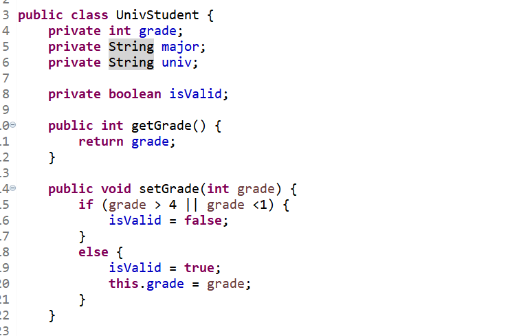
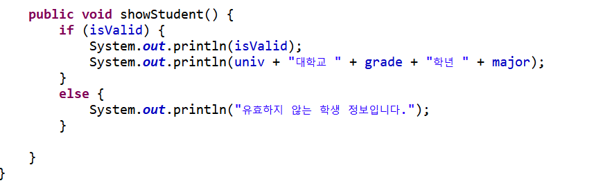
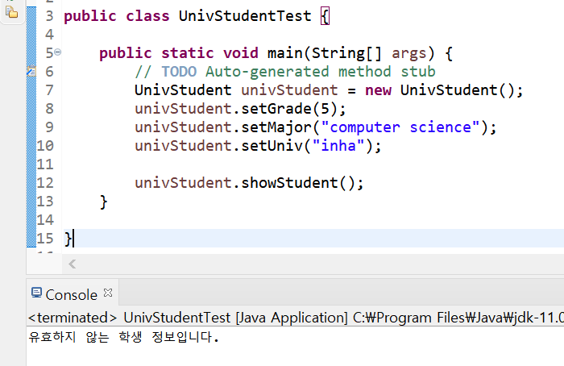
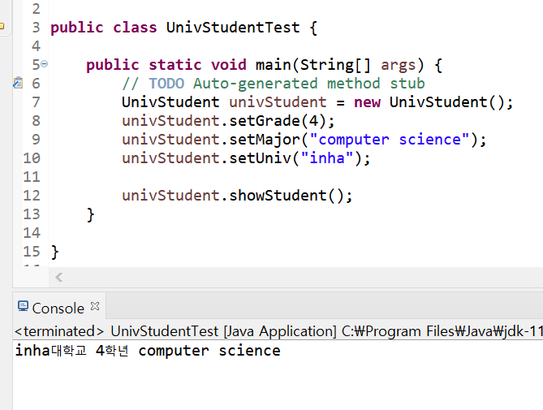
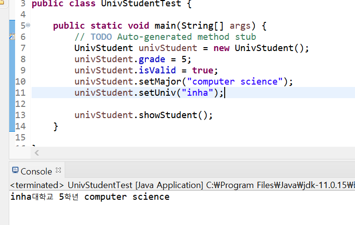

객체 지향 설계의 중요성을 느끼고 다시 공부중이다 ...ㅎㅎ<br/>

객체를 설계할 때는 내부의 메서드 공개 여부를 결정하는 것도 중요하다. 오늘은 이와 관련해서 짧게 학습을 해보자!

## 접근 제어 지시자와 정보은닉

### 📌 접근 제어 지시자

클래스 외부에서 클래스의 멤버 변수, 메서드, 생성자에 접근할 수 있는지를 결정하는 키워드이다.

- private : 같은 클래스 내부에서만 접근 가능 (외부 클래스, 상속 관계의 클래스에서도 접근 불가)
- 아무것도 없음 (default) : 같은 패키지 내부에서만 접근 가능 (상속 관계라도 패키지가 다르면 접근 불가)
- protected : 같은 패키지나 상속 관계의 클래스에서 접근 가능. 그 외 외부에서는 접근이 불가능
- public : 클래스 외부 어디서나 접근 가능

### 📌 get()/ set() 메서드

그렇다면 외부에서 private으로 선언된 멤버 변수에 접근할 수 있는 방법은 없을까?<br/>

get, set 메서드를 사용하면 private 멤버 변수에도 접근할 수 있다. (단 해당 메서드는 public으로 제공한다.)

<br/>

get 메서드만 제공 되는 경우는 read-only 필드라고도 볼 수 있다.

### 📌 그런데 왜 굳이 get, set 메서드를 사용하는 걸까?

여기까지 배우면 한 가지 의문이 든다. get, set 메서드를 사용해서 private 멤버 변수에 접근하고 싶다면 그냥 멤버 변수를 public으로 선언하면 되지 않나? 왜 get, set 메서드를 사용하는 걸까? <br/>

그 이유를 알아보기 위해 예시로 한 가지 클래스를 만들어보자.<br/>



- 학년과 전공과 대학정보를 지닌 UnivStudent라는 클래스가 있다.

- grade, major, univ는 getter와 setter 메소드가 있다.
- 대학교에는 1학년부터 4학년까지만 있다고 가정하고, `setGrade()`안에서 1미만, 4초과의 수가 들어올 경우 `isValid`를 false로 바꿔 유효하지 않은 수임을 나타낸다.



- showStudent라는 메소드에서는 isValid를 통해 유효하지 않은 grade일 경우 "유효하지 않은 학생 정보입니다." 를 출력하고 유효할 경우 위와 같이학생의 정보를 출력한다.

<br/> <br/>

UnivStudent클래스를 테스트해보기 위해 UnivStudentTest라는 클래스를 만들고 set메서드를 사용해서 멤버 변수 값을 할당하고 showStudent를 실행해보자.



나는 5학년이므로 당당히 setGrade에 5를 넣어줬다. <br/>

그러나 setGrade() 내부의 유효성 검사로 인해 isValid가 false가 되어 showStudent에서 "유효하지 않는 학생 정보입니다." 를 출력하는 것을 볼 수 있다...

<br/> <br/>



grade에 4를 넣어주면 학생 정보를 잘 보여주는 것을 알 수 있다.

<br/><br/>

이제 UnivStudent의 멤버 변수들을 public으로 다 바꿔보자. 그리고 UnivStudentTest를 다음과 같이 작성한다.



set메서드를 사용하지않아도 멤버 변수에 바로 접근할 수 있다. 즉, set 메서드의 유효성 검사가 일어나지 않고 바로 멤버 변수에 값을 넣을 수 있다. isValid또한 임의로 true로 변경할 수 있다. <br/>

콘솔창을 보면 grade는 1학년부터 4학년까지만 유효하나 5학년이라고 출력되는 것을 볼 수 있다. (다시는 5학년을 무시하지마라)

<br/>

> 위 예시처럼 멤버 변수에 바로 접근이 가능하다면 의도치않은 값(grade가 5)이 들어가고 프로그램 오류가 발생할 확률이 증가한다.<br/>
>
> 때문에 자바는 멤버 변수에 대한 정보를 은닉한다. 자바와 같이 객체 지향 프로그램에서는 데이터 자체는 외부에서 접근 할 수 없도록하고, 메소드만 공개해서 이 중 유효한 값들을 데이터로 저장한다.<br/>

### 📌 정보 은닉

private로 제어한 멤버 변수도 public 메서드가 제공되면 접근 가능하지만 변수가 public으로 공개되었을 때보다 private일 때 각 변수에 대한 제한을 public 메서드에서 제어할 수 있다.<br/>

객체 지향 프로그램에서 정보 은닉은 필요한 외부에서 접근 가능한 최소한의 정보를 오픈함으로써 객체의 오류를 방지하 클라이언트 객체가 더 효율적으로 객체를 활용할 수 있도록 해준다.

## 캡슐화

마찬가지로 private이나 public을 이용해서 정보를 숨기는 것이다. 객체를 감싸서 꼭 필요한 메서드만 외부에 오픈함.

- 대부분의 멤버 변수와 메서드를 감추고 외부에 통합된 인터페이스만은 제공하여 일관된 기능을 구현 하게 함

<br/>

아래 예시를 보자.

```java
package ch10;

public class StudentReport {
	StringBuffer buffer = new StringBuffer();

    private String line = "============================================================\n";
    private String title = " name\t  univ\t\t grade\t\t major\n";

    private void makeHeader(){
        buffer.append(line);
        buffer.append(title);
        buffer.append(line);
    }

    private void generateBody(){
        buffer.append("hongo\t");
        buffer.append("inha\t\t");
        buffer.append("5\t\t");
        buffer.append("computer-science\n");
    }

    private void makeFooter(){
        buffer.append(line);
    }

    public String getReport(){
        makeHeader();
        generateBody();
        makeFooter();
        return buffer.toString();
    }
}
```

```java
public class StudentReportTest {

	public static void main(String[] args) {
		// TODO Auto-generated method stub
		StudentReport report = new StudentReport();
		String builder = report.getReport();
		System.out.println(builder);
	}

}
```

- StudentReport클래스를 보면 report의 헤더와 바디, 푸터를 생성하는 메서드는 private이고 makeHeader(), generateBody(), makeFooter()를 순서대로 실행하는 getReport()함수만이 public인 것을 볼 수 있다.
- 만약 사용자가 StudentReport 클래스를 사용하는데 있어 세부 내용은 알 필요 없고 레포트 획득 로직만이 필요하다면 위와 같이 레포트를 획득하는 getReport()만이 외부에서 접근가능하게 설정할 수 있다.
- 이처럼 대부분의 멤버변수와 메서드는 숨기고 getReport()와 같이 필요한 메서드만을 공개해 인터페이스처럼 제공하는 것을 **캡슐화**라고 한다.

## 회고

오늘은 정보은닉과 캡슐화를 알아보았다. 캡슐화란 단순히 세부적인 정보를 숨기고 필요한 정보만 인터페이스로 보여준다는 것만 알았는데 오늘 왜 캡슐화가 필요한지, 캡슐화가 얻는 이점에 대해 알게 되었다.<br/>

이전에는 객체 지향에 대해 깊게 이해하는게 귀찮아서 대충 대충 넘어갔는데 코드를 짜면서 단순히 동작하는 코드가 아니라 잘 설계된 예쁜 코드를 작성하는 것이 중요하다는 것을 알게되었다. 나도... 하나의 함수에 막 우겨넣은 코드가 아니라 기능별로 클래스&패키지 나눠서 재사용하기 편한 코드 짜고 싶다!!!<br/>

앞으로도 객체지향과 디자인 패턴에 대해 쭉 학습해볼 예정이다. 뇽
