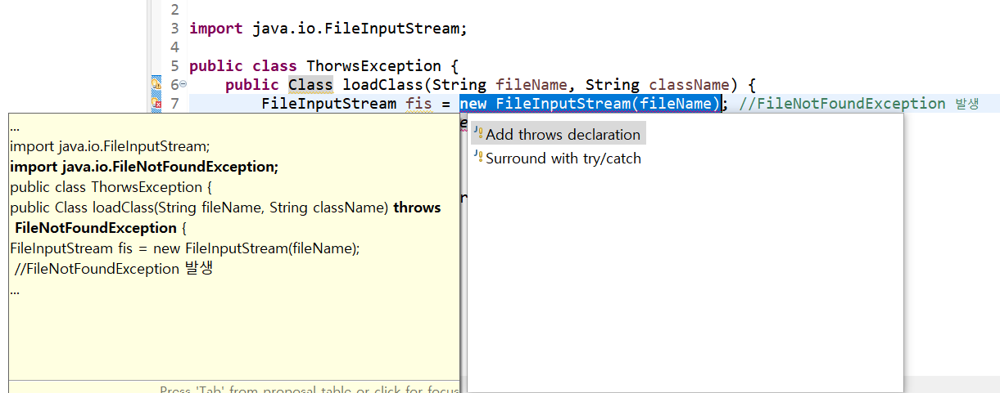

## 예외처리

### 📌 try-catch 문

try catch 구문은 이미 학습한 내용이므로 간단한 예시만 작성하고 빠르게 넘어가겠다!

```java
public class ArrayExceptionHandling {

	public static void main(String[] args) {
		int[] arr = {1};
		try{
			for(int i=0; i<100; i++){
				System.out.println(arr[i]);
			}
		}catch(ArrayIndexOutOfBoundsException e){
			System.out.println(e.getMessage());
            // 에러 설명 출력
            // Index 1 out of bounds for length 1

            System.out.println(e);
            System.out.println(e.toString());
            // 에러 클래스의 정확한 이름 : 에러 설명
            // java.lang.ArrayIndexOutOfBoundsException: Index 1 out of bounds for length 1
		}
	}
}

```

### 📌 try-catch-finally 문

- 파일이나 네트워크를 닫는 등 리소스 해제 구현시 자주 사용된다.
- try{} 블럭이 실행됐다면 반드시 finally{} 블럭도 실행된다. (try나 catch 블럭에서 return을 한다 해도 **반드시** 실행된다.)
- 여러 개의 예외 블럭이 있는 경우 각각에서 리소스를 해제하지 않고 finally 블록에서 해제하도록 구현한다.

```java
//ex
FileInputStream fis = null;
		try {
			fis = new FileInputStream("a.txt");
            //return;
		} catch (FileNotFoundException e) {
			System.out.println(e);
			return;
		}finally{
			if(fis != null){
				try {
					fis.close();
				} catch (IOException e) {
					// TODO Auto-generated catch block
					e.printStackTrace();
				}
			}
			System.out.println("finally 수행완료");
		}
```

### 📌 try-with-resource 문

try-catch-finally문보다 깔끔하게 리소스를 해제할 수 있다!<br/>

```java
try (FileInputStream fis = new FileInputStream("a.txt")){
    // 위 try들과는 다르게 try옆에 리소스를 인자로 넣어준다.
    System.out.println("read");
} catch (FileNotFoundException e){
    e.printStackTrace();
} catch (IOException e) { // IOException은 파일을 닫을 때 발생하는 오류이다. 즉, 자동으로 리소스를 해제해준다.
    e.printStackTrace();
}
```

> AutoCloseable이라는 인터페이스가 구현돼있기때문에 자동으로 리소스를 해제해준다.

### 📌AutoCloseable 인터페이스

AutoCloseable인터페이스를 구현한 클래스를 사용해서 리소스가 해제될 때의 동작을 상세하게 설정할 수도 있다. 예시로 간단하게 문구를 출력해보자.

```java
public class MyAutoClose implements AutoCloseable{

    @Override
    public void close() throws Exception {
        System.out.println("리소스 closing...");
    }
}
```

```java
public class AutoCloseTest{
    public static void main(String[] args) {
    	MyAutoClose myclose = new MyAutoClose();

        try(myclose){
            // throw new Exception();
        } catch(Exception e){
            System.out.println("catch!");
        }
    }
}
```

- 위와 같이 `AutoCloseable` 인터페이스를 구현한 `MyAutoClose`클래스를 생성한 뒤, 이를 try문에 적용해보자!

- try문에서 예외처리가 발생해 catch를 하지않더라도 자동으로 리소스를 해제한다.

  > **[출력결과]**<br/>
  >
  > 리소스 closing...

<br/>

- try문에서 throw를 통해 예외처리가 일어나게 한 뒤 catch를 하더라도 자동으로 리소스를 해제한다.

  > **[출력결과]**<br/>
  >
  > 리소스 closing...<br/>
  >
  > catch!

## 예외처리 미루기

- 예외 처리는 예외가 발생하는 문장에서 try-catch 블록으로 처리하는 방법과 이를 사용하는 부분에서 처리하는 방법 두 가지가 있다.
- throws를 이용하면 예외가 발생할 수 있는 부분을 사용하는 문장에서 예외를 처리할 수 있다.

### 📌 예시

```java
public class ThorwsException {
	public Class loadClass(String fileName, String className) {
		FileInputStream fis = new FileInputStream(fileName); //FileNotFoundException 발생
		Class c = Class.forName(className);  //ClassNotFoundException 발생
		return c;
	}

	public static void main(String[] args) {

	}
}
```

- 위 코드를 작성하면 함수 `loadClass` 내부에 예외처리를 하는 코드가 없으므로 빨간 줄이 쫙 쳐지며 컴파일에러가 난다.
- 옆의 전구 아이콘을 클릭하면 다음과 같이 두 가지 해결방안이 뜬다.



- 두 번째 방법은 우리가 지금까지 해왔던 것처럼 try문을 작성해서 함수 내부에 예외처리 구문을 만들어 주는 것이다.
- 첫 번째 방법이 바로 예외처리 미루기인데, 함수옆에 throws를 사용해서 에러를 작성하면 예외처리를 미룰 수 있다.

> 즉, 해당 함수 구현코드에서 예외처리를 작성하지않고, 실제로 loadClass()를 호출하는 코드에서 예외처리를 하겠다는 말이다. <br/>
>
> 실제 예외가 발생한 코드내부에서 예외처리를 하는게 좋을지, 해당 예외가 발생할 코드를 호출하는 외부에서 예외처리를 하는게 좋을지는 상황에 따라 다르다고 한다.

<br/>

```java
public class ThorwsException {
    // throws를 사용해서 예외처리를 미룸
	public Class loadClass(String fileName, String className) throws FileNotFoundException, ClassNotFoundException {
		FileInputStream fis = new FileInputStream(fileName); //FileNotFoundException 발생
		Class c = Class.forName(className);  //ClassNotFoundException 발생
		return c;
	}

	public static void main(String[] args) {
		ThrowsException test = new ThrowsException();

        // loadClass를 호출하는 main메서드에서 예외처리를 함
		try {
			test.loadClass("a.txt", "java.lang.String");
		}catch (FileNotFoundException | ClassNotFoundException e) {// 멀티 예외처리도 가능하다. (에러가 저 중에 하나라도 있으면 실행)
			e.printStackTrace();
		}catch (Exception e){ // 어떤 에러가 나올지 모를 경우 Exception을 사용하면 디폴트로 처리가 가능하다.
            // Exception은 모든 예외처리들의 상위클래스이기 때문에 업캐스팅이 된다.

        }
	}
}
```

## 사용자 정의 예외 클래스

직접 예외를 만들 수도 있다.

- 기존 예외 클래스중 가장 유사한 예외 클래스에서 상속 받아 사용자 정의 예외 클래스를 만든다.
- 기본적으로 Exception 클래스를 상속해서 만들 수 있다.

```java
public class PassWordException extends IllegalArgumentException{
    // 물론 그냥 최상위클래스인 Exception으로 해도 돌아간다.
	public PassWordException(String message) {
		// message는 에러시 출력되는 문구이다.
		super(message);
	}
}
```

```java
public class PassWordTest {

	private String password;

	public void setPassword(String password) {

		if (password == null) {
			throw new PassWordException("input: "+password+", 비밀번호는 null일 수 없습니다.");
		}
		else if (password.length() < 8) {
			throw new PassWordException("input: "+password+", 비밀번호는 8글자 미만일 수 없습니다.");
		}
		else if (password.matches("[a-zA-Z]+")) {// 정규 표현식
			throw new PassWordException("input: "+password+", 비밀번호는 문자로만 구성될 수 없습니다.");
		}

		this.password = password;
	}

	// 테스트 실행
	public static void main(String[] args) {
		PassWordTest test = new PassWordTest();
		String nullpw = null;
		String smallpw = "abc1";
		String strpw = "aaaaaaaaaaa";

		try {
			//test.setPassword(nullpw);
			test.setPassword(smallpw);
			//test.setPassword(strpw);
		}
		catch(PassWordException e){
			System.out.println(e.getMessage());
		}
	}

}
```
