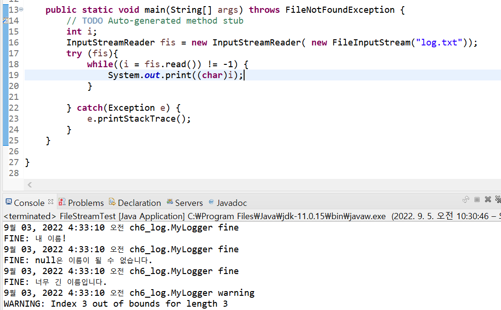
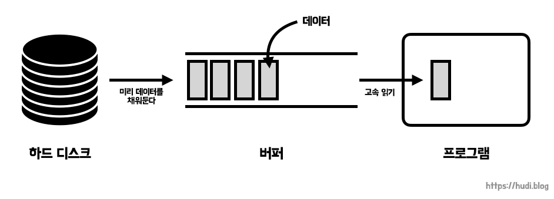

## 보조 스트림 (필터 스트림)

[Java - I/O스트림](https://blog.hongo.app/iostream/)에 이어 보조 스트림도 학습해보자!

- 실제 읽고 쓰는 스트림이 아닌 보조 기능을 제공하는 스트림이다.

- FilterInputStream과 FilterOutputStream이 보조 스트림의 상위 클래스들이다.

- 생성자의 매개변수로 또 다른 스트림(기반 스트림이나 다른 보조 스트림)을 입력받는다. 입력받은 스트림에 보조 스트림의 기능을 추가한다.

- Decorator Pattern으로 구현 된다.

> 실제 읽고 쓰는 기능이 없기때문에 매개 변수로 읽고 쓰는게 가능한 스트림을 입력받는다. 인자로 들어온 스트림을 실행하고 거기에 부차적으로 보조 기능을 추가한다.

<br/>

#### 상위 클래스 생성자

| 생성자                                        | 설명                                         |
| --------------------------------------------- | -------------------------------------------- |
| protected FilterInputStream과(InputStream in) | 생성자의 매개변수로 InputStream을 받습니다.  |
| public FilterOutputStream(OutputStream out)   | 생성자의 매개변수로 OutputStream을 받습니다. |


### 📌 InputStreamReader와 OutputStreamWriter

- 바이트 단위로 읽거나 쓰는 자료를 문자로 변환해주는 보조 스트림

#### 예제

```java
FileInputStream fis = new FileInputStream("log.txt");
int i;
try (fis){
    while((i = fis.read()) != -1) {
        System.out.print((char)i);
    }

} catch(Exception e) {
    e.printStackTrace();
}
```

> **출력 결과**<br/>
> 9¿? 03, 2022 4:33:10 ¿??? ch6_log.MyLogger fine
> FINE: ³? ??¸§!<br/>
> 9¿? 03, 2022 4:33:10 ¿??? ch6_log.MyLogger fine
> FINE: null?º ??¸§?? ?? ¼? ¾ø½?´?´?.<br/>
> 9¿? 03, 2022 4:33:10 ¿??? ch6_log.MyLogger fine
> FINE: ³?¹? ±? ??¸§??´?´?.<br/>
> 9¿? 03, 2022 4:33:10 ¿??? ch6_log.MyLogger warning<br/>
> WARNING: Index 3 out of bounds for length 3

위 코드는 FileReader 실습에 사용한 코드이다. FileReader가 아니라 FileInputStream으로 읽으면 한글은 2byte이기에 깨져서 출력되었다.<br/>

FileInputStream에 보조스트림 InputStreamReader을 추가해 한글이 잘 출력되게 해보자.



```java
InputStreamReader fis = new InputStreamReader(new FileInputStream("log.txt"));
```

> 위와 같이 `InputStreamReader`에 인자로 `FileInputStream`을 넣었더니 `FileInputStream`에 바이트를 문자로 변환하는 기능이 추가된 것을 볼 수 있다.

### 📌 BufferedInputStream과 BufferedOutputStream

- 약 8k의 배열이 제공되어 입출력이 빠르게 하는 기능이 제공되는 보조 스트림
- BufferedReader와 BufferedWriter는 문자용 입출력 보조 스트림

> 버퍼링을 사용해 더 빠르게 입출력을 수행할 수 있다.

<br/>

#### 버퍼란?

프로그램의 실행 성능은 컴퓨터를 구성하는 요소 중 가장 처리 속도가 느린 부품의 속도를 따른다. CPU, 메모리가 아무리 성능이 좋다 한들 하드디스크의 속도가 가장 느리므로 프로그램 처리 속도는 하드디스크의 영향을 많이 받게된다.<br/>

연산 장치와 보조 기억 장치의 속도 차이를 개선하기 위해 버퍼를 사용할 수 있다. **버퍼는 데이터를 보내지 않고 임시로 모아두다가, 일정 크기가 되었을 때 한번에 내보내기 위해** 사용한다.<br/>



<br/>

#### 예제

약 5MB 정도의 파일 a.zip을 읽어서 copy.zip에 써보자. <br/>

```java
long millisec = 0;
int i;
FileInputStream fis = new FileInputStream("a.zip");
try (fis){
    millisec = System.currentTimeMillis();
    FileOutputStream fos = new FileOutputStream("copy.zip");

    while((i = fis.read())!= -1) {
        fos.write(i);
    }
    millisec = System.currentTimeMillis();

} catch(Exception e) {
    e.printStackTrace();
}
long seconds = TimeUnit.MILLISECONDS.toSeconds(millisec);
System.out.println(seconds+"초 소요됨");
```

```java
79초 소요됨
```

> 내 컴퓨터 ㅠ

<br/>

그럼 BufferedInputStream과 BufferedOutputStream를 사용하면 어떻게 될까? 코드를 변경해보자.

```java
long millisec = 0;
int i;
FileInputStream fis = new FileInputStream("a.zip");
try (fis){
    millisec = System.currentTimeMillis();
    FileOutputStream fos = new FileOutputStream("copy.zip");
    BufferedInputStream bis = new BufferedInputStream(fis);
    BufferedOutputStream bos = new BufferedOutputStream(fos);

    while((i = bis.read())!= -1) {
        bos.write(i);
    }
    millisec = System.currentTimeMillis();

} catch(Exception e) {
    e.printStackTrace();
}
long seconds = TimeUnit.MILLISECONDS.toSeconds(millisec);
System.out.println(seconds+"초 소요됨");
```

```java
0초 소요됨
```

> 이렇게 빨라진다고...? 😮

+<br/>

보조 스트림이 보조 스트림을 감쌀 수도 있으므로

```java
Socket socket = new Socket();

new BufferedReader(new InputStreamReader(socket.getInputStream()));
```

이렇게 다중으로 감쌀수도 있다. (물론 가장 안쪽에는 실제 입력,출력 기능이 있는 스트림이 있어야 함)

## 참고

- Do it! 자바 프로그래밍 입문
- [https://hudi.blog/java-filter-stream/](https://hudi.blog/java-filter-stream/)
