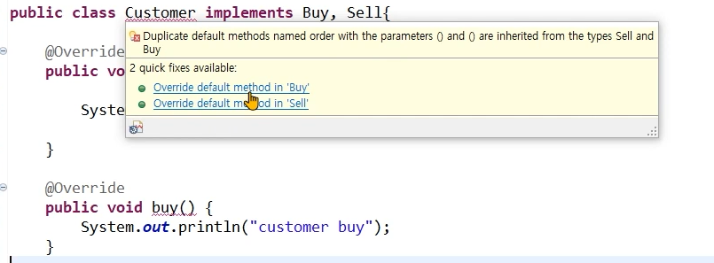

## 인터페이스

- 기본적으로 모든 메서드가 추상 메서드이다.

- 모든 변수는 상수로 선언된다. public static final (직접 키워드를 넣지 않아도 컴파일 과정에서 자동으로 추가된다.)

- 인터페이스를 구현한 클래스는 인터페이스 형으로 선언한 변수로 형 변환 할 수 있음

- 인터페이스 Calc와 이를 타입 상속받은 CompleteCalc 클래스가 있을 때 다음이 성립한다.

  `Calc calc = new CompleteCalc();`

  - 상속에서의 형 변환과 동일한 의미
  - 클래스 상속과 달리 구현 코드가 없으므로 여러 인터페이스를 구현할 수 있음 ( cf. extends)
  - 형 변환되는 경우 인터페이스에 선언된 메서드만을 사용가능함

<br/>

> 타입 상속 이란?<br/>
>
> 클래스 상속 처럼 코드가 쓰여진 메서드를 상속받는게 아니라 인터페이스 내부의 함수들처럼 비어있는 메서드들을 상속받은 것이다.

### 📌 인터페이스가 하는 일

- 클래스나 프로그램이 제공하는 기능을 명시적으로 선언
- 일종의 클라이언트 코드와의 약속이며 클래스나 프로그램이 제공하는 명세(specification)
- 클라이언트 프로그램은 인터페이스에 선언된 메서드 명세만 보고 이를 구현한 클래스를 사용할 수 있음
  - 클라이언트에서 프로그램의 자세한 내부 구조를 알 필요가 없다!
  - 사용할 수 있는 메서드는 무엇이 있고, 해당 메서드의 매개변수와 리턴값등만 알면 된다.
- 어떤 객체가 하나의 인터페이스 타입이라는 것은 그 인터페이스가 제공하는 모든 메서드를 구현했다는 의미임
- 인터페이스를 구현한 다양한 객체를 사용함 - 다형성
- 예) JDBC 인터페이스

## 인터페이스의 요소

### 📌 상수

모든 변수는 상수로 변환된다. public static final

```java
double PI = 3.14;
int ERROR = -999999999;
```

### 📌 추상 메서드

선언된 모든 메서드는 추상 메서드이다. public abstract

### 📌 디폴트 메서드 (자바 8이후)

- 구현을 가지는 메서드, 인터페이스를 구현하는 클래스들에서 공통으로 사용할 수 있는 기본 메서드
- `default` 키워드 사용
- 상속받은 클래스에서 재정의가 가능하다.
- 상속받은 클래스로 인스턴스가 생성되어야만 사용이 가능하다.

> 원래 추상메서드만 존재했지만, 인터페이스를 상속받은 클래스에서 중복인 코드를 계속 작성하는 일이 생기자 디폴트 메서드가 추가되었다.

### 📌 정적 메서드 (자바 8이후)

- 인스턴스 생성과 상관 없이 인터페이스 타입으로 사용할 수 있는 메서드

```java
static int total(int[] arr) {
	int total = 0;

	for(int i: arr) {
		total += i;
	}
	mystaticMethod();
	return total;
}

```

> static 메서드는 재정의할 수 없다.

### 📌 private 메서드 (자바 9이후)

- 인터페이스를 구현한 클래스에서 사용하거나 재정의 할 수 없음
- 인터페이스 내부에서만 사용하기 위해 구현하는 메서드
- default 메서드나 static 메서드에서 사용하기위해 만들어진다.

```java
private void myMethod() {
	System.out.println("private method");
}

private static void mystaticMethod() {
	System.out.println("private static method");
}

---
default void description(){
    myMethod();
}

static void staticDescription(){
    myStaticMethod();
}
```

## 인터페이스를 활용한 다형성 구현


> UserInfoDao가 oracle버전과, mysql버전, mssql버전이 필요하다고 할 때 버전별로 UserInfoDao를 생성하면 오버헤드가 발생한다. <br/>
>
> 위처럼 다형성을 사용해 전체 코드가 아닌 db에 연결되어있는 dao부분만 교체할 수 있다면 큰 오버헤드 없이 구현이 가능하다. 이를 전략 패턴이라고 부른다.

- 환경파일(db.properties) 에서 database의 종류에 대한 정보를 읽고 그 정보에 맞게 dao 인스턴스를 생성하여 실행될 수 있게 한다.

<br/>


계층 구조는 위와 같다.

### 📌 UserInfo

유저 정보를 나타내는 클래스이다.

```java
package ch13.domain.userinfo;

public class UserInfo {
	private String userId;
	private String passwd;
	private String userName;

	// 아래 get, set 메서드 존재 (생략)
	// ...
}

```

### 📌 UserInfoDao (인터페이스)

데이터에 접근하고 조작하는 메서드가 들어있다.<br/>

```java
package ch13.domain.userinfo.dao;

import ch13.domain.userinfo.UserInfo;

public interface UserInfoDao {
	void insertUserInfo(UserInfo userInfo);
	void updateUserInfo(UserInfo userInfo);
	void deleteUserInfo(UserInfo userInfo);
}
```

> 유저정보 데이터베이스를 조작하기 위해 어떤 메서드가 제공되는지만 명시해준다.

### 📌 UserInfoMySqlDao

```java
package ch13.domain.userinfo.dao.mysql;

import ch13.domain.userinfo.UserInfo;
import ch13.domain.userinfo.dao.UserInfoDao;

public class UserInfoMySqlDao implements UserInfoDao{

	@Override
	public void insertUserInfo(UserInfo userInfo) {
		// TODO Auto-generated method stub
		System.out.println("insert into MYSQL DB userId =" + userInfo.getUserId() );
	}

	@Override
	public void updateUserInfo(UserInfo userInfo) {
		// TODO Auto-generated method stub
		System.out.println("update into MYSQL DB userId =" + userInfo.getUserId() );
	}

	@Override
	public void deleteUserInfo(UserInfo userInfo) {
		// TODO Auto-generated method stub
		System.out.println("delete from MYSQL DB userId =" + userInfo.getUserId() );
	}

```

- 인터페이스 UserInfoDao를 상속한 클래스이다.
- 인터페이스에서 정의하지않은 코드 내부를 MySql버전에 맞춰 작성해준다.

> 간단한 예시이므로 직접 데이터베이스에 접근하진 않고 단순히 출력만 하는 코드를 작성했다.

<br/>

같은 방식으로 `UserInfoOracleDao`도 만든다.

### 📌 db.properties

```properties
DBTYPE=MYSQL
```

- 프로퍼티 파일을 프로젝트 최상단 폴더(루트)에 생성한다.

  > 파일을 프로젝트 최상단 폴더에서부터 읽어들이기 때문이다.

### 📌 UserInfoClient

```java
package ch13.userinfo.web;

public class UserInfoClient {

	public static void main(String[] args) throws IOException {
		FileInputStream fis = new FileInputStream("db.properties"); // 프로퍼티 파일을 읽어옴
		Properties prop = new Properties(); // key-value 쌍을 페어로 읽어들임
		prop.load(fis);

		String dbtype = prop.getProperty("DBTYPE"); // DBTYPE의 value를 받아옴

		UserInfo userInfo = new UserInfo();
		userInfo.setUserId("1");

		UserInfoDao userInfoDao = null; // 빈 인터페이스 생성

		if(dbtype.equals("ORACLE")) {
			userInfoDao = new UserInfoOracleDao(); // 업캐스팅
		}
		else if(dbtype.equals("MYSQL")) {
			userInfoDao = new UserInfoMySqlDao(); // 업캐스팅
		}

		userInfoDao.insertUserInfo(userInfo);
		userInfoDao.updateUserInfo(userInfo);
		userInfoDao.deleteUserInfo(userInfo);
	}

}
```

- 실제 유저 데이터베이스에 접근을 요청하는 `UserInfoClient` 클래스이다.

- 현재 프로퍼티 파일의 `DBTYPE`은 `MYSQL`이므로 `UserInfoDao`에는 `UserInfoMySqlDao` 인스턴스가 할당된다.

## 하나의 클래스가 여러 인터페이스를 구현할 경우

하나의 클래스가 여러 클래스를 상속받을 수 없다.

> 상속받은 클래스들중에서 함수명이 같은 함수가 있다면 어떤 함수를 실행해야할지 모호해지기 때문이다.

<br/>

인터페이스는 코드 구현부가 없으므로 하나의 클래스가 여러 인터페이스를 구현할 수 있다고 배웠다. 그러나 앞서 인터페이스에도 구현부가 들어가는 디폴트 메서드가 있다는 것을 배웠다. 여러 인터페이스를 상속받았을 때 디폴트 메서드가 중복되는 경우는 어떻게 해야할까?<br/>

> 답은 디폴트 메서드가 중복되는 경우는 구현하는 클래스에서 재정의해야한다.

### 예시

예시를 봐보자. 인터페이스 Buy와 Sell은 각각 dafault void order()함수를 가지고 있다고 하자.

```java
public interface Sell {

	void sell();

	default void order() {
		System.out.println("판매 주문");
	}
}

```

```java
public interface Buy {

	void buy();

	default void order() {
		System.out.println("구매 주문");
	}
}
```

<br/>

그리고 이 두 개의 인터페이스를 상속받은 Customer 클래스가 있다.



> Buy와 Sell에서 함수명이 같은 디폴트 함수가 있으므로 어떤 인터페이스에 있는 디폴트 함수를 오버라이딩할 지를 결정해야한다.<br/>
>
> 물론 직접 함수를 재정의해도 된다.

<br/>

```java
public class Customer implements Buy, Sell{

	@Override
	public void sell() {
		System.out.println("customer sell");
	}

	@Override
	public void buy() {
		System.out.println("customer buy");
	}

	public void sayHello() {
		System.out.println("Hello");
	}

	@Override
	public void order() {
		System.out.println("customer order");
	}

}
```

## 인터페이스끼리 상속

```java
public interface MyInterface extends X, Y{
	...
}
```

- 인터페이스가 인터페이스를 상속받을 때는 `extends` 키워드를 사용한다.
- 인터페이스는 다중 상속이 가능하고 구현 코드의 상속이 아니므로 타입 상속 이라고 한다.
