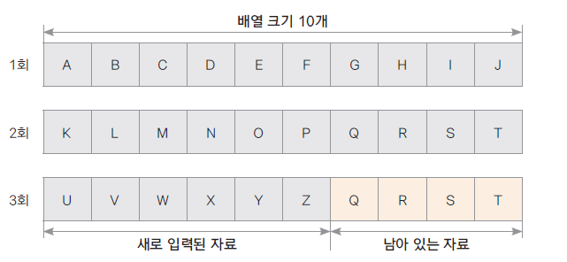
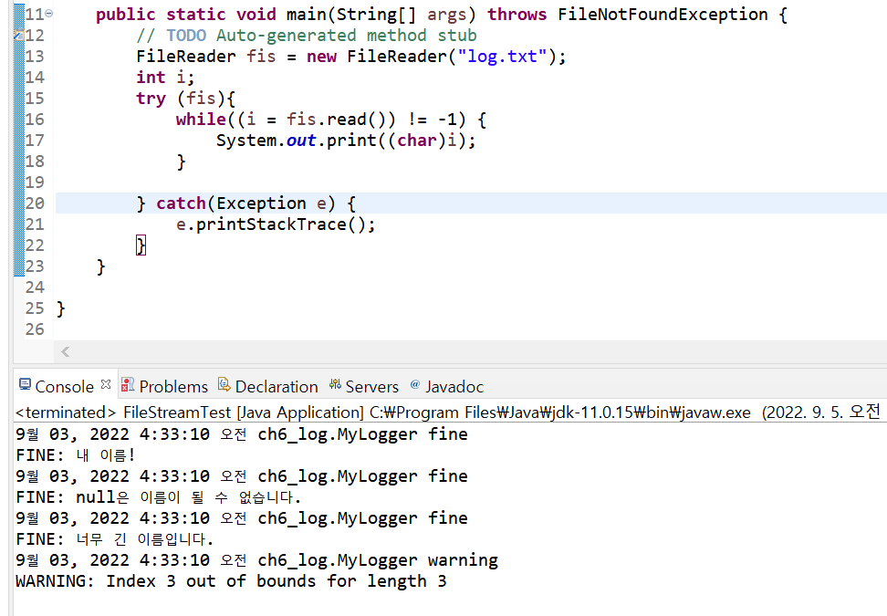

## 입출력 스트림(I/O 스트림)

- 자바는 다양한 입출력 장치에 독립적으로 일관성있는 입출력을 입출력 스트림을 통해 제공한다.
- 입출력이 구현되는 곳: 파일 디스크, 키보드, 마우스, 네트웍, 메모리 등 모든 자료가 입력되고 출력되는 곳

## 입출력 스트림의 구분

- 대상 기준 : 입력 스트림 / 출력 스트림
- 자료의 종류 : 바이트 스트림 / 문자 스트림
- 기능 : 기반 스트림 / 보조 스트림

### 📌 기반 스트림과 보조 스트림

- 기반 스트림 : 대상에 직접 자료를 읽고 쓰는 기능의 스트림
- 보조 스트림 : 직접 읽고 쓰는 기능은 없이 추가적인 기능을 더해주는 스트림
- 보조 스트림은 직접 읽고 쓰는 기능은 없으므로 항상 기반 스트림이나 또 다른 보조 스트림을 생성자의 매개 변수로 포함함


<br/>

| 종류        | 예시                                                                                |
| ----------- | ----------------------------------------------------------------------------------- |
| 기반 스트림 | FileInputStream, FileOutputStream, FileReader, FileWriter 등                        |
| 보조 스트림 | InputStreamReader, OutputStreamWriter, BufferedInputStream, BufferedOutputStream 등 |

## System 클래스의 표준 입출력 멤버

```java
public class System{
	public static PrintStream out;
	public static InputStream in;
	public static PrintStream err;
}
```

> - System.out : 그동안 자주 사용했던 표준 출력(모니터) 스트림이다.
>   - System.out.println("hello");
> - System.in : 표준 입력(키보드) 스트림이다.
>   - int i = System.in.read();
> - System.err : 표준 에러 출력(모니터) 스트림
>   - System.err.println("에러 메세지");

### 📌 예시 - System.in

```java
// 문자열 하나 받기
int i;
try{
    i = System.in.read(); // read()의 반환값은 int형이다.
    System.out.println((char)i);
} catch (IOException e){
    e.printStackTrace();
}

// 문자열 여러 개 받기
int i;
try{
    while((i = System.in.read()) != '\n'){// 엔터를 치면 종료
    System.out.print((char)i);
    }
} catch (IOException e){
    e.printStackTrace();
}
```

## 바이트 단위 스트림

## - InputStream

> 바이트 단위 입력 스트림의 최상위 추상 클래스

- 많은 추상 메서드가 선언되어 있고 이를 하위 스트림이 상속받아 구현한다.

### 📌 InputSteam의 주요 하위 클래스

| 스트림 클래스        | 설명                                                                          |
| -------------------- | ----------------------------------------------------------------------------- |
| FileInputStream      | 파일에서 바이트 단위로 자료를 읽습니다.                                       |
| ByteArrayInputStream | byte 배열 메모리에서 바이트 단위로 자료를 읽습니다.                           |
| FilterInputStream    | 기반 스트림에서 자료를 읽을 때 추가 기능을 제공하는 보조 스트림의 상위 클래스 |

### 📌 InputSteam의 주요 메서드

| 메서드                               | 설명                                                                                                                          |
| ------------------------------------ | ----------------------------------------------------------------------------------------------------------------------------- |
| int read()                           | 입력 스트림으로부터 한 바이트의 자료를 읽습니다. 읽은 자료의 바이트 수를 반환합니다.                                          |
| int read(byte b[])                   | 입력 스트림으로 부터 b[] 크기의 자료를 b[]에 읽습니다. 읽은 자료의 바이트 수를 반환합니다.                                    |
| int read(byte b[], int off, int len) | 입력 스트림으로 부터 b[] 크기의 자료를 b[]의 off변수 위치부터 저장하며 len 만큼 읽습니다. 읽은 자료의 바이트 수를 반환합니다. |
| void close()                         | 입력 스트림과 연결된 대상 리소스를 닫습니다.                                                                                  |

> 리소스를 읽고 나선 반드시 close()를 해줘야 함!

### 📌 예시 - FileInputStream

```java
// input.txt
abc
```

```java
FileInputStream fis = null;
		// try문안에서 인풋스트림을 정의할 경우 finally문에서 사용하지 못함
		// 미리 null로 선언해준다
		try {
			fis = new FileInputStream("input.txt");
			int i;
			while ((i = fis.read()) != -1) // 더 읽어올 바이트가 없다면 -1을 리턴
			System.out.print((char)i);

		}catch(Exception e) {
			e.printStackTrace();
		}finally {
			try {
				fis.close();
			} catch (Exception e) {
				// TODO Auto-generated catch block
				e.printStackTrace();
			}
		}
```

> 출력결과 : abc

<br/>

물론 `try-with-resource`문을 사용해서 파일이 `AutoCloseable`하게 만들 수도 있다.

```java
try (FileInputStream fis = new FileInputStream("input.txt"); ){
			int i;
			while ((i = fis.read()) != -1)
			System.out.print((char)i);

		}catch(Exception e) {
			e.printStackTrace();
		}
```

### 📌 예시 - 버퍼 사용

```java
try (FileInputStream fis = new FileInputStream("input.txt"); ){
			int i;
			byte[] buffer = new byte[10];
			while ((i = fis.read(buffer)) != -1) {
				for(int ch : buffer) {
					System.out.print((char)ch);
				}
				System.out.println(" "+i+"바이트 읽음");
			}


		}catch(Exception e) {
			e.printStackTrace();
		}
```

> **출력 결과** <br/>
>
> abcdefghiz 10바이트 읽음<br/>
> klmnopqrst 10바이트 읽음<br/>uvwxyzqrst 6바이트 읽음

- 위와 같이 byte배열인 버퍼를 생성한 뒤 read함수에 매개변수로 넣으면 파일을 읽어와 버퍼에 저장한다.
- read()안에 버퍼를 인자로 넣은 경우, read()의 반환값이 읽어온 사이즈 크기가 된다. (-1이면 읽지 못함)
- 아래 for문을 통해 버퍼에 들어간 모든 데이터를 출력하고 있다.
- 마지막에 6byte만 읽어왔음에도 10개가 출력되는 것은 이미 버퍼에 작성된 부분을 읽어 왔기 때문이다.



<br/>

버퍼에서 읽어온 만큼만 출력하려면 아래와 같이 작성하면 된다.

```java
try (FileInputStream fis = new FileInputStream("input.txt"); ){
			int i;
			byte[] buffer = new byte[10];
			while ((i = fis.read(buffer)) != -1) {
				for(int j = 0; j<i; j++) {
					System.out.print((char)buffer[j]);
				}
				System.out.println(" "+i+"바이트 읽음");
			}


		}catch(Exception e) {
			e.printStackTrace();
		}
```

## - OutputStream

> 바이트 단위 출력 스트림 최상위 추상 클래스

- 많은 추상 메서드가 선언되어 있고 이를 하위 스트림이 상속받아 구현함

### 📌 OutputStream의 주요 하위 클래스

| 스트림 클래스         | 설명                                                                        |
| --------------------- | --------------------------------------------------------------------------- |
| FileOutputStream      | 파일에서 바이트 단위로 자료를 쓴다.                                         |
| ByteArrayOutputStream | byte 배열 메모리에서 바이트 단위로 자료를 쓴다.                             |
| FilterOutputStream    | 기반 스트림에서 자료를 쓸 때 추가 기능을 제공하는 보조 스트림의 상위 클래스 |

### 📌 OutputStream의 주요 메서드

| 메서드                                | 설명                                                                      |
| ------------------------------------- | ------------------------------------------------------------------------- |
| int write()                           | 한 바이트를 출력한다.                                                     |
| int write(byte b[])                   | b[] 크기의 자료를 출력한다.                                               |
| int write(byte b[], int off, int len) | b[] 배열에 있는 자료의 off 위치부터 len 개수만큼 자료를 출력한다.         |
| void flush()                          | 출력을 위해 잠시 자료가 머무르는 출력 버퍼를 강제로 비워 자료를 출력한다. |
| void close()                          | 출력 스트림과 연결된 대상 리소스를 닫는다. 출력 버퍼가 비워진다.          |

### 📌 예제 - FileOutputStream

#### 한 바이트씩 쓰기

```java
try(FileOutputStream fos = new FileOutputStream("output.txt")){ // 해당 파일이 없으면 자동으로 생성, 오버라이트가 디폴트값
    fos.write(65); // A 아스키 값이 들어감
    fos.write(66); // B
} catch (Exception e){
    e.printStackTrace();
}
```

<br/>

#### byte[] 배열에 넣고 배열을 한 번에 쓰기

```java
FileOutputStream fos = new FileOutputStream("output.txt");
byte[] buffer = new byte[26];
byte data = 65;
for(int i = 0; i<26; i++) {
    buffer[i] = data++;
}
try(fos){ // JAVA 9부터 지원
    fos.write(buffer);
} catch (Exception e){
    e.printStackTrace();
}
```

## 문자 단위 입출력 스트림

## - Reader

> 문자 단위 입력 스트림 최상위 추상 클래스

- 많은 추상 메서드가 선언되어 있고 이를 하위 스트림이 상속받아 구현함

### 📌 Reader의 주요 하위 클래스

| 클래스            | 설명                                                                             |
| ----------------- | -------------------------------------------------------------------------------- |
| FileReader        | 파일에서 문자 단위로 읽는 스트림 클래스이다.                                     |
| InputStreamReader | byte 단위로 읽은 자료를 문자로 변환해주는 보조 스트림 클래스                     |
| BufferedReader    | 문자로 읽을 때 배열을 제공하여 한꺼번에 읽을 수 있는 기능을 제공하는 보조 스트림 |

<br/>

### 📌Reader의 주요 메서드

| 메서드                                 | 설명                                                                                                                 |
| -------------------------------------- | -------------------------------------------------------------------------------------------------------------------- |
| int read()                             | 파일로부터 한 문자를 읽는다. 읽은 문자를 반환한다.                                                                   |
| int read(char b[])                     | 파일로 부터 b[] 크기의 자료를 b[]에 읽습니다.                                                                        |
| int read(char[] buf, int off, int len) | 파일로 부터 b[] 크기의 자료를 b[]의 off변수 위치부터 저장하며 len 만큼 읽습니다. 읽은 자료의 바이트 수를 반환합니다. |
| void close()                           | 입력 스트림과 연결된 대상 리소스를 닫습니다.                                                                         |

<br/>

### 📌 예제 - FileReader

```java
/// log.txt
9월 03, 2022 4:33:10 오전 ch6_log.MyLogger fine
FINE: 내 이름!
9월 03, 2022 4:33:10 오전 ch6_log.MyLogger fine
FINE: null은 이름이 될 수 없습니다.
9월 03, 2022 4:33:10 오전 ch6_log.MyLogger fine
FINE: 너무 긴 이름입니다.
9월 03, 2022 4:33:10 오전 ch6_log.MyLogger warning
WARNING: Index 3 out of bounds for length 3
```

짜잔 저번 logging에서 작성한 log파일이다. 이 파일을 읽어와보자!<br/>

FileReader로 읽어와보기 전에 먼저 배운 FileInputStream으로 읽어와보자.

```java
FileInputStream fis = new FileInputStream("log.txt");
int i;
try (fis){
    while((i = fis.read()) != -1) {
        System.out.print((char)i);
    }

} catch(Exception e) {
    e.printStackTrace();
}
```

> **출력 결과**<br/>
> 9¿? 03, 2022 4:33:10 ¿??? ch6_log.MyLogger fine
> FINE: ³? ??¸§!<br/>
> 9¿? 03, 2022 4:33:10 ¿??? ch6_log.MyLogger fine
> FINE: null?º ??¸§?? ?? ¼? ¾ø½?´?´?.<br/>
> 9¿? 03, 2022 4:33:10 ¿??? ch6_log.MyLogger fine
> FINE: ³?¹? ±? ??¸§??´?´?.<br/>
> 9¿? 03, 2022 4:33:10 ¿??? ch6_log.MyLogger warning<br/>
> WARNING: Index 3 out of bounds for length 3

- 한글은 제대로 출력되지 않는 것을 볼 수 있다.
- 1byte씩 읽어오고 있어 숫자와 영어는 잘 출력되지만 2byte인 한글은 깨져보이는 것을 볼 수 있다.

<br/>

이번엔 FileReader로 가져와보자.



> 파일이 잘 출력되는 것을 볼 수 있다.

### - Writer

> 문자 단위 출력 스트림 최상위 추상 클래스

- 많은 추상 메서드가 선언되어 있고 이를 하위 스트림이 상속받아 구현함

### 📌 Writer 주요 하위 클래스

| 스트림 클래스      | 설명                                                                         |
| ------------------ | ---------------------------------------------------------------------------- |
| FileWriter         | 파일에서 문자 단위로 자료를 쓴다.                                            |
| OutputStreamWriter | 바이트 단위의 자료를 문자로 변환해 출력해주는 보조 스트림 클래스             |
| BufferedWriter     | 문자로 쓸 때 배열을 제공하여 한꺼번에 쓸 수 있는 기능을 제공하는 보조 스트림 |

<br/>

### 📌 Writer 주요 하위 메서드

| 메서드                                  | 설명                                                                      |
| --------------------------------------- | ------------------------------------------------------------------------- |
| int write()                             | 한 문자를 출력한다.                                                       |
| int write(char b[])                     | b[] 크기의 자료를 출력한다.                                               |
| int write(char b[], int off, int len)   | b[] 배열에 있는 자료의 off 위치부터 len 개수만큼 자료를 출력한다.         |
| int write(String str)                   | 문자열 str을 출력한다.                                                    |
| int write(String str, int off, int len) | 문자열 str의 off번째 문자로부터 len 개수만큼 출력한다.                    |
| void flush()                            | 출력을 위해 잠시 자료가 머무르는 출력 버퍼를 강제로 비워 자료를 출력한다. |
| void close()                            | 출력 스트림과 연결된 대상 리소스를 닫는다. 출력 버퍼가 비워진다.          |

### 📌 예제 - FileWriter

```java
try(FileWriter fw = new FileWriter("writer.txt")){
    fw.write('A'); // 문자 하나 출력
    char buf[] = {'B','C','D','\n'};
    fw.write(buf); // 문자 배열 출력
    fw.write("im string\n"); // String 출력
	fw.write("65"); // 숫자 그대로 출력
    fw.write(65); // A
} catch(Exception e){
    e.printStackTrace();
}
```

```
// 출력결과
ABCD
im string
65A
```

이후 [Java - 보조 스트림(필터 스트림)](https://blog.hongo.app/filterstream/)으로 포스팅이 이어진다.

## 참고

- Do it! 자바 프로그래밍 입문
- [https://hudi.blog/java-inputstream-outputstream/](https://hudi.blog/java-inputstream-outputstream/)
