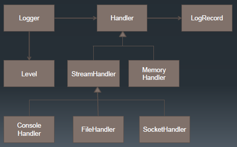
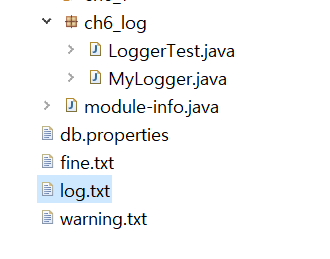
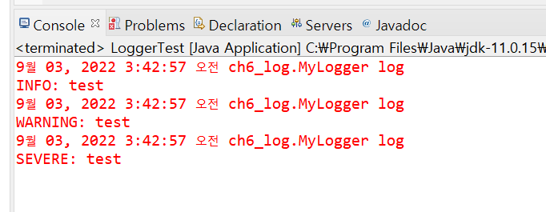

## 오류 로그 남기기 - Logger

java.util.logging.Logger를 활용해보자.

### 📌 java.util.logging.Logger

* 자바에서 기본적으로 제공되는 log package
* 파일이나 콘솔에 로그 내용을 출력할 수 있음
* jre/lib/logging.properties 파일을 편집하여 로그의 출력방식 로그 레벨을 변경 할 수 있음
* logging 패키지에서 제공하는 로그 레벨은`severe`, `warning`, `info`, `config`, `fine`, `finer`, `finest` 임 (이름을 보면 유추할 수 있지만 severe로 갈수록 심각한? 수준이다.)

* 오픈소스로는 log4j를 많이 사용하고 있음

<br/>



* `Logger`안에는 `Handler`가 있다.
* `Handler`에는 `ConsoleHandler`와 `FileHandler`가 있다.

> * ConsoleHandler : 콘솔에 로그를 찍어줌
> * FileHandler : 파일에 로그를 찍어줌
>
> (우리는 오늘 예시에서 FileHandler만 다뤄볼 것이다...)


### 📌 1) 로거 만들기

```java
public class MyLogger {
	
	Logger logger = Logger.getLogger("mylogger");
    // getLogger의 인자는 로거의 key라고 보면 편하다.
    // 같은 이름의 로거를 get하면 같은 로거가 반환된다.
    
    // 싱글톤 패턴
	private static MyLogger instance = new MyLogger();
	
    // 생성될 로그 파일 이름들
	public static final String errorLog = "log.txt";
	public static final String warningLog = "warning.txt";
	public static final String fineLog = "fine.txt";
	
    // 파일핸들러
	private FileHandler logFile = null;
	private FileHandler warningFile = null;
	private FileHandler fineFile = null;

    // 싱글톤 패턴
	private MyLogger(){
	
			try {
                // 클래스의 파일핸들러들을 같이 생성해준다. 첫 번째 인자는 파일의 이름이다.
                // 두 번째 인자를 true로 넣으면 파일에 overwrite가 아니라 append방식으로 작성된다.
				logFile = new FileHandler(errorLog, true);
				warningFile = new FileHandler(warningLog, true);
				fineFile = new FileHandler(fineLog, true);
				
			} catch (SecurityException e) {
				e.printStackTrace();
			} catch (IOException e) {
				e.printStackTrace();
			}
	
        	// 찍는 포맷
			logFile.setFormatter(new SimpleFormatter());
			warningFile.setFormatter(new SimpleFormatter());
			fineFile.setFormatter(new SimpleFormatter());
			
        	// 로거의 레벨을 설정한다.
			logger.setLevel(Level.ALL);
        
       		// 파일핸들러마다 레벨을 또 설정할 수 있다.
        	// 지정된 레벨이상(레벨이 같거나 더 심각한)의 것만 로깅한다.
			fineFile.setLevel(Level.FINE);
			warningFile.setLevel(Level.WARNING);
			
        	// 로거에 핸들러를 추가한다.
			logger.addHandler(logFile);
			logger.addHandler(warningFile);
			logger.addHandler(fineFile);
	}	
	
	// 싱글톤 패턴
	public static MyLogger getLogger(){
		return instance;
	}

	// 로그를 찍는 함수
	public void log(String msg){
		
		logger.finest(msg);
		logger.finer(msg);
		logger.fine(msg);
		logger.config(msg);
		logger.info(msg);
		logger.warning(msg);
		logger.severe(msg);
		
	}
	
	public void fine(String msg){
		logger.fine(msg);
	}
	
	public void warning(String msg){
		logger.warning(msg);
	}
}

```


### 📌 2) 로거 테스트

```java
// 테스트

ublic class LoggerTest {

	public static void main(String[] args) {
		// 싱글톤 패턴
		MyLogger myLogger = MyLogger.getLogger();
		
		myLogger.log("test");
	}

}

```

<br/>

실행결과는...? 두근



> 짜잔 프로젝트하단에 파일이 세 개 생겼다! MyLogger에서 정의한 파일 이름 그대로 세 가지가 생겼다...! 로거에 각각 파일 이름을 적용한 세 개의 핸들러를 등록했기 때문이다. 파일안의 살펴보자.

<br/>

* log.txt

```properties
9월 03, 2022 3:42:56 오전 ch6_log.MyLogger log
FINEST: test
9월 03, 2022 3:42:56 오전 ch6_log.MyLogger log
FINER: test
9월 03, 2022 3:42:56 오전 ch6_log.MyLogger log
FINE: test
9월 03, 2022 3:42:56 오전 ch6_log.MyLogger log
CONFIG: test
9월 03, 2022 3:42:57 오전 ch6_log.MyLogger log
INFO: test
9월 03, 2022 3:42:57 오전 ch6_log.MyLogger log
WARNING: test
9월 03, 2022 3:42:57 오전 ch6_log.MyLogger log
SEVERE: test
```

> logger.setLevel(Level.ALL); <br/>
>
> logger에는 모든 레벨을 적용했었다. <br/>
>
> 그렇기에 main메서드에서 적은 "test"라는 문구가 모든 레벨에서 찍힌 것을 볼 수 있다.

<br/>

* fine.txt

```properties
9월 03, 2022 3:42:56 오전 ch6_log.MyLogger log
FINE: test
9월 03, 2022 3:42:56 오전 ch6_log.MyLogger log
CONFIG: test
9월 03, 2022 3:42:57 오전 ch6_log.MyLogger log
INFO: test
9월 03, 2022 3:42:57 오전 ch6_log.MyLogger log
WARNING: test
9월 03, 2022 3:42:57 오전 ch6_log.MyLogger log
SEVERE: test
```

> fineFile.setLevel(Level.FINE);<br/>
>
> logger의 레벨은 All이지만 fineFile의 핸들러에 별도로 레벨 FINE을 등록해줬다. fine.txt파일은 이 핸들러에 의해 생긴 파일이다.<br/>
>
> FINE레벨이상의 레벨부터 로그가 찍힌 것을 볼 수 있다.


* warning.txt

로그 파일을 먼저 보기 전, 기억을 떠올려보자. 핸들러 warningFile에는 레벨 WARNING을 등록해줬고 warning.txt는 이 핸들러에 의해 생긴 파일이다. 그렇다면 로그 내용은...?

<br/><br/>

```properties
9월 03, 2022 3:42:57 오전 ch6_log.MyLogger log
WARNING: test
9월 03, 2022 3:42:57 오전 ch6_log.MyLogger log
SEVERE: test
```

예상했겠지만 WARNING레벨 이상부터 로그가 찍힌 것을 볼 수 있다!


### 📌 3) 콘솔 로그 설정

파일 로그 외에 콘솔에 로그가 찍힌 것도 볼 수 있다.



> 이 녀석의 레벨은 INFO인듯한데, 어디서 설정을 할 수 있을까?

<br/>

* 일단 jre가 설치된 파일 경로를 찾자.

  * 이클립스 상단의 Window -> Preferences 에서 Installed JREs에서 파일경로를 찾을 수 있다.

* 나는 `C:\Program Files\Java\jdk-11.0.15\lib\jrt-fs.jar`이라고 되어있었는데 저기까지 다 가진말고 jdk폴더까지만 들어가서 `conf` 폴더를 열어보자.

* 그럼 `logging.properties`라는 파일을 찾을 수 있다! 

* 해당 파일을 열어보면 .level = INFO 라고 적혀있는 부분이 있다. 여기서 콘솔 로그의 레벨을 설정할 수 있다! 

  

## 🤔 예시 - MyName

```java
public class MyName {
	private String name;
}
```

클래스 `MyName`은 다음과 같이 name 멤버변수 하나만 존재하는 아주 귀여운 클래스이다. 이 클래스에 아래와 같은 예외를 만들어서 로깅테스트를 해보자!

* 이름이 "hongo"이면 예외처리
* 이름이 null 이면 예외처리
* 이름에 " "가 4개 이상 들어가면 예외처리

<br/>


### 📌 예외만들기

간단한 예외를 직접 만들어보자!

```java
public class NameFormatException extends IllegalArgumentException {
	public NameFormatException(String message) {
		// TODO Auto-generated constructor stub
		super(message);
	}
}
```

`IllegalArgumentException`를 상속받아 에러메시지를 던질 수 있는 `NameFormatException`을 만들었다.


### 📌 예외 throw 코드 작성

예외처리에 해당할 경우 setName을 할 수 없게 작성해보자. 예외처리가 일어나면 방금 만든 `NameFormatException`가 발생한다고 하자. 예외처리시 넘겨줄 에러문구도 작성해주자.

```java
public class MyName {
	private String name;

	public String getName() {
		return name;
	}

	public void setName(String name) {
		if (name == "hongo") {
			throw new NameFormatException("내 이름!");
		}
		else if (name == null) {
			throw new NameFormatException("null은 이름이 될 수 없습니다.");
		}
		else if (name.split(" ").length > 3) {
			throw new NameFormatException("너무 긴 이름입니다.");
		}
		this.name = name;
	}
	
}
```


### 📌 테스트

자, 이제 테스트를 해보자! 로거는 귀찮으니까 위에서 생성한 `MyLogger`를 재활용하자.

> MyLogger는 대충 ALL레벨 핸들러와 FINE레벨 핸들러, WARNING 레벨 핸들러를 가지고 있다. ALL 핸들러의 로그는 "log.txt", FINE 핸들러의 로그는 "fine.txt", WARNING 핸들러의 로그는 "warning.txt"에 작성된다.<br/>
>
> 그리고 로그를 FINE레벨로 작성하는 fine 내장 함수와 WARNING레벨로 작성하는 warning 내장 함수가 존재한다.

```java
public class NameFormatTest {
	public static void main(String[] args) {
		MyLogger mylogger = MyLogger.getLogger();
		
		String n1 = "hongo";
		String n2 = null;
		String n3 = "Very Long Long Name";

		ArrayList<String> names = new ArrayList<>();
		names.add(n1); names.add(n2); names.add(n3);
		
		MyName myname = new MyName();
		for(int i = 0; i<4; i++) {
			try {
				myname.setName(names.get(i));
			}
			catch (NameFormatException e){
				mylogger.fine(e.getMessage());
			}
			catch (Exception e) {
				mylogger.warning(e.getMessage());
			}
			
		}
	}
}
```

* "hongo", null, "Very Long Long Name"을 차례대로 setName()에 넣어보자. (각각의 string들은 catch(NameFormatException e)에서 잡힐 것 이다.)
  * 해당 예외는 mylogger의 fine레벨로 기록된다.
* 또한 for문의 i를 0to3까지 반복하게 만들어 ArrayList names의 인덱스를 오버해보자. (이 에러는 catch(Exception e)에서 잡힐 것이다.)
  * 해당 예외는 mylogger에 warning레벨로 기록된다.

<br/><br/>

실행을 하면 파일 세 개가 생긴다. 파일의 내용을 살펴보자.

<br/>

* log.txt && fine.txt

```properties
9월 03, 2022 4:33:10 오전 ch6_log.MyLogger fine
FINE: 내 이름!
9월 03, 2022 4:33:10 오전 ch6_log.MyLogger fine
FINE: null은 이름이 될 수 없습니다.
9월 03, 2022 4:33:10 오전 ch6_log.MyLogger fine
FINE: 너무 긴 이름입니다.
9월 03, 2022 4:33:10 오전 ch6_log.MyLogger warning
WARNING: Index 3 out of bounds for length 3
```

> 두 파일에는 FINE 레벨과 WARNING 레벨의 로그가 모두 찍혔다. (당연하다. 핸들러가 ALL이랑 FINE이니까.)

<br/>

* warning.txt

```properties
9월 03, 2022 4:33:10 오전 ch6_log.MyLogger warning
WARNING: Index 3 out of bounds for length 3
```

> warning.txt를 작성하는 핸들러는 WARNING 레벨이므로 WARNING레벨 이상의 로그만 찍힌다. 때문에 fine()으로 작성한 로그는 찍히지않았다. 

<br/>


이처럼 로그를 사용해서 특정 레벨에 맞게 로그를 기록해 프로그램 정보를 확인하거나 디버깅을 편리하게 할 수 있다. 
