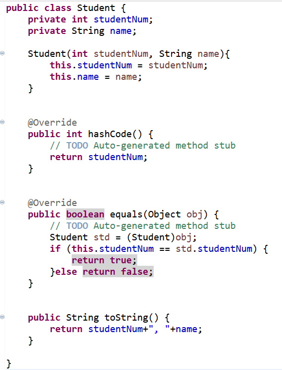
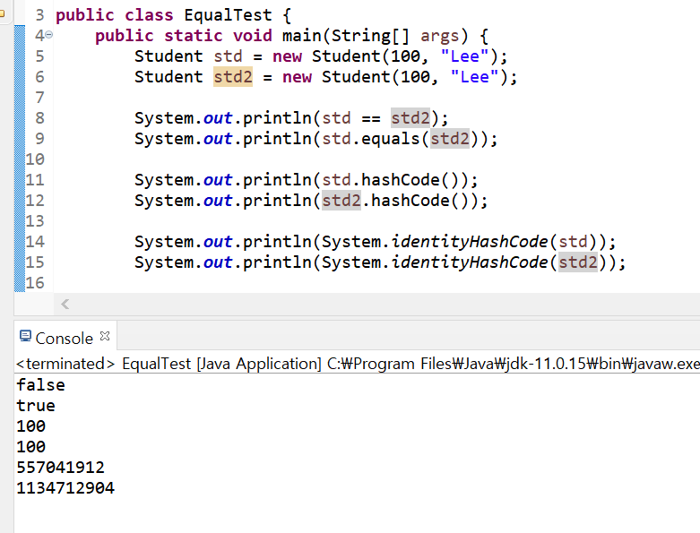

## Object 클래스

> 모든 클래스의 최상위 클래스

* 모든 클래스는 Object클래스를 상속받는다. (컴파일러가 자동으로 extends Object를 추가함)
* 일부 메서드는 재정의가 가능하다.
* Object 클래스는 java.lang 패키지안에 들어있다.


### java.lang 패키지

* 프로그래밍시 import 하지 않아도 자동으로 imort된다.
* import.java.lang.*;
* 많이 사용하는 기본 클래스들이 속한 패키지
* String, Integer, System... 등이 포함되어있다


## Object 클래스의 메서드 활용

### 📌 toString()

객체에서 해당 메서드를 호출할 경우 `클래스이름@16진수해시코드`형태로 출력된다.

* ex) ch2.Student@07dae90

<br/>

클래스 내부에서 toString()을 재정의한다면 클래스 맞춤으로 문자열을 출력할 수 있다. 디버깅또는 로깅할 때 해당 객체의 정보를 쉽게 파악할 수 있다.

* String이나 Integer 클래스는 이미 재정의 되어 있음


### 📌 equals()

* 두 인스턴스의 `주소 값`을 비교하여 true/false를 반환
* 재정의 하여 두 인스턴스가 논리적으로 동일함의 여부를 구현함
* 인스턴스가 다르더라도 논리적으로 동일한 경우 true를 반환하도록 재정의 할 수 있음
* ex (같은 학번, 같은 사번, 같은 아이디의 회원...)


### 📌 hashCode() 

* hashCode()는 인스턴스의 저장 주소를 반환한다.

* 힙메모리에 인스턴스가 저장되는 방식이 hash 방식이다. 주소값을 해시 코드라고 부른다.

* hash : 정보를 저장, 검색하는 자료구조

* 자료의 특정 값(키 값)에 대한 저장 위치를 반환해주는 해시 함수를 사용

  

  

  * 키는 학번, 사번등이 들어간다.

<br/>

> equals() 와 hashCode()는 페어라고 보는게 좋다. equals를 논리적으로 동일한 경우로 재정의했을경우, hashCode()도 재정의 해준다.

<br/>

#### 예시



> * toString을 studentNum, name 형태로 바꿨다.
> * equals와 hashcode는 같이 재정의하도록 한다.
> * equals의 매개변수는 `Object`타입이므로 비교하려는 객체와 같은 타입으로 다운캐스팅해줘야한다.
> * 학번(studentNum) 이 같다면 논리적으로 같은 객체라고 본다. 해시코드또한 학번으로 지정한다.

<br/>



> * 실행결과는 위와 같다.
> * std와 std2는 물리적으로는 같지 않지만 (std == std2는 false)
> * 두 객체의 학번이 같으므로 논리적으로는 같다고 출력한다.(equals)
> * System.identityHashCode() 는 재정의된 hashCode()와 상관없이 진짜 주소값과 연관된 해시코드를 리턴한다.


### 📌 clone()

* 객체 원본을 그대로 복사

* private까지 전부 복제가 되니, 객체 지향 프로그램에서의 정보 은닉, 객체 보호의 관점에서 위배될 수 있다.

* 클론이 가능하다고 미리 명시해줘야 한다.

  `implements Clonable`

* return타입은 Object (다운캐스팅이 필요함)

<br/>

#### 예시

```java
public class Student implements Cloneable {
	private int studentNum;
	private String name;
	
	public int getStudentNum() {
		return studentNum;
	}

	@Override
	protected Object clone() throws CloneNotSupportedException 		{
		// TODO Auto-generated method stub
		return super.clone();
	}
	... 생략
}
```

> 클론이 가능한 클래스에 Cloneable implements와 clone()메서드 오버라이딩 필요

```java
public class EqualTest {
	public static void main(String[] args) throws CloneNotSupportedException {
		Student std = new Student(100, "Lee");
		Student copyStd = std;
		
		System.out.println(copyStd.getName());
		System.out.println(std == copyStd);		
		System.out.println(System.identityHashCode(std));
		System.out.println(System.identityHashCode(copyStd));

		System.out.println("--------------------------------");
		
		Student cloneStd = (Student)std.clone();
		System.out.println(cloneStd.getName());
		System.out.println(std == cloneStd);		
		System.out.println(System.identityHashCode(std));
		System.out.println(System.identityHashCode(cloneStd));
		
		System.out.println("--------------------------------");
		
		std.setName("Hong");
		System.out.println(copyStd.getName());
		System.out.println(cloneStd.getName());
	}

}
```

```
// 실행결과
Lee
true
557041912
557041912
--------------------------------
Lee
false
557041912
1134712904
--------------------------------
Hong
Lee
```

* Student copyStd = std; 의 경우 주소값까지 완전히 똑같은 객체임을 알 수 있다. (즉, copyStd와 std는 이름만 다를뿐 같은 객체를 가리킨다.)
  * std의 변수값을 바꾸면 copyStd의 값도 바뀐다. 이는 역으로 해도 마찬가지이다. (둘은 같은 객체를 가리키고 같은 공간을 변경시키기 때문)
* clone한 객체는 내부 멤버 변수값들은 동일하지만 다른 객체임을 알 수 있다.

