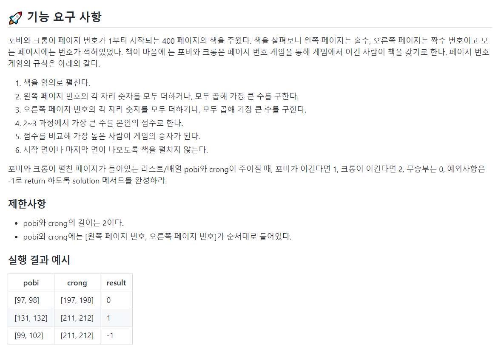

## Problem1 : 책 펼치기 게임



### 📗 기능 목록

```
📌 getPageNumberSum (Integer pageNumber)
* pageNumber의 각 자리 숫자들의 합을 반환한다.

📌 getPageNumberMul (Integer pageNumber)
* pageNumber의 각 자리 숫자들의 곱을 반환한다.

📌 getMaxNumber (List<Integer> pages)
* 왼쪽 페이지와 오른쪽 페이지의 각 자리 숫자들의 합과 곱들을 얻고, 그 중 가장 큰 값을 반환한다.

📌 getWinner (int pobiNumber, int crongNumber)
pobi와 crong의 페이지 펼치기 게임 결과를 반환
* pobiNumber가 crongNumber보다 크면 1을 반환
* crongNumber가 pobiNumbet보다 크면 2를 반환
* pobiNumber과 crongNumber의 값이 같으면 0을 반환

📌 isValid (List<Integer> page)
page안의 왼쪽 페이지 번호와 오른쪽 페이지 번호가 유효한지 검사
* 왼쪽 페이지와 오른쪽 페이지가 연속된 페이지가 아니라면 0을 반환
* 왼쪽 페이지가 오른쪽 페이지보다 크다면 0을 반환 (왼쪽부터 읽는 책이라고 가정)
* 왼쪽 페이지 번호가 짝수라면 0을 반환
* 오른쪽 페이지 번호가 홀수라면 0을 반환
* 페이지의 범위가 2이상, 399이하가 아니라면 0을 반환 (책의 시작면과 마지막면은 나올 수 없으므로, 1번 페이지로 시작하는 장과 400번 페이지로 끝나는 장은 펼칠 수 없다고 가정함.)
* 위 사항에 해당되지 않으면 1을 반환
```

### 📌 코드

[깃허브 코드](https://github.com/hgo641/java-onboarding/blob/hgo641/src/main/java/onboarding/Problem1.java)

- `getPageNumberSum`과 `getPageNumberMul` 을 사용해 각 페이지의 자릿수 합과 곱을 구한 후, `getMaxNumber`를 사용해 한 사람이 페이지 펼치기를 해서 얻을 수 있는 가장 큰 숫자를 얻게 했다.
- `isValid`는 기능요구사항을 읽고 만든 페이지 번호 유효성 검사 함수이다. 슬랙에서도 많은 의견이 나왔는데 나는 **"시작면과 마지막면은 펼칠 수 없다."**는 요구 사항을 1로 시작하는 페이지와 400으로 끝나는 페이지는 펼칠 수 없다는 것으로 이해해 이를 `isValid`에 반영했다.


### 🛠 보완하고 싶은 점

```java
public static int solution(List<Integer> pobi, List<Integer> crong) {
        if(!isValid(pobi) || !isValid(crong)){
            return -1;
        }
        int answer = Integer.MAX_VALUE;
        int pobiNum = getMaxNumber(pobi);
        int crongNum = getMaxNumber(crong);
        answer = getWinner(pobiNum, crongNum);

        return answer;
    }
```

<br/>

현재 코드에서는 `solution`함수에서 `isValid`를 사용해 페이지 번호의 유효성 검사를 하고 있는데, 어디선가... pageNumber 자체를 하나의 클래스로 만들고 해당 클래스를 생성할 때 유효성 검사를 한 번에 실시하는 것이 좋다는 말을 들은 것 같다. (어디였지)

```java
class PageList{
    List<Integer> pageList;

    PageList(List<Integer> pageList){
        this.pageList = pageList;
        if (!isValid()){
            throw new IllegalArgumentException();
        }
    }

    public boolean isValid(){
        Integer leftPage = pages.get(0);
        Integer rightPage = pages.get(1);
        if(rightPage - leftPage != 1){
            return false;
        }
        if(leftPage%2 == 0){
            return false;
        }
        if(rightPage%2 != 0){
            return false;
        }
        if(leftPage < 2){
            return false;
        }
        if(rightPage > 399){
            return false;
        }
        return true;
    }

    // ...
}
```

- 이런 식으로 `PageList`라는 클래스 자체를 만들어서 solution에서는 `IllegalArgumentException`가 발생하면 -1을 리턴하게 하는 방식이 각 메서드, 클래스들의 역할을 더 분명하게 하지 않을까?

아... 지식이 부족하니 어떤 구조가 더 좋은 구조인지 판별하기도 힘들다. 이번 프리코스를 하면서 좋은 구조에 대해 많이 알아봐야겠다.
