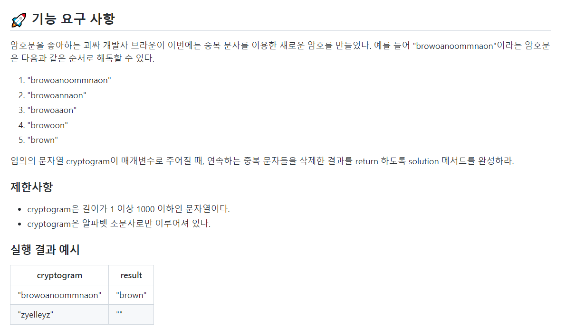

## Problem2 : 암호 해독



### 📗 기능 목록

```
📌 getOverlapLength

*  cypherText에서 `index` 번째 문자가 연속되는 중복 범위를 반환

📌 deleteOverlap

* 문자열에 연속되는 중복 문자들이 있다면 이를 삭제하고 true를 반환
* 문자열에 연속되는 중복 문자들이 없다면 false를 반환

📌 decrypt

* 해독한 암호문을 반환
```

### 📌 코드

[깃허브 코드](https://github.com/hgo641/java-onboarding/blob/hgo641/src/main/java/onboarding/Problem2.java)

- 전체 코드

```java
class Decryption{
    private StringBuilder cypherText;

    Decryption(String cryptogram){
        this.cypherText = new StringBuilder(cryptogram);
    }

    /**
     * cypherText에서 index번째 문자가 연속되는 중복 범위를 반환
     * @param index 중복을 검사할 기준이 되는 문자의 index
     * @return 중복되는 길이
     */
    Integer getOverlapLength(int index){
        Integer length = 0;
        Character prev = cypherText.charAt(index);
        while(index < cypherText.length() - 1){
            Character next = cypherText.charAt(++index);
            if(prev.equals(next) == false){
                break;
            }
            length++;
        }
        if(length > 0){
            length++;
        }
        return length;
    }

    /**
     * 문자열에 연속되는 중복 문자들이 있다면 삭제를 수행
     * @return 삭제가 수행되면 true, 삭제가 수행되지 않았으면 false
     */
    Boolean deleteOverlap(){
        int index = 0;
        Boolean isDelete = false;
        while(index < cypherText.length()){
            Integer length = getOverlapLength(index);
            cypherText.delete(index, index + length);
            if(length.equals(0)){
                index++;
                continue;
            }
            isDelete = true;
        }
        return isDelete;
    }

    /**
     * 암호문을 해독
     * @return 해독이 완료된 암호문
     */
    String decrypt(){
        Boolean isDelete;
        do{
            isDelete = deleteOverlap();
        }while (isDelete.equals(true));
        return cypherText.toString();
    }
}

public class Problem2 {

    public static String solution(String cryptogram) {
        String answer = "";
        Decryption decryption = new Decryption(cryptogram);
        answer = decryption.decrypt();

        return answer;
    }
}
```

<br/>

#### 🤔 상세 설명

이 문제를 보자마자 가장 처음 든 생각은 스택을 사용하면 풀 수 있겠는데? 였다. 이전에 비슷한 문제를 풀어본 경험이 있어 풀이 방법이 빨리 떠올랐다. ([백준 9935 문자열 폭발](https://www.acmicpc.net/problem/9935))<br/>

그런데... 예상하지 못한 부분이 있었는데... `acccabba`와 같은 문자열이 들어올 경우 스택 풀이는 가장 최신에 들어오는 문자와 스택의 top을 비교하게 로직을 짜서 아래와 같이 수행이 되었다.

- `a ( c c c )` <- 중복으로 삭제
- `( a a )` <- 중복으로 삭제
- `( b b )` <-중복으로 삭제
- `a` <- 결과

즉, 스택에 들어오는 문자와 바로바로 중복을 검사하기에, 문자열 중간에 중복으로 사라지는 문자들이 있을 경우, 올바른 중복 검사를 하지 못했다. 백준 문자열 폭발 문제의 경우는 한 번 검사를 한 문자들은 폭발을 할 우려가 없기 때문에 스택으로 푸는게 가능했다.<br/>

위 로직을 올바르게 고치려면 바로바로 중복 문자를 제거하지않고, 중복 문자들을 일단 찾았다가 한 번에 삭제하고, 다시 중복 문자들을 찾는 반복을 수행해야한다.

- `"a ( c c c ) a (b b) a"` <- 중복 문자 탐색
- `"a a a"` <- 중복 문자 한 번에 제거
- `"(a a a)"` <- 중복 문자 탐색
- `" "` <- 중복 문자 한 번에 제거

위 로직을 굳이 스택으로 구현할 필요가 있을까? 싶어 위의 최종 코드가 탄생하게 되었다...

- `deleteOverlap()` 으로 현재 문자열의 중복 문자들 제거

- `getOverlapLength(int index)`로 index번째 문자가 중복되는지 체크 ex) `a (c c c) a (b b) a`
