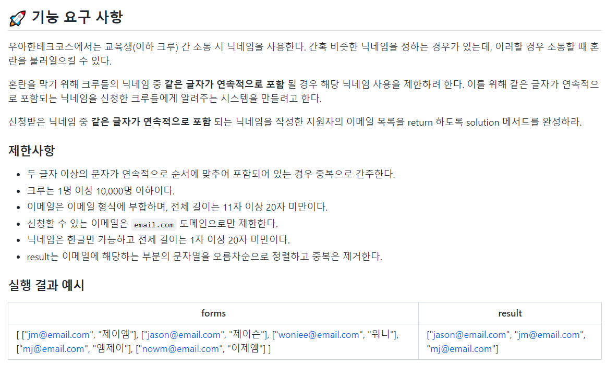

## Problem6 : 닉네임 중복 체크




## 📗 기능 목록

```
📌 checkOverlapOfWord
한 nickname안의 두 글자 이상이 중복되는지를 체크

📌 checkOverlap
nickname들이 중복인지를 체크

📌 getOverlapNicknames
중복되는 nickname들의 리스트를 반환
```


## 📌 코드

[깃허브 코드](https://github.com/hgo641/java-onboarding/blob/hgo641/src/main/java/onboarding/Problem6.java)

```java
	/**
     * nickname이 두 글자 이상 중복이 아니라면 wordOfNickname에 삽입, 중복된다면 중복되는 nickname의 index를 반환
     * @param nickname 중복을 검사할 nickname
     * @param index nickname의 index
     * @return nickname이 중복이 아니라면 -1, 중복이라면 중복되는 nickname의 index
     */
    int checkOverlapOfWord(String nickname, Integer index){
        for(int i = 0; i<nickname.length()-1; i++){
            String target = nickname.substring(i, i+2);
            if(wordOfNickname.containsKey(target) && wordOfNickname.get(target) != index){
                return wordOfNickname.get(target);
            }
            wordOfNickname.put(target, index);
        }
        return -1;
    }

    /**
     * form에 있는 nickname들이 중복인지 아닌지를 체크
     */
    void checkOverlap(){
        for(int i = 0; i<forms.size(); i++){
            List<String> form = forms.get(i);
            String nickname = form.get(1);
            int overlapIndex = checkOverlapOfWord(nickname,i);
            if(overlapIndex != -1){
                isOverlap[overlapIndex] = true;
                isOverlap[i] = true;
            }
        }
    }
```

* 닉네임을 두 글자씩 나눈 word가 중복되지 않는다면 `wordOfNickname`해시맵에 key로 저장한다.
* 이후 다른 사람의 닉네임을 이루는 word와 같은 word가 `wordOfNickname`에 key로 존재한다면, 해당 word는 중복이라는 의미이므로, 두 닉네임이 중복임을 체크한다.


### ✏ 다른 분의 풀이

[mihye126](https://potatosprout.tistory.com/13)님의 허락을 받고 슬랙에 공유해주신 풀이를 가져왔다.

```java
private static List<String> tokenizer(String str) {
        return IntStream.rangeClosed(0, str.length() - 2)
            .mapToObj(i -> String.join("", Arrays.copyOfRange(str.split(""), i, i + 2)))
            .collect(Collectors.toList());
    }
```

* Stream API을 사용해 닉네임을 두 글자씩 나누는 메소드이다.

해당 문제와 같이 트래픽이 적은 경우는 Stream을 사용하면 가독성있게 처리할 수 있다. (트래픽이 많을 경우에는 traditional for-loop를 사용하는 것이 효율성면에서 좋다고 한다. 참고 : [java-stream-api는-왜-for-loop보다-느릴까](https://jypthemiracle.medium.com/java-stream-api%EB%8A%94-%EC%99%9C-for-loop%EB%B3%B4%EB%8B%A4-%EB%8A%90%EB%A6%B4%EA%B9%8C-50dec4b9974b)) <br/>

Stream에 대한 지식이 없어 이런 풀이 방법은 생각하지 못했는데 가독성이 뛰어난 좋은 방법인 것 같다.

<br/>

```java
public static List<String> solution(List<List<String>> forms) {
        //key: token / value: email
        HashMap<String, HashSet<String>> userMap = new HashMap<>();

        for (List<String> form : forms) {
            String nickname = form.get(1);
            String email = form.get(0);
            List<String> tokens = tokenizer(nickname);
            tokens.forEach(token -> appendMapValue(token, email, userMap));
        }

        List<String> entries = userMap.entrySet().stream()
            .filter(item -> item.getValue().size() > 1) //token에 이메일이 2개 이상이면 추출
            .flatMap(item -> item.getValue().stream())//value값인 email만
            .sorted()//정렬하기
            .collect(Collectors.toList());    //stream to list

        return entries;
    }
}
```

* 이후 userMap [nicknameToken] ={email1, email2, ...} 에서도 Stream을 사용해 중복 닉네임을 가진 이메일만 필터하는 것을 볼 수 있다.


