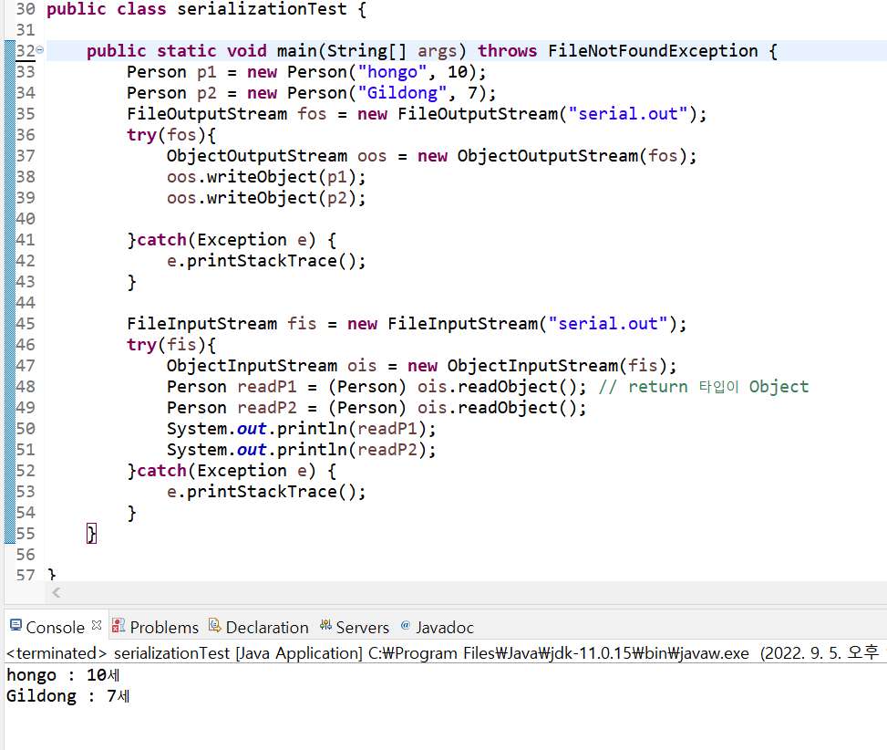

## 직렬화 (serialization)

* 직렬화 (serialization) : 인스턴스의 상태를 그대로 파일 저장하거나 네트워크로 전송

* 비직렬화 (deserialization) : 직렬화한 것을 다시 자바 클래스로 복원하는 방식

* 자바에서는 보조 스트림 `ObjectInputStream`과 `ObjectOutputStream`을 활용하여 직렬화를 제공함


### Serializable 인터페이스

* 직렬화를 할 클래스에 적용해야하는 인터페이스

* `transient` : 직렬화 하지 않으려는 멤버 변수에 사용함 (Socket등 직렬화 할 수 없는 객체)
  * 복원될 때는 디폴트값이 들어감 ex) int : 0, String : null

### 📌 예제

```java
class Person implements Serializable{
	private String name;
	private int age;
	
	Person(String name, int age){
		this.name = name;
		this.age = age;
	}
	
	@Override
	public String toString() {
		// TODO Auto-generated method stub
		return (name + " : "+ age+ "세");
	}
	
}
```

> 직렬화할 클래스는 `Serializable`인터페이스를 반드시 상속해야한다.

<br/>



> `ObjectOutputStream`을 사용해 직렬화한 객체를 `ObjectInputStream`을 사용해 파일에서 다시 가져온다.


### External 인터페이스

`Serializable`인터페이스를 받으면 그냥 readObject(), writeObject()로 직렬화, 비직렬화를 할 수 있다. <br/>

그런데 만약 프로그래머가 직접 객체를 읽고 쓰는 코드를 구현하고 싶다면 `External`인터페이스를 구현해 `writeExternal`과 `readExternal`메서드를 오버라이딩해 구현하면 된다.


```java
class Person implements Externalizable{
	String name;
	int age;
	
	public Person(){}
	public Person(String name, int age){
		this.name = name;
		this.age = age;
	}
	
	@Override
	public String toString() {
		// TODO Auto-generated method stub
		return (name + " : "+ age);
	}

	@Override
	public void writeExternal(ObjectOutput out) throws IOException {
		// TODO Auto-generated method stub
		out.writeUTF(name);
		out.writeInt(age);
	}

	@Override
	public void readExternal(ObjectInput in) throws IOException, ClassNotFoundException {
		// TODO Auto-generated method stub
		name = in.readUTF();
		age = in.readInt();
	}
	
}
```

> 클래스를 위와 같이 바꾸고 실행을 하면 잘 되는 것을 볼 수 있다.<br/>
>
> (public Person(){})이 없을경우 유효한 생성자가 없다면서 에러가 나는데 왜인지는 모르겠음.
